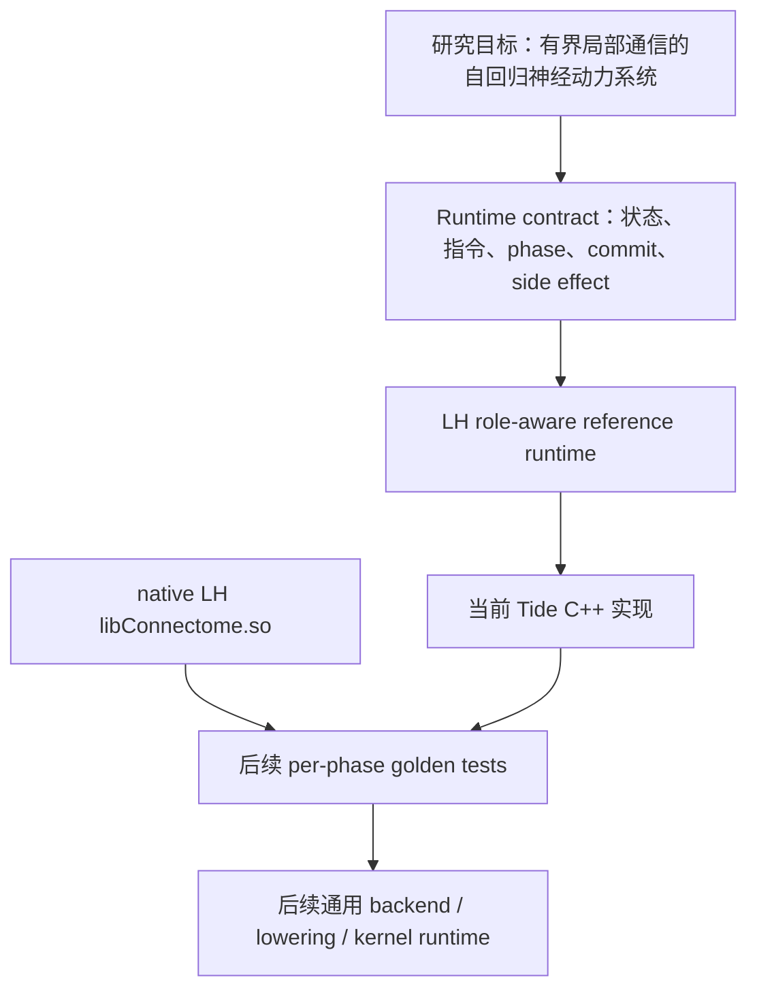
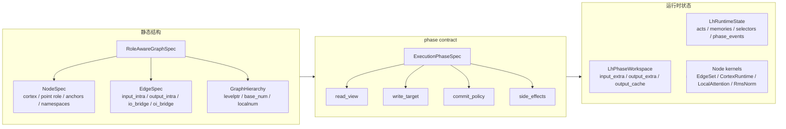
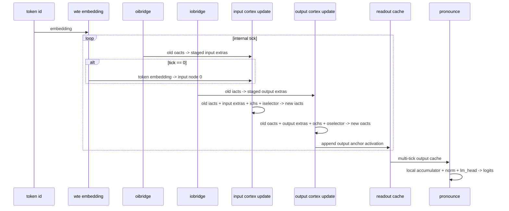
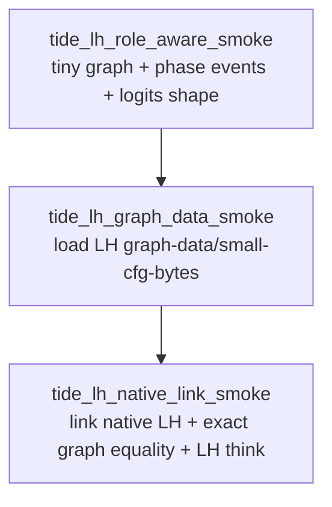

# TIDE 当前架构状态

## 一页版

当前 `~/llm/tide` 的状态不是完整 TIDE，也不是 `lh` C++ Connectome 的逐行复刻，而是一版轻量的 `LH role-aware reference runtime`。

它已经完成的事情是：

- 用一张 `RoleAwareGraphSpec` 承载 LH 的 input cortex、output cortex、bridge、anchor、hierarchy、node role 与 edge role。
- 用 `ExecutionPhaseSpec` 明确每个 phase 的 `read view / write target / commit policy / side effects`。
- 用 `LhPhaseWorkspace` 表达单个 token 内部的 staged messages 与 readout cache。
- 用 `LhRuntimeState` 表达跨 token 持续存在的 activations、local memories、selectors、pronounce memory 与 phase event log。
- 能链接 native ARM 版 LH `libConnectome.so`，并验证 LH 与 Tide 读取同一份 graph data 后，hierarchy 与四张 CSR 图完全一致。

它还没有完成的事情是：

- 还没有 LH 参数名到 Tide 参数名的 state-dict 映射。
- 还没有逐 phase 导出 artifact 并做数值 golden test。
- 还没有复刻 LH 的 packed / cached / cross-batch hidden modes。
- 还没有把当前 LH-specific runtime 抽成最终通用 TIDE backend / lowering / execution runtime。

因此，当前最准确的判断是：

> TIDE 已经有一版可运行、可测试、可链接 native LH 的 role-aware phase runtime 骨架；当前对齐等级是 graph / role / phase / state-semantics alignment，不是 numeric parity。

## 架构分层



这张图里的关键点是：当前实现先选择 LH 作为 reference family，用它把 runtime contract 钉住。等 LH 的 graph、phase、state 与数值逐步对齐后，再抽出通用 backend/runtime，而不是一开始就实现一个过重的通用系统。

## 核心对象



这里最重要的抽象边界是：

- `RoleAwareGraphSpec` 只回答“图上有什么”。
- `ExecutionPhaseSpec` 回答“当前 phase 允许看什么、写什么、什么时候提交”。
- `LhPhaseWorkspace` 回答“一个 token 内部的短期 staged 信息在哪里”。
- `LhRuntimeState` 回答“跨 token 持续存在的控制器状态在哪里”。
- node kernels 只负责局部计算，不应偷偷决定 phase 可见性和 commit 顺序。

## 当前 LH phase runtime

LH 的一个 external token step 被拆成多个 internal tick。当前 Tide 实现的 phase schedule 是：



这张图容易误解的一点是：`iobridge` 读取的是 tick start 时的旧 `iacts`，不是 `input cortex update` 后的新 `iacts`。所以 phase 的核心不是顺序标签，而是：

```text
barrier + visibility + commit order
```

如果没有这层约束，统一 graph runtime 很容易退化成普通消息传递循环，从而破坏 LH 语义。

## 数据与对齐状态

当前已有三层测试：



`tide_lh_native_link_smoke` 目前确认：

- native LH `libConnectome.so` 可以在当前 ARM 机器上链接。
- LH `GraphConfig / GraphData` 与 Tide `RoleAwareGraphSpec` 对同一份 graph data 的读取结果一致。
- 一致性不是只看 shape，而是检查 hierarchy 与 CSR `indptr / indices / edge_ids`。
- LH `IOCortexNet::think()` 能跑一轮，并产出期望 logits shape。

当前还没有确认：

- 同一参数下 Tide 与 LH 的 bridge 输出一致。
- 同一参数下 Tide 与 LH 的 cortex candidate activations 一致。
- 同一参数下 Tide 与 LH 的 selector 输出一致。
- 同一参数下 Tide 与 LH 的 local hidden / KV cache 更新一致。
- 同一参数下最终 logits 一致。

## 与 `tide.old` 的关系

`tide.old` 有更完整但更重的 runtime 抽象，例如：

- `GraphSpec`
- `ClockContext`
- `ExecutionPlan`
- `GraphState`
- `NodeKernel`
- `CommitPolicy`
- lowering / backend / packed runtime

当前 `~/llm/tide` 没有直接继承这套复杂结构。原因是：如果一开始就把通用 runtime、backend、packed kernel、LH compatibility 全部放进来，失败原因会不可诊断。

当前路线更窄：

1. 先用 LH role-aware runtime 固定语义。
2. 再做 native LH per-phase numeric alignment。
3. 再把稳定对象抽成通用 TIDE runtime contract。
4. 最后再决定哪些 `tide.old` 的 backend / lowering 设计值得复用。

## 当前架构判断

当前最重要的抽象不是“统一成一张普通图”，而是：

> 物理上可以统一成一张 role-aware graph；语义上必须保留 multi-phase runtime、独立 state namespace、selector 控制面、hidden lifecycle 与 commit policy。

也就是说：

- 图统一是静态结构层的统一。
- phase 不统一成普通循环，是执行语义层的保真。
- input / output cortex 不混用，是状态语义层的保真。
- selector 与 hidden lifecycle 不藏进 kernel，是控制语义层的保真。

## 下一步

下一步不应马上扩张到完整 TIDE backend，而应继续做对齐：

1. 做 LH -> Tide 参数映射。
2. 增加 per-phase artifact capture。
3. 先比较 bridge 输出。
4. 再比较 `BatchCHALInput` / candidate activations。
5. 再比较 selector selected activations。
6. 再比较 hidden / KV cache 更新。
7. 最后比较 pronounce 与 logits。

只有逐 phase 对齐后，`prefill / decode` 等价性讨论才有稳固工程基础。否则即使最终 logits 不同，也无法判断差异来自参数映射、phase 可见性、selector、hidden cache，还是 kernel 实现。
