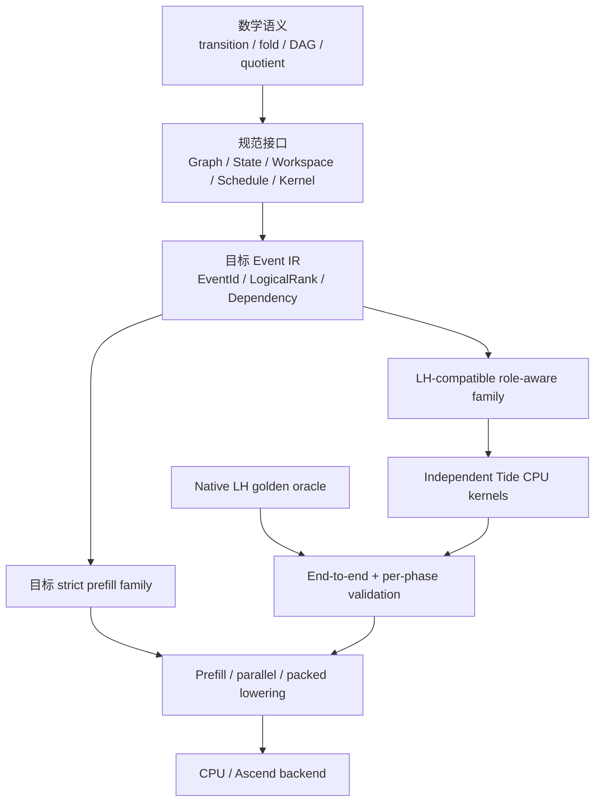

# TIDE 当前架构状态

> [!summary] 本页定位
> 本页是 `~/llm/tide` 的动态工程快照，不定义数学语义。数学 contract 见 [[step-transition-mathematical-specification]]，规范性实现接口见 [[step-transition-implementation-specification]]。

## 快照边界

本页基于 2026-07-10 的本机代码状态，代码基线至少包含：

```text
79bb9ec Add selector artifacts and CPU stress benchmark
```

当前 `~/llm/tide` 已经不是单纯的 LH native wrapper，也不是完整通用 TIDE。最准确的定位是：

> 一套由 Tide 自己的 role-aware graph、phase schedule、state/workspace contract 与独立 CPU kernels 承载的 LH-compatible reference runtime；native LH 继续作为 golden oracle。

## 一页版

已经完成：

- `RoleAwareGraphSpec` 承载 input/output cortex、bridge、anchor、hierarchy、node role 与 edge role。
- `ExecutionPhaseSpec` 明确 phase 的 read view、write target、commit policy 与 side-effect boundary。
- `LhPhaseWorkspace` 表达 token-local staged messages 与 multi-tick readout cache。
- `LhRuntimeState` 表达跨 token activations、local memories、selectors、pronounce memory 与 phase events。
- native LH whole `think()`、Tide schedule 驱动的 native phase path、独立 Tide CPU path 已形成可比较的三层 reference chain。
- 独立 Tide CPU kernels 在当前覆盖配置上与 native LH end-to-end logits 对齐。
- signal-level phase artifacts 与 selector count artifacts 已逐 phase 对齐。
- attention/add hidden families、主要 cache modes、norm families 与 heterogeneous cortex configuration 已有覆盖测试。
- 已有 CPU stress benchmark，并限制最多 160 核、800 GB address-space budget。

尚未完成：

- strict model-level `prefill()` API 与 `prefill = decode fold` 证明。
- 通用 `EventId / LogicalRank / Dependency / StateVersion / CommitEvent` IR、dynamic event generation 与 causality verifier。
- zero-delay SCC detection，以及可选 implicit/fixed-point kernel contract。
- memory-state 级 per-phase artifact equality。
- 通用 backend-neutral state-dict / parameter mapping API。
- 独立的通用 parallel executor、完整 packed/crossbatch performance lowering。
- Ascend/NPU execution、graph-node affinity 与 multi-device runtime。
- 训练可行性、scaling 与一般 graph 性能优势验证。

## LH 的工程与研究边界

当前 native LH parity 的作用是固定一个复杂 reference family，并验证 Tide 的 graph/phase/state 抽象。它不意味着后续数学或实现必须完整保留 LH 的所有机制。

LH 中的 hierarchy、bridge、selector、local hidden、multi-tick readout 等内容应被视为 mechanism pool。每个机制后续都可以进入三种去向：

1. 保留，并证明它满足 strict chunk-prefill contract。
2. 修改为 tagged、可分解、可 scan 或可验证的等价版本。
3. 若它阻碍 prefill/sequence parallel 且没有独立价值，则留在 compatibility family 或直接移除。

工程优先级由总体目标裁决：局部通信、超稀疏、可训练性与高效序列执行高于完整 LH compatibility。

## 架构分层



这套分层刻意把三件事分开：

- 数学文档规定什么叫正确。
- strict prefill family 是 model-level prefill 与序列并行的目标主线，当前尚未形成完整实现。
- LH-compatible family 提供一个复杂但具体的 reference transition。
- Event IR 是下一层目标接口，当前代码尚未完整实现；图中出现它不表示完成状态。
- Tide CPU / packed / Ascend 只是该语义的不同实现或 lowering。

## 核心对象

| 对象 | 当前职责 | 不应承担的职责 |
| --- | --- | --- |
| `RoleAwareGraphSpec` | 静态 node/edge role、anchor、hierarchy 与 CSR topology | 不决定 phase visibility 或 commit order |
| `ExecutionPhaseSpec` | active roles、read view、write target、commit policy、side effects | 不实现数值 kernel |
| `LhPhaseWorkspace` | token-local input/output extras、output cache、phase artifacts | 默认不跨 token 持久化 |
| `LhRuntimeState` | activations、local hidden/cache、selector、pronounce、step/tick coordinates | 不隐藏 workspace lifecycle |
| `EdgeSet` / `CortexRuntime` | bridge、affected、cortex update | 不改变 schedule |
| `LocalChal` / `LocalAttention` / `LocalAdd` | node-local numerical transition | 不偷偷扩大 read scope |
| `LhNativeBackend` | native LH golden oracle 与 phase-driven reference path | 不是最终 Tide backend |

## 目标 Event IR 缺口

当前 Tide 已有 fixed LH-like phase schedule、step/tick coordinates 与 phase event log，但还没有独立于 LH family 的通用 dynamic event runtime。

| 目标对象 | 当前可复用基础 | 尚缺内容 |
| --- | --- | --- |
| `EventId` | external step、internal tick、phase、node/edge role | 稳定的跨 family schema 与序列化表示 |
| `LogicalRank` | 固定 LH phase order | dynamic event 的良基 rank 与在线校验 |
| `Dependency` | phase read/write contract、CSR topology | value/state/control/commit dependency 的显式边 |
| `StateVersion` | `LhRuntimeState` 与 phase read view | backend-neutral version identity 与 conflict relation |
| `CommitEvent` | `ExecutionPhaseSpec.commit_policy` | 可被 chunk lowering 和 validator 共同引用的事件对象 |
| `CausalityVerifier` | phase artifact tests | finite-run、rank monotonicity 与 zero-delay SCC 检查 |

因此，当前 role-aware runtime 可以作为 Event IR 的复杂输入样本，但不能被描述为已经完成 dynamic DAG executor。

## LH Phase Contract

一个 external token step 的当前 reference order 是：

```text
for internal_tick:
  oibridge
  external_input    # only tick 0
  iobridge
  input_update
  output_update
  readout_cache
pronounce
```

顺序本身还不够。每个 phase 还固定：

- 读取 tick-start 还是 phase-updated state。
- 写入 workspace 还是 persistent state。
- 写入何时对后续 phase 可见。
- hidden decay、KV append、selector count、clear-after-activation 等 side effects。

因此当前最重要的架构结论仍然是：

> 物理上可以是一张 role-aware graph；语义上必须保留 multi-phase runtime、独立 state namespaces、selector control state、hidden lifecycle 与 commit policy。

## 对齐矩阵

| 层级 | 当前状态 | 证据边界 |
| --- | --- | --- |
| Graph hierarchy / CSR | 已对齐 | LH 与 Tide loader 比较 hierarchy、`indptr / indices / edge_ids` |
| Phase contract | 已对齐 | phase order、read view、write target、commit policy、side effects |
| Native whole vs native phase-driven | 已对齐 | 连续 token logits 与 phase event equality |
| Independent Tide whole model | 已对齐于当前覆盖配置 | 独立 Tide CPU kernels 对 native LH end-to-end logits |
| Per-phase signal artifacts | 已对齐 | input/output extras、activations、output cache |
| Selector artifacts | 已覆盖 count state | `affectcount / selectcount`；并非宣称所有未来 tie-breaking 均已证明 |
| Memory-state artifacts | 未完整覆盖 | hidden/KV memory 尚未进入完整 per-phase artifact report |
| Hidden/cache modes | 已有组件级覆盖 | `CROSSBATCH / LOOP / PACKED / CACHEDMATMUL / CACHEDPACKED / CACHEDATTENTION` |
| Add hidden / norm / heterogeneous config | 已覆盖 | TensorHidden、RMSNorm、LayerNorm、Identity、mixed CHAL bands |
| Strict chunk prefill | 未完成 | 当前模型入口仍是 decode-style `think()` |
| Ascend/NPU | 未实现 | 目前只有 adaptation/lowering 调查与设计 |

## Golden Reference Chain

当前验证链可以写成：

```text
native LH whole think
  == Tide schedule + native LH phase kernels
  == captured native phase artifacts
  == independent Tide CPU kernels
```

这条链证明的是当前覆盖 family 下的实现语义与数值对齐。它没有自动证明：

- 一般 graph 的 chunk prefill correctness。
- 训练时反向传播等价。
- 浮点重排后的所有 backend 都等价。
- 当前 LH transition 本身具有理想的可训练性或高性能 prefill 结构。

## CPU Mode 与性能状态

当前 CPU path 已覆盖主要 LH hidden/cache mode，并提供：

```text
tide_lh_cpu_stress
scripts/run_cpu_stress_matrix.sh
```

benchmark 可比较 native LH 与 independent Tide 的 forward/backward、batch、sequence length 与线程数。解释时必须保持同 graph、config、参数、mode、batch、length 与 thread budget。

当前 benchmark 的意义是发现性能瓶颈和回归，不是证明 sequence-parallel prefill。调用端循环多个 `think()` 仍然只是 decode fold。

## 与数学主线的接口

当前工程 runtime 提供一个具体 reference transition：

```text
Step(input_token, State) -> logits, State'
```

数学主线接下来需要回答：

1. 这个 transition 的 reference semantic contract 到底保留哪些 state 与 provenance？
2. 哪些 LH/Tide kernel 可证明具有 chunk implementation？
3. 哪些跨 token / round 聚合是 semantics-preserving quotient？
4. 哪些 phase、selector、readout、pronounce 机制必须顺序执行，哪些可以 scan、batch 或 reorder？
5. 如何从 decode-style runtime 得到第一版真实 model-level `prefill()`？
6. 如何把 fixed phase log 提升为 dependency-complete Event IR，并保证 dynamic selector 只生成良基有限 execution？

## 当前下一步

建议顺序：

1. 保持 native LH 为 golden oracle，补 memory-state per-phase artifacts。
2. 从现有 phase event log 提取最小 `EventId / LogicalRank / StateVersion / CommitEvent` schema，并先支持 fixed schedule。
3. 以 [[step-transition-mathematical-specification]] 的 B0 contract 为基准定义 model-level `prefill()` 输入、输出与 state contract。
4. 先实现并验证 token-wise map、causal attention、affine scan 的 chunk paths。
5. 为每条 chunk path 给出 non-degenerate certificate 与 work/span/memory/communication ledger，再增加 dynamic event generation、parallel executor、batch memory、packed selector 与 crossbatch fusion。
6. 把 LH-specific config mapping 收敛为 backend-neutral state-dict API。
7. CPU semantic parity 与 prefill proof gate 稳定后，再做 Ascend lowering。

工程判断应始终保持：

> 后端优化可以改变 layout、物理执行顺序和 kernel fusion，但不能反过来定义 reference semantics。
