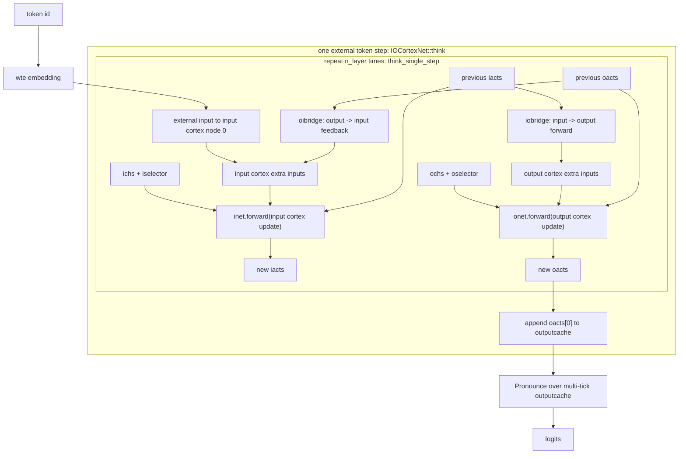
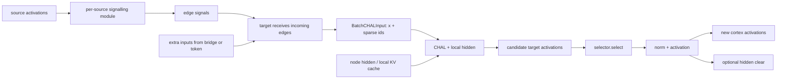

# Prefill / Decode 等价性研究上下文

## 定位

这份备忘记录对 `~/llm/lh` 与 `~/llm/tide.old` 的初步审视结论，用于后续展开 `prefill / decode` 等价性问题。

当前不把这里的结论视为最终架构方案。更准确地说：

- ObsidianVault 中已有内容提供 TIDE 的原始历史动机。
- `~/llm/lh` 提供实现层动机和关键语义参考。
- `~/llm/tide.old` 提供一轮已经推进过的 runtime 架构尝试。
- 最终哪些对象应留下、如何设计，应由 `prefill / decode` 等价性研究反过来裁决。

## 总体判断

TIDE 不应被重写成 `lh` 的 C++ 复刻，而应被视为一个统一的 graph-state token runtime。

`lh` 的价值在于提供原始语义：

- 分层局部图。
- input / output cortex。
- input-to-output 与 output-to-input bridge。
- bridge phase。
- selector。
- local hidden / local KV hidden 生命周期。
- 多 internal tick 的 readout。

`tide.old` 的价值在于提供 runtime 抽象：

- `GraphSpec`。
- `NodeSpec` / `EdgeSpec`。
- `ClockContext`。
- `ExecutionPlan` / `EmissionPlan`。
- `GraphState`。
- `NodeKernel`。
- `CommitPolicy`。
- `FamilyConfig` / family builder。
- strict / non-strict family contract。

后续重写应提炼两者，而不是继承任一边的完整实现。

## `lh` 提供的实现层动机

`~/llm/lh` 当前应以 C++ Connectome 为主线理解。Python / PyConnectome 是更早期的原型版，适合回看原始建模动机；C++ Connectome 才是当前已经推进到 runtime、batch hidden、selector 和局部 KV cache 的主要实现。

关键文件包括：

- `~/llm/lh/Connectome/cpp/include/CortexNet.h`
- `~/llm/lh/Connectome/cpp/src/CortexNet.cpp`
- `~/llm/lh/Connectome/cpp/include/AccumulateLocal.h`
- `~/llm/lh/Connectome/cpp/src/AccumulateLocal.cpp`
- `~/llm/lh/Connectome/cpp/include/BatchHidden.h`
- `~/llm/lh/Connectome/cpp/include/Hidden.h`
- `~/llm/lh/Connectome/cpp/include/Selector.h`
- `~/llm/lh/Connectome/cpp/src/Selector.cpp`
- `~/llm/lh/Connectome/cpp/include/GraphConfig.h`
- `~/llm/lh/Connectome/cpp/src/GraphConfig.cpp`
- `~/llm/lh/Connectome/cpp/include/Adjacency.h`
- `~/llm/lh/Connectome/cpp/src/Adjacency.cpp`
- `~/llm/lh/PyConnectome/Graph.py`
- `~/llm/lh/PyConnectome/Model.py`
- `~/llm/lh/PyConnectome/CortexNet.py`
- `~/llm/lh/PyConnectome/AccumulateLocal.py`
- `~/llm/lh/train.py`

### C++ Connectome 的总体工作方式

`lh` C++ Connectome 不是一张普通图上的同质 message passing。更准确地说，它是一个 role-aware 的双 cortex 稀疏递归运行时：

- `GraphConfig` 定义层级节点集合，包括 `levelptr`、`hpnums`、`base_num`、`localnum`。
- `GraphData` 加载四张有向 CSR 图：`inputA`、`outputA`、`ioA`、`oiA`。
- `inputA` 与 `outputA` 分别服务 input cortex 与 output cortex。
- `ioA` 是 input-to-output bridge，`oiA` 是 output-to-input bridge。
- input / output 两套 cortex 有各自的 activations、hidden、selector 与更新路径。
- bridge 不只是边类型，而是有执行相位和方向的 runtime 对象。

一个 external token step 中，`IOCortexNet::think` 会把 token embedding 注入 input cortex 的 0 号节点，然后运行 `n_layer` 次 internal tick。每个 tick 调用 `think_single_step`，并缓存每次 output cortex 的 `oacts[0]`，最后由 `Pronounce` 汇聚这些 tick cache 得到 logits。



### 单个 Cortex 的传播与更新

`BaseCortexNet` 提供通用有向传播骨架：

1. 每个 source node 用自己的 signalling module 生成出边信号。
2. 每条边携带一个 `BatchSignals`。
3. target node 收集入边信号与 optional extra input。
4. 收集结果打包为 `BatchCHALInput`，其中 `x` 是非空信号矩阵，`ids` 是 batch-by-local-input 的稀疏 CSR 索引。

`IntraCortexNet` 在这个传播骨架上做节点更新：

1. `affected()` 得到每个 target node 的 `BatchCHALInput`。
2. 每个 target node 用自己的 CHAL 结合局部输入与 hidden。
3. `selector.select()` 决定保留哪些激活。
4. 被保留的激活经过 norm 与 activation。
5. 如果打开 `clear_after_activation`，被激活样本对应的 hidden 会被清理。



### CHAL 与局部记忆

`AccumulateLocal` 是节点局部更新的核心。当前主要有两类 hidden：

- `TensorHidden`：add 型累积状态。
- `KVHidden`：attention 型局部 KV cache。

`Attention` 型 CHAL 的语义是：

1. 对本轮局部输入生成 Q/K/V。
2. 将 K/V append 到该节点自己的 `KVHidden`。
3. 用 Q attend 该节点的局部历史 KV。
4. 通过 confluence 把局部输入维度压回一个输出向量。
5. 再经过 projection 输出节点激活。

这说明 `lh` 的 memory 不是全局 KV cache，而是每个节点自己维护局部历史。这个生命周期是架构语义的一部分，不应在 TIDE 中退化为普通 tensor buffer。

### Selector 的层级局部语义

`NaiveSelector` 不是一个通用 top-k 层，而是显式依赖 `GraphConfig` 的层级和局部组：

- `s` 之前的 hub 节点，只要被影响就保留激活。
- 底层节点按 `base_num` 个 base hub 分组。
- 每个局部组包含 `localnum` 个 point；如果 `with_lead_point=true`，还包含一个 lead point。
- 每个局部组按 `selectnum` 保留少量激活。
- 选择优先级结合了 `selectcount`、`affectcount`、signal norm 和 index tie-break。

因此 selector 本身带有运行时历史，影响后续激活路径。它不是可以随意藏进 node kernel 的纯函数；TIDE 如果要承载 LH role-aware 语义，必须把 selector 作为 runtime 控制面的一部分。

### Role-aware 的准确含义

这里的 role-aware 不只是节点或边带标签，而是 runtime 必须显式保留以下角色与相位：

- `input cortex` 与 `output cortex` 是两套状态空间，不是一张普通图的两个区域。
- `inputA`、`outputA`、`ioA`、`oiA` 不是同质边集合。
- `oibridge` 与 `iobridge` 有方向，也有调用顺序。
- token embedding 只作为 external input 注入 input cortex 的 0 号节点。
- readout 只读取 output cortex 的指定输出状态，并且当前实现读的是多 internal tick 的 `oacts[0]` cache。
- hub、lead point、local point 的层级角色会影响 selector。
- hidden 的 decay、clear、append、cache layout 与 selector history 一起构成运行时状态。

如果后续 TIDE 把这些内容 flatten 成“一张图 + 同质节点 + 同质边 + 一个普通消息传递循环”，就会丢掉 `lh` 当前最重要的结构语义。TIDE 的目标不应是复刻 C++ Connectome 的类型体系，而应抽象出足以承载这些角色、相位和生命周期的 runtime contract。

### Python 原型中的图结构动机

`Graph.py` 构造的是分层 hubs / points 图：

- 先生成多层 hub 与底层 point。
- 局部连接来自类似 Delaunay 的邻域图。
- 跨层连接来自 hub 从属关系。
- 最终生成 `inputA` 与 `outputA` 两张有向图。
- `inputA` 以 node 0 为输入入口向下传播。
- `outputA` 是 `inputA` 的反向输出图。
- `ioA` 与 `oiA` 提供 input cortex 与 output cortex 之间的 bridge。

这里最重要的不是某个具体建图算法，而是：

- 图是局部的。
- 图有层级。
- 图有输入到输出的传播方向。
- input / output 两套 cortex 不是同一张普通图。
- bridge 拓扑有角色和方向。

这些内容适合用来理解 `lh` 的原始动机，但当前主线语义应以 C++ Connectome 为准。

### Python 原型中的双 cortex 与 bridge phase

`Model.py` 中的 `IOCortexNet.forward_single_step` 明确包含四段：

1. `oibridge`：用上一时刻 output cortex 的状态补入当前 input cortex 输入。
2. `iobridge`：用当前 input cortex 状态生成 output cortex 输入。
3. `inet`：更新 input cortex。
4. `onet`：更新 output cortex。

`forward` 中每个 token 会运行 `n_layer` 次内部步骤，并把多个 internal tick 的 output cortex 顶部状态交给 `pronounce`。

这说明 `lh` 的 internal tick 不是普通 Transformer layer 的简单替代，而是有相位结构：

- feedback bridge。
- forward bridge。
- input cortex update。
- output cortex update。
- temporal readout。

当前 C++ Connectome 的关键点是：bridge 既有方向，也有相位；`oibridge` 与 `iobridge` 都在 cortex update 前生成 extra inputs，然后 `inet` 和 `onet` 分别更新各自 cortex。因此，后续 TIDE 抽象应保存“bridge phase + cortex update phase”的语义，而不是只保存四张 adjacency。

### Python 原型中的 selector 与 local hidden

`CortexNet.py` 中的 `IntraCortexNet.select` 是 `lh` 的重要语义来源：

- 前 `s` 个 hub 节点在受影响后总是激活。
- 底层 point 按 base hub 分组。
- 每个局部组里按信号范数 top-k 选择 point。
- selector 是外部控制面的一部分，不应藏进 node kernel。

`AccumulateLocal.py` 中的 CHAL 提供两类 local hidden：

- `TensorHidden`：add 型累积。
- `KVHidden`：attention 型局部 KV cache。

attention 型 local hidden 的工作方式是：

- 对本轮局部输入生成 Q/K/V。
- 将 K/V 追加到该节点自己的 KV hidden。
- 对局部输入与历史 KV 做 attention。
- 再经 confluence 压成一个输出向量。

这说明 `lh` 里每个节点拥有自己的局部记忆，局部记忆的生命周期是架构语义，而不是普通 tensor buffer。

### 当前实现局限

`lh` 当前不应直接作为后续 runtime 蓝图：

- Python 原型大量使用 object array 和 per-node / per-edge loop，只适合保留建模直觉。
- `train.py` 是逐 token 串行训练，没有真正 sequence-parallel prefill。
- C++ Connectome 已经是当前主线实现，并引入 batch hidden、KVHidden、selector、多 batch 加速，但仍围绕 Connectome 专用类型体系展开。
- C++ Connectome 当前保留了 role-aware 语义，但还没有直接给出 strict `prefill = decode fold` 等价性。

因此，后续应保留 `lh` 的语义动机，不应复刻它的执行组织。

## `tide.old` 提供的架构尝试

`~/llm/tide.old` 当前工作区干净，但它可能已经被多轮实验和架构推进弄得过重。它仍然有重要参考价值。

关键文件包括：

- `~/llm/tide.old/docs/zh/status/current.md`
- `~/llm/tide.old/docs/zh/architecture/core-data-contracts.md`
- `~/llm/tide.old/docs/zh/architecture/timing-and-node-contract.md`
- `~/llm/tide.old/docs/zh/architecture/execution-scenarios-and-parallelism.md`
- `~/llm/tide.old/docs/zh/planning/lh-to-tide-family-unification.md`
- `~/llm/tide.old/cpp/include/tide/tide_libtorch.h`
- `~/llm/tide.old/cpp/include/tide/training_driver.h`
- `~/llm/tide.old/cpp/src/training_driver.cpp`
- `~/llm/tide.old/cpp/src/runtime_message_aggregation.cpp`
- `~/llm/tide.old/cpp/src/runtime_lowered_execution.cpp`
- `~/llm/tide.old/cpp/src/contract_audit_family_impl.h`
- `~/llm/tide.old/cpp/src/contract_audit_sequence_impl.h`
- `~/llm/tide.old/cpp/src/contract_audit_lh_semantic_impl.h`
- `~/llm/tide.old/cpp/tests/sequence_parallel_smoke.cpp`

### 已经形成的核心边界

`tide.old` 的重要推进是把 runtime 拆成了以下对象：

- `Mode`：`Train` / `Prefill` / `Decode`。
- `FamilyKind`：`Transformer` / `MambaLike` / `LH` / `RwkvLike` / `LinearAttentionLike`。
- `ClockContext`：mode、external step、internal tick、barrier、execution phase。
- `MessageBatch`：payload 加 edge、source、target、batch、sequence step、visibility metadata。
- `GraphSpec`：静态图与 node / edge spec。
- `ExecutionPlan`：当前 tick 的 active nodes、inbox edges、emit edges、memory read/write selectors。
- `EmissionPlan`：执行后的 selected outputs、next active nodes、selected messages。
- `GraphState`：local sequence states、persistent memories、KV caches、visible messages、partition transport state。
- `NodeKernel`：统一 tick 接口，不同 family 实现不同内核。
- `CommitPolicy`：负责 staging message / memory 何时变成可见。

这个边界本身值得保留，但需要压缩复杂度。

### strict 与 non-strict family

`tide.old` 已经做了一个关键区分：

- strict family：
  - `Transformer`
  - `MambaLike`
  - `RWKVLike`
  - `LinearAttentionLike`
- non-strict family：
  - `LH role-aware`

strict family 声明 `prefill / decode` 的 sequence-parallel equivalence contract。

`LH role-aware` 只声明统一 prefill/decode/supervised 入口和 role-aware 语义，但不声明严格 sequence-parallel 等价。

这个区分应保留。原因是 `lh` 的 selector、bridge phase、hidden lifecycle 与多 tick readout 更容易破坏逐 token causal equivalence。未经验证前，不应把它包装成 strict family。

### 当前重点已经转向 contract

`tide.old/docs/zh/status/current.md` 已经把当前高优先关注点收缩为：

- `prefill / decode` 等价性 contract。
- `prefill = decode fold` 的数学前提。
- 将前提绑定到 `sequence_parallel` gate、contract audit、family smoke。

这说明后续重写前，应先研究清楚等价性，不应急着继续堆 backend surface。

## Prefill / Decode 等价性的核心问题

直觉公式是：

```text
prefill(x[0:L]) == fold(decode, x[0]), ..., decode(x[L-1])
```

更具体地说，对任意位置 `t`，full prefill 在位置 `t` 的 readout / state，应等价于逐 token decode fold 处理到 `x[0:t]` 后的 readout / state。

但这不是自动成立。`prefill` 能吃 `[B, L, D]` 并不等于它是 decode fold 的等价并行实现。

### 必要条件

至少需要满足以下条件：

1. 相同 causal computation graph

- 位置 `t` 只能依赖 `<= t` 的输入。
- prefill 不得让未来 token 影响早期 token 的状态、message、selector 或 readout。

2. 相同参数与 deterministic 设置

- 参数相同。
- mask 相同。
- positional encoding 语义相同。
- normalization 语义相同。
- dropout 关闭或可复现。

3. 相同 node kernel 语义

- prefill 的 full-sequence branch 与 decode 的 single-step branch 必须实现同一递推。
- 如果 prefill 做整段 summary，而 decode 做逐 token update，则不等价。

4. 相同 KV / memory append 语义

- prefill 后物化出的 KV cache 应等于逐 token decode append 后的 KV cache。
- append 顺序、row length、metadata、source position 都要一致。

5. 相同 message visibility 与 commit order

- message 在 internal tick / barrier 后何时可见，必须一致。
- 同 tick 新写出的 staging memory 不能被另一个节点因为执行顺序偶然读到。

6. 相同 selector / routing 因果性

- selector 在 prefill 中不能基于整段序列联合决策早期位置。
- 如果 decode 是逐 token routing，prefill 也必须能还原逐 token routing。

7. 相同 readout 定义

- 要明确比较的是 full sequence readout、last token readout、memory slot readout，还是 visible message readout。
- 不同 readout 定义对应不同等价粒度。

### 等价粒度

后续研究必须先明确等价粒度，否则测试会混乱。

可能的等价层级：

1. readout equivalence

- 只比较每个位置的最终 readout。
- 最弱，但最接近任务损失。

2. state equivalence

- 比较每个节点的 local sequence state 与 persistent memory。
- 更强，可以定位 runtime 语义差异。

3. cache equivalence

- 比较 KV cache 的 row length、arena layout、keys、values、append metadata。
- 对 Transformer 类 strict family 很关键。

4. message equivalence

- 比较 visible messages、staging messages、sequence step、edge index、batch index。
- 对 graph runtime 很关键。

5. selector / active-set equivalence

- 比较 active nodes、inbox edges、emit edges、memory read/write selectors。
- 对 LH-like sparse family 很关键。

越强的等价越难满足，但也越能证明 runtime contract 清楚。

## 对后续重写的设计约束

### 首先固定数学语义，再写优化路径

重写时不应先追求 packed arena、backend dispatch 或昇腾后端。

推荐顺序：

1. 定义最小 strict family 的 `prefill = decode fold` contract。
2. 实现最小 dense reference path。
3. 用测试证明 prefill 与 decode fold 在 readout / state / cache 层等价。
4. 再引入 message passing。
5. 再引入 sparse selector。
6. 最后再做 packed arena、分区、NPU backend。

### Train / Prefill / Decode 应共用对象族

`train`、`prefill`、`decode` 不应是三套互不相关 API。

它们应共用：

- 同一个 graph spec。
- 同一个 node spec。
- 同一个 graph state。
- 同一个 node kernel contract。
- 同一个 commit policy。

区别应体现在：

- `ClockContext.mode`。
- 输入序列长度。
- readout spec。
- 是否物化或复用 persistent memory / KV cache。

### `lh` 应先保留为 non-strict reference family

LH-like 路径短期更适合用于验证：

- role-aware graph。
- bridge phase。
- selector。
- local hidden lifecycle。
- sparse local communication。

它不应第一阶段承担 strict prefill/decode equivalence 的主证明压力。

更稳的方式是：

- 用 Transformer-like 或 LinearAttention-like family 先证明 strict contract。
- 再把 LH-like family 放入同一 runtime，并明确声明 non-strict 或逐步提升到 partial strict。

### 最小实现应避免过度工程化

`tide.old` 已经证明可以把很多对象都做出来，但也暴露了复杂度风险。

重写时应优先保留最少对象：

- `ClockContext`
- `GraphSpec`
- `GraphState`
- `ExecutionPlan`
- `NodeKernel`
- `CommitPolicy`
- `ExternalStepDriver`
- `ReadoutSpec`

可以延后：

- partitioned transport。
- multiple backend dispatch。
- packed arena allocator。
- role-aware LH full semantics。
- complex selector history。
- CUDA / NPU custom kernel ABI。

## 当前未解决问题

1. strict contract 的最小 family 应选哪个？

候选：

- single-node Transformer block。
- multi-node Transformer-like DAG。
- LinearAttention-like recurrent family。

2. prefill/decode 等价应以哪个层级作为第一 gate？

候选：

- readout equivalence。
- state equivalence。
- cache equivalence。
- message equivalence。

3. `local_sequence_state` 与 `persistent_memory` 的边界如何固定？

核心区别应是生命周期，而不是 tensor shape。

4. 有环图是否进入第一阶段？

当前判断：不应进入第一阶段。应先做无环、dense、同步图，再做固定 tick 的有环图。

5. 昇腾后端何时进入？

当前判断：在 strict contract 与 CPU reference gate 稳定前，不应让昇腾后端决定核心语义。昇腾应作为后端实现目标，而不是语义源头。

6. `lh` 中 multi-tick readout 如何与 strict prefill/decode 对齐？

当前判断：multi-tick readout 本身不必然破坏 sequence parallel，但必须明确 readout 消费哪些 tick cache、sequence state 或 memory view。未经定义前，不应把它纳入 strict contract。

## 下一步讨论建议

后续应专门讨论 `prefill = decode fold` 的形式化定义。建议按以下顺序：

1. 先定义最小状态转移系统。
2. 再定义 external step 与 internal tick。
3. 再定义 readout / state / cache / message 的等价层级。
4. 再定义 strict family 与 non-strict family。
5. 再反推第一版 TIDE runtime 最小对象。
6. 最后才决定哪些 `tide.old` 代码或文档概念应保留。
