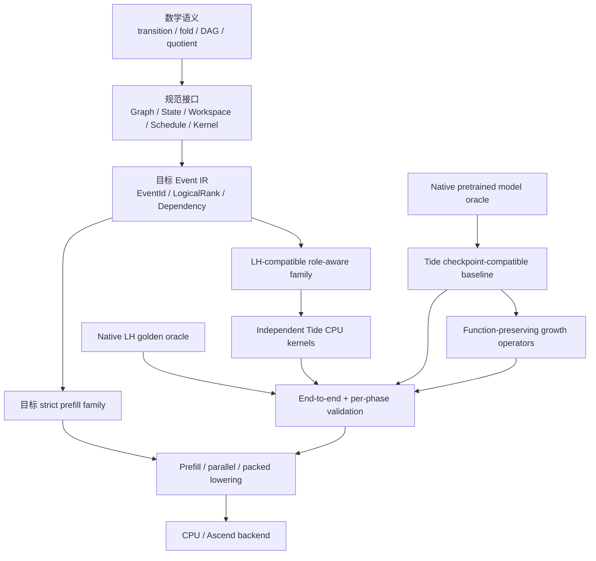
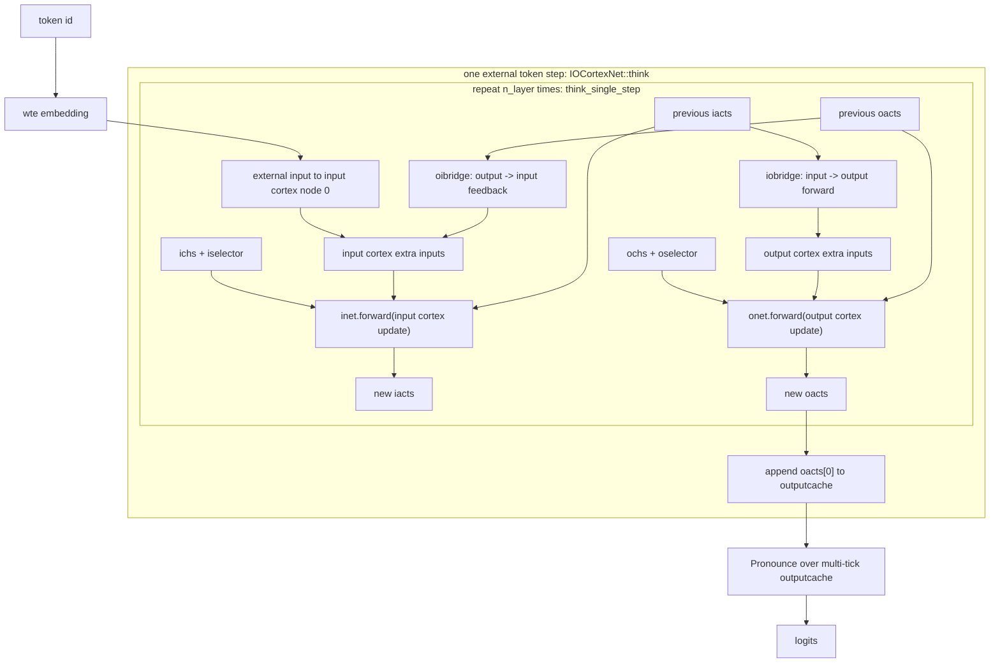
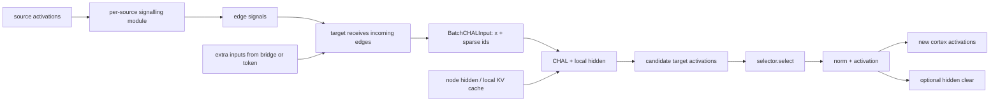

# Tide Runtime、验证与工程状态

> [!summary] 本页定位
> 本页统一保存三类工程信息：稳定的 runtime/StepTransition 实现契约、带日期的当前架构与数值验证快照，以及 LH/tide.old 的历史迁移记录。它同时规定 Graph 收缩线和 checkpoint 生长线共享的 state-dict、transition、artifact 与 backend 验证接口，但不假设两条模型路线最终汇合。数学定义和证明只以 [[tide-mathematical-foundations]] 为准；本页中的历史性能数字不构成当前性能承诺。

> [!important] 阅读顺序
> 第一部分回答“runtime 应实现什么”；第二部分回答“当前已经实现并验证了什么”；第三部分解释“这些接口为何从 LH 演化而来”。后两部分不得反向修改第一部分的规范含义。

## 第一部分：StepTransition 实现规范


> [!summary] 本页定位
> 本部分只处理 `StepTransition` 的规范性实现抽象、事件中间表示（Event IR）、LH 映射、阶段/读取/写入/提交约束、计算核替换路线与工程检查项。数学定义与证明见 [[tide-mathematical-foundations]]；`~/llm/tide` 当前完成度见本页第二部分。

> [!note] 中英文术语
> `token`、`prefill`、`decode`、`logits` 以及接口名、代码字段、固定缩写和模型专名保留英文，其余解释性正文优先使用中文。`token`、输入位置、空间节点、消息和事件实例是不同对象；实现字段必须能映射到数学 contract 中的对象。

> [!important] 实现对象不能代替数学对象
> `Graph` 中的 node/edge 是静态空间结构；`Event` 是某次执行中的动态事件实例；`Message` 是一次具体边上传输；`StateVersion` 是一次提交后的状态快照。`owner` 只是消息或局部输出记录的归属索引，不是 `EventId`、消息标识符或计算轨迹。实现接口可以压缩这些字段，但不能让同一个字段同时承担身份、逻辑时间、归属和来源四种职责。

本部分不是代码状态日志。这里的 `Graph / State / Workspace / Schedule / Kernel` 是稳定接口词汇；某个接口是否已经由当前 CPU、紧凑打包或 Ascend 后端实现，应以本页第二部分的带日期快照为准。

### 为什么需要实现规范

LH 带来了许多实现概念：

- `iacts / oacts`
- `ichs / ochs`
- `iselector / oselector`
- `internal tick`
- bridge phase
- readout cache
- pronounce memory
- selector count
- hidden / KV cache

这些对象对复刻 LH 很重要，但如果直接用它们做 `prefill / decode` 等价性证明，人类理解成本会很高，也容易被具体实现细节绑住。

实现规范的作用是把 LH 这类复杂系统压成几个稳定接口：

```text
StepTransition(Graph, Schedule, State, input_value)
  -> output_logits, State'
```

数学层只证明这些接口的语义。实现层负责说明如何把 LH、Tide kernel、packed/crossbatch 和 backend lowering 放入这些接口。

### 五个工程对象

#### 1. Graph

`Graph` 描述系统中有哪些节点、边、角色和 anchor。

它不应只是普通无类型图，而应是 role-aware graph：

- node 有 role。
- edge 有 role。
- 有 input anchor。
- 有 readout anchor。
- 可以有 input-side / output-side / bridge 等结构性标签。

#### 2. State

`State` 是相邻 `StepTransition` 调用之间传递的运行时状态容器。容器中的某些槽位可以在每步入口被无条件覆盖；只有旧值能够影响后续输入步语义的分量才称为持久上下文。

它可包含：

- node-visible activation value。
- node memory。
- selector / controller state。
- pronounce memory。
- local hidden / KV cache。

关键点是：`State` 容器会跨调用传递，但每个分量的生命周期必须单独声明。例如 KV/SSM state 默认是持久上下文，当前步 activation slot 可以由入口初始化逻辑覆盖。位置 $t+1$ 的输入只能读取参考语义允许可见的已提交状态版本。在最简单的 step-complete profile 中，这就是位置 $t$ 完整提交后的 `State`；固定周期重叠 profile 则必须按绝对逻辑时间和阶段判断可见性，不能只按 `token` 索引判断。

#### 3. Workspace

`Workspace` 是当前 step、内部轮次或阶段范围内的临时数据。

它可包含：

- 当前 internal tick 的 staged messages / extra inputs。
- 当前输入步的 readout cache。
- phase artifact。
- debug / golden-test artifact。

关键点是：`Workspace` 不等于持久 `State`。它的生命周期由 step 和 phase 规则决定。固定周期 streaming profile 中跨边界仍未消费的消息不能简单丢进会被清空的 `Workspace`；它们必须进入显式 continuation state 或具有等价生命周期的运行时队列。

#### 4. Schedule

`Schedule` 在 step-complete profile 中是一次输入步内按顺序执行的 phase 列表；在 fixed-period streaming profile 中则描述绝对逻辑轮次内的阶段次序。

每个 phase 必须声明：

- 读什么。
- 写什么。
- 是否修改持久 state。
- 什么时候 commit。
- 哪些结果只在 workspace 中可见。

phase 的核心不是 enum 名称，而是：

```text
barrier + visibility + commit order
```

固定 schedule 是最简单实例。未来 dynamic runtime 可以在线选择 phase-local events，但生成策略仍必须服从同一个 visibility、commit 与 logical-rank contract。

#### 5. Kernel

`Kernel` 是局部计算函数。

它只负责当前 phase 的局部 transition，例如：

- edge emit。
- message gather。
- node update。
- selector。
- readout。
- pronounce。

kernel 不应偷偷改变 phase 顺序、可见性或 commit timing。

### StepTransition 伪代码

一个 external input step 可写成：

```text
Step(input_value, State):
  Workspace = init_workspace(input_value, State)

  for internal_round in rounds:
    for phase in Schedule:
      view = read(State, Workspace, phase.read_scope)
      delta = Kernel_phase(view, phase.params)
      commit(State, Workspace, delta, phase.write_scope)

  logits, State = finalize(State, Workspace)
  return logits, State
```

实现时必须保证：

- `read` 不隐式扩大可见范围。
- `Kernel_phase` 不直接写全局状态。
- `commit` 是唯一改变持久 state 的入口。
- `Workspace` 的生命周期默认不跨 step-complete profile 的输入步。

上面的伪代码描述 fixed-round reference family。若内部轮次数或实际事件实例由选择器动态决定，还必须给出终止条件、事件预算或良基逻辑秩，不能把无限循环隐藏在 `rounds` 中。

该伪代码默认一个 `Step` 完成后才开始下一个输入位置。[[tide-mathematical-foundations#第二部分：显式 allocator 的一般空间 DAG|一般空间 DAG 窗口语义]] 允许按固定外部周期注入输入，并允许长路径消息跨边界延续；第三部分另给出可选 `owner/support/frontier` 证书。实现该 profile 时必须把绝对轮次、阶段、在途消息与状态提交轨迹纳入运行时契约，不能把输入位置或 `owner` 直接当成全局内部时间。

当前数学定理只对齐最后一个 readout 后继续 flush 的 closed finite execution；可直接接续 decode 的实现还必须定义 boundary cut，并把 cut 上的 node-state snapshots 与 in-flight messages 共同编码进 continuation state。

### Dynamic Event Contract

dynamic Tide 不要求从 input 到 output 的路径在运行前固定。规范对象应从“静态路径”提升为“运行时产生的有限 logical events”。

建议最小 Event IR 为：

```text
EventKey {
  kind
  location_kind       # external / spatial_node / spatial_edge / subgraph
  location_id
  logical_timestamp
  owner_support
  frontier
  semantic_tie
}

Event {
  id                  # deterministic stable identifier, not a thread-order counter
  key
  read_set
  write_set
  predecessors
  state_version
  visibility_scope
  commit_target
  kernel_kind
}
```

`EventId` 只标识一个具体事件实例。`owner_support` 表示该事件显式处理或标识的归属索引集合，`frontier` 表示输入前缀依赖上界；二者都不能替代事件标识符。配置 J/F 的一个事件可以同时具有多个 `owner`，所以 `EventId` 不能再以单个 `external_token` 字段充当事件身份。

#### Logical rank

逻辑时间戳和逻辑秩由语义 profile 决定。step-complete profile 可以取：

```text
StepTimestamp = (external_step, internal_round, phase_ordinal, microstep)
```

fixed-period streaming profile 可以取：

```text
StreamingTimestamp = (absolute_round, phase_ordinal, microstep)
```

若配置 O 在同一时间戳内按 `owner` 排序，则完整逻辑秩还要加入规范归属并列键；配置 J/F 的联合事件不拆成多个归属并列项：

```text
LogicalRank = (logical_timestamp, semantic_tie)
SerializationKey = (LogicalRank, EventId)
```

`owner` 和 `frontier` 是事件标签，不自动成为时间。只有参考语义明确使用 `owner` 打破同刻并列时，它才通过 `semantic_tie` 参与逻辑秩。`EventId` 只进入稳定序列化键，不能凭编号大小创造事件依赖；若同刻事件之间确有状态或控制依赖，该依赖必须由 `semantic_tie` 或更细逻辑子事件显式表达。

这里 `semantic_tie` 是语义 profile 为“同一逻辑时间戳内必须有序的事件”给出的确定性键；没有这种有序要求时取空值或统一常量。`SerializationKey` 只用于日志、测试比较和稳定存储，即使它把本来可并行的事件排成全序，也不能把这个存储次序误写成新的事件依赖。

逻辑秩使用良基字典序。运行时每次创建依赖时都必须满足：

```text
rank(predecessor) < rank(successor)
```

选择器可以在线决定路由记录和出站消息，从而决定未来哪些节点事件会在消息到达后实例化；它不创建或销毁静态空间节点。若选择器被细化成独立事件，它的控制依赖也必须进入 Event IR。strict core 不能创建同一逻辑秩内未声明的环。

#### Dependency completeness

Event IR 至少需要显式表达：

- consumed value 的 producer。
- state read 对应的 version。
- write/write 与 read/write conflict order。
- phase visibility 与 barrier。
- selector decision 对 future routing 的影响。
- output 与 persistent-state commit event。

若 implementation 删除一条 dependency，必须提供 independence、commutativity、non-aliasing 或 semantics-preserving quotient 证明。

#### Finite execution

有限 token 输入不自动保证有限执行。dynamic runtime 还必须满足至少一种：

- internal round 有静态上界。
- event budget 有运行时上界。
- event generation 有终止性证明。
- rank 除单调增加外还被有限 chunk domain 有界。

#### Zero-delay SCC policy

对同一 logical rank 的 dependency subgraph 做 SCC 检查：

1. singleton 且无 self-loop：普通 event。
2. cycle 跨越显式 token / round / state-version / delay boundary：在 dynamic unfolding 中属于不同 rank。
3. 同 rank zero-delay SCC：strict core 拒绝。

若未来确实需要 equilibrium / implicit computation，应把整个 SCC 显式声明为 `FixedPointKernel` 或 `RootSolveKernel`，并单独规定 fixed-point selection、termination、cost 与 differentiation contract。它不能作为普通 graph cycle 自动获得语义。

#### Kernel metadata lowering

logical time 是语义要求，但底层 kernel 不一定接收原始整数 tuple。合法 lowering 包括：

- causal mask。
- segment offset。
- packed row index。
- CSR / block-sparse layout。
- batch descriptor。
- 已验证的固定 schedule。

这些表示必须保留 kernel 所需的 logical partition、visibility 和 commit provenance。data pack 是物理布局优化，不是删除时间语义。

### LH 如何纳入

LH 的实现概念可以映射到这个规范模型，而不需要直接成为证明语言。

| LH 内容 | 实现规范中的位置 |
| --- | --- |
| `iacts / oacts` | `State.activation[node_id, namespace]`，node 带 input/output role。 |
| `ichs / ochs` | `State.memory[node_id, namespace]`。 |
| `iselector / oselector` | `State.controller[selector_scope]`。 |
| `input_extra / output_extra` | `Workspace.mailbox[node_id, namespace]`。 |
| `internal tick` | `internal_round`。 |
| `OiBridge / IoBridge` | edge-message phase，读一组 role nodes，写另一组 mailbox。 |
| `ExternalInput` | input injection phase，只在指定 round 写 input anchor mailbox。 |
| `InputUpdate / OutputUpdate` | node-update phase，读 activation + mailbox + memory + selector，写 activation / memory / selector。 |
| `ReadoutCache` | 当前 token 的 workspace accumulator。 |
| `Pronounce` | final readout kernel，读 workspace output cache，改 pronounce memory，输出 logits。 |

因此，LH 可被理解为一个较复杂的 `StepTransition` 实例，而不是 `StepTransition` 本身。

### LH-like phase schedule

当前 LH-like external input step 可拆成：

```text
for tick in internal_ticks:
  oibridge
  external_input  # only selected tick, usually tick 0
  iobridge
  input_cortex_update
  output_cortex_update
  readout_cache
pronounce
```

更明确的 read/write/commit 约束是：

```text
phase oibridge:
  read:
    - state.oacts@tick_start
  write:
    - workspace.input_extra@staged
  commit:
    - visible_to.input_cortex_update

phase external_input:
  condition:
    - only selected internal tick of the external input step
  read:
    - token embedding
  write:
    - workspace.input_extra[input_anchor]@staged
  commit:
    - visible_to.input_cortex_update

phase iobridge:
  read:
    - state.iacts@tick_start
  write:
    - workspace.output_extra@staged
  commit:
    - visible_to.output_cortex_update

phase input_cortex_update:
  read:
    - state.iacts@tick_start
    - workspace.input_extra@committed
    - state.ichs
    - state.iselector
  write:
    - state.iacts@next
    - state.ichs@updated
    - state.iselector@updated
  side_effects:
    - hidden decay / update
    - selector affectcount / selectcount update
    - optional hidden clear after selector accepts the node-update candidate
  commit:
    - end_of_phase

phase output_cortex_update:
  read:
    - state.oacts@tick_start
    - workspace.output_extra@committed
    - state.ochs
    - state.oselector
  write:
    - state.oacts@next
    - state.ochs@updated
    - state.oselector@updated
  side_effects:
    - hidden decay / update
    - selector affectcount / selectcount update
    - optional hidden clear after selector accepts the node-update candidate
  commit:
    - end_of_phase

phase readout_cache:
  read:
    - state.oacts@next[readout_anchor]
  write:
    - workspace.output_cache.append
  commit:
    - step-local only

phase pronounce:
  read:
    - workspace.output_cache
    - state.pronounce_memory
  write:
    - logits
    - state.pronounce_memory@updated
```

这里最容易出错的点是：`iobridge` 在当前 LH 语义中读取 tick start 时的旧 `iacts`，不是 `input_cortex_update` 后的新 `iacts`。如果统一 graph runtime 没有这个 read view 约束，就会改变 LH 语义。

### 两类 runtime support family

这里的两类 family 是 runtime 需要承载的 reference family，不是 [[README#两条战略路线|两条模型设计路线]]：

- LH compatibility family 负责提取复杂机制、提供 golden oracle、暴露 state/phase/selector 问题。
- strict prefill family 负责建立最小、可理解、可证明、可高性能实现的数学与 runtime 核心。

总体目标是“局部通信 + 超稀疏”，不是逐行复刻 LH。若某个 LH 机制无法满足或严重阻碍 model-level prefill、序列并行与 non-degenerate chunk certificate，可以简化、替换或留在 non-strict compatibility family。

#### Family L：LH 机制提取与 compatibility

目标：

```text
Typed Graph
+ StateStore
+ Workspace
+ PhaseSchedule
+ KernelRegistry
```

这个 family 保留 LH 的 phase、selector、readout、pronounce 和 memory 语义。

优势：

- 可复刻 LH。
- 可对齐 native LH。
- 可用现有工程作为 golden reference。

代价：

- 抽象较复杂。
- 需要显式 state scope、selector scope、workspace lifetime。
- 证明不能只靠普通 graph，需要依赖 phase schedule 与 state contract。

#### Family S：strict prefill core

目标：

```text
for round:
  messages = EdgeKernel(Graph, State)
  State.nodes = NodeUpdate(messages, State.nodes)
logits = Readout(State)
```

这个 family 选择更简单的通用 graph recurrent runtime，并承担当前数学与 model-level prefill 主线。

优势：

- 更容易解释。
- 更容易定义严格的顺序 fold 语义。
- 更可能成为后续可训练性实验的最小核心。

代价：

- 不一定能完整复刻 LH。
- 可能丢掉 LH 中某些为局部通信、超稀疏、selector 历史设计的机制。
- 需要重新验证其表达力、训练稳定性与性能价值。

### B0-B6 工程推进梯度

`EventId / LogicalRank / Dependency / StateVersion / CommitEvent` 是贯穿 B0-B6 的 cross-cutting execution contract，不是额外的 B7 机制。static executor 可以预先生成 events；dynamic executor 在线生成同一种 Event IR。

当前 B0 已经吸收旧版 B1 的 factorized node state：visible activation 与 private memory/cache/state 从基线开始就同时存在。因此 Transformer KV cache、Mamba/SSM recurrent state、Linear Attention accumulator 都属于 B0 的正常表达能力，不应被当作后续层级的新增机制。

B0 的工程门槛也要随之提高：不能只实现一个能容纳这些模型的 graph runtime，还要先给主力 kernel family 建立 chunk prefill proof gate。最低限度包括：

第一层是一般 correctness gate：把 decode fold 展开成 logical event DAG，确认 chunk implementation 计算的是同一个 DAG、同一组 kernel equation、同一个 output/final-state extraction。这个 gate 只证明 `C_L = Fold_T^L`，不自动给出高性能。

对 LH-like 图运行时，事件键至少应能表达：

```text
(kind, location, logical_timestamp, owner_support, frontier, semantic_tie)
```

物理执行可以乱序，`owner` 较大的消息也可以在墙钟时间上先完成；但消息必须带独立标识符、`owner`、逻辑轮次、阶段等元数据，空间节点计算核必须按逻辑时间戳做分桶、排序、掩码或缓冲。若节点内把不同 `owner` 或逻辑轮次的消息做不可逆、无时间标签聚合，输入影响关系会被折叠，通常无法证明 chunk prefill correctness。

第二层才是 kernel family 的高性能见证：

| Kernel family | Reference transition | Chunk implementation | 高性能见证 |
| --- | --- | --- | --- |
| FFN / norm / residual | token-wise update | batched map over sequence | vectorized / fused elementwise kernel |
| Causal attention | append KV cache, read causal prefix | batched QKV + causal mask / prefix read | matmul / FlashAttention-style fused attention |
| Linear attention | prefix accumulator update | prefix sum / associative scan | scan / fused scan |
| Mamba / SSM | affine recurrent state update | parallel prefix / chunk scan | scan / chunk scan kernel |

只有这些 B0 kernel family 的 `C_L = Fold_T^L` 先成立，后续 B1-B6 的推进才是在可靠基线之上检查新增机制是否保持或破坏等价性。

数学文档中已把 correctness 与 performance proof gate 收束为以下结果和证书：

- `Unified Contract-DAG-Quotient Theorem`：统一 reference contract abstraction、logical event DAG 与 event-level quotient。
- `B0 Logical Event DAG Theorem`：若 chunk implementation 保持同一个 logical event DAG，则 correctness 成立。
- `Aggregation Quotient Theorem`：若聚合丢失 provenance，则必须证明该聚合是所有后续 kernel 与 final-state extraction 的 semantics-preserving quotient。
- `Non-Degenerate Chunk Certificate`：排除单事件顶点 oracle，要求 uniform primitives、explicit lowering 与完整 cost ledger。
- `B0-Transformer Theorem`：由 token-wise kernels、causal attention、有限 layer-wise chain 组合得到 Transformer chunk prefill correctness。
- `B0-Mamba / SSM Theorem`：由 token-wise kernels、causal convolution 的 shift-register recurrence、selective SSM 的 affine scan recurrence、有限 layer-wise chain 组合得到 Mamba / SSM chunk prefill correctness。

| 层级 | 新增机制 | 实现重点 | prefill 风险 |
| --- | --- | --- | --- |
| B0 | standard factorized graph runtime | visible activation + private memory/cache/state；覆盖 Transformer KV cache、Mamba/SSM state、linear-attention accumulator；chain graph + rounds 表达标准 block stack | 只定义顺序 fold，不自动得到 chunk prefill；cache append / recurrent update 仍需 chunk 等价证明。 |
| B1 | typed edge / mailbox | edge role + step-local mailbox | mailbox 必须 step-local / round-local。 |
| B2 | runtime phase schedule | input/output/bridge/readout 等大范围阶段的 read/write/commit contract | 不可跨 phase 改 role / direction / barrier / visibility。 |
| B3 | selector / controller state | selector 作为控制面状态 | selector 不能基于未来 token 联合决策。 |
| B4 | readout cache | step-local cache lifecycle | readout cache 不能跨输入步泄漏。 |
| B5 | pronounce memory | final readout recurrence | 可能需要 scan / checkpoint / sequential update。 |
| B6 | LH-like input/output roles and bridges | role-aware graph + state namespace | 必须保留 role、scope、phase read-write contract。 |

### Kernel 替换规则

优化 kernel、packed kernel、crossbatch kernel 或 backend lowering 时，必须逐 phase 保持：

- read scope。
- write target。
- commit timing。
- workspace lifetime。
- persistent state equivalence。
- output equivalence。

建议替换顺序：

1. bridge kernel。
2. message gather / mailbox layout。
3. node candidate hidden-value computation。
4. selector。
5. local hidden / KV cache update。
6. readout cache。
7. pronounce。
8. packed / crossbatch fusion。
9. backend lowering。

每替换一层，都应做 phase artifact 对齐，而不是只看最终 logits。

### Golden Test 要求

最低限度应有三类测试：

```text
same initial state
same input tokens
same parameters
```

比较：

- final logits。
- final persistent state。
- phase event order。
- per-phase read artifact。
- per-phase delta artifact。
- per-phase committed state。
- workspace lifecycle。

如果浮点执行顺序不同，logits 可用预声明容差；但 state artifact 的语义等价必须明确。

### 当前建议

短期应保持五类工作协同：

1. 用数学规范定义 transition、fold、chunk correctness 与 simulation。
2. 用 Event IR 与实现规范约束 logical rank、dependency、graph/state/workspace/phase/kernel 边界。
3. 工程上保留 native LH golden path，并用独立 Tide CPU path 做 translation-validation-style 对齐。
4. 建立 native pretrained model 到 Tide baseline、再到中性扩展模型的 checkpoint golden path。
5. 用更简单的 strict transition family 建立 model-level prefill，再分别检验哪些结果能推广到 LH-like mechanisms 和 checkpoint-derived branches。

五类工作都由各自 reference contract 下的 `prefill / decode` 等价性反过来裁决 graph、state、schedule 与 kernel 设计；它们共享验证接口，但不要求两条模型路线最终统一。

第一批最小可检查对象：

```text
StepTransition Math Spec
Event IR / LogicalRank Spec
StateStore Spec
Workspace Lifetime Spec
Phase Read/Write Scope Spec
Kernel Equivalence Spec
Backend-Neutral State-Dict Mapping Spec
Function-Preserving Growth Equality Test
Prefill = Decode Fold Test
Chunk Prefill Correctness Test
```

只有这些对象被明确下来，后续讨论“是否支持 prefill”、“是否可 sequence-parallel”、“是否可 packed / crossbatch fusion”才不会被 LH 的具体实现细节淹没。

---

## 第二部分：当前架构与验证快照


> [!summary] 本页定位
> 本部分是 `~/llm/tide` 的动态工程快照，不定义数学语义。数学 contract 见 [[tide-mathematical-foundations]]，规范性实现接口见本页第一部分。

### 快照边界

本页基于 2026-07-10 的本机代码状态，代码基线至少包含：

```text
79bb9ec Add selector artifacts and CPU stress benchmark
```

当前 `~/llm/tide` 已经不是单纯的 LH native wrapper，也不是完整通用 TIDE。最准确的定位是：

> 一套由 Tide 自己的 role-aware graph、phase schedule、state/workspace contract 与独立 CPU kernels 承载的 LH-compatible reference runtime；native LH 继续作为 golden oracle。

### 一页版

已经完成：

- `RoleAwareGraphSpec` 承载 input/output cortex、bridge、anchor、hierarchy、node role 与 edge role。
- `ExecutionPhaseSpec` 明确 phase 的 read view、write target、commit policy 与 side-effect boundary。
- `LhPhaseWorkspace` 表达 step-local staged messages 与 multi-tick readout cache。
- `LhRuntimeState` 表达跨输入步保存的数值 activation values、local memories、selectors、pronounce memory 与 phase events；这里的 activation 是张量状态，不是事件实例化。
- native LH whole `think()`、Tide schedule 驱动的 native phase path、独立 Tide CPU path 已形成可比较的三层 reference chain。
- 独立 Tide CPU kernels 在当前覆盖配置上与 native LH end-to-end logits 对齐。
- message/hidden-level phase artifacts 与 selector count artifacts 已逐 phase 对齐；历史测试接口中的 `signal` 指数值张量，不表示计算轨迹。
- attention/add hidden families、主要 cache modes、norm families 与 heterogeneous cortex configuration 已有覆盖测试。
- 已有 CPU stress benchmark，并限制最多 160 核、800 GB address-space budget。

尚未完成：

- 原生预训练 Transformer/Mamba 到 Tide baseline 的 100% parameter mapping、logits、cache/state 和训练梯度验证链。
- 零 residual、clone-and-split 与递归固定 merge 等 checkpoint growth operator 的实现和 equality report。
- strict model-level `prefill()` API 与 `prefill = decode fold` 证明。
- 通用 `EventId / LogicalRank / Dependency / StateVersion / CommitEvent` IR、dynamic event generation 与 causality verifier。
- zero-delay SCC detection，以及可选 implicit/fixed-point kernel contract。
- memory-state 级 per-phase artifact equality。
- 通用 backend-neutral state-dict / parameter mapping API。
- 独立的通用 parallel executor、完整 packed/crossbatch performance lowering。
- Ascend/NPU execution、graph-node affinity 与 multi-device runtime。
- 训练可行性、scaling 与一般 graph 性能优势验证。

### LH 的工程与研究边界

当前 native LH parity 的作用是固定一个复杂 reference family，并验证 Tide 的 graph/phase/state 抽象。它不意味着后续数学或实现必须完整保留 LH 的所有机制。

LH 中的 hierarchy、bridge、selector、local hidden、multi-tick readout 等内容应被视为 mechanism pool。每个机制后续都可以进入三种去向：

1. 保留，并证明它满足 strict chunk-prefill contract。
2. 修改为 tagged、可分解、可 scan 或可验证的等价版本。
3. 若它阻碍 prefill/sequence parallel 且没有独立价值，则留在 compatibility family 或直接移除。

工程优先级由总体目标裁决：局部通信、超稀疏、可训练性与高效序列执行高于完整 LH compatibility。

### 架构分层



这套分层刻意把下列对象分开：

- 数学文档规定什么叫正确。
- strict prefill family 是 model-level prefill 与序列并行的目标主线，当前尚未形成完整实现。
- LH-compatible family 提供一个复杂但具体的 reference transition。
- checkpoint-compatible baseline 提供成熟预训练模型的第二条 golden chain；当前尚未实现。
- growth operator 只在指定中性参数点要求函数保持，继续训练或结构变异后必须建立新的模型 contract。
- Event IR 是下一层目标接口，当前代码尚未完整实现；图中出现它不表示完成状态。
- Tide CPU / packed / Ascend 只是该语义的不同实现或 lowering。

### 核心对象

| 对象 | 当前职责 | 不应承担的职责 |
| --- | --- | --- |
| `RoleAwareGraphSpec` | 静态 node/edge role、anchor、hierarchy 与 CSR topology | 不决定 phase visibility 或 commit order |
| `ExecutionPhaseSpec` | active roles、read view、write target、commit policy、side effects | 不实现数值 kernel |
| `LhPhaseWorkspace` | step-local input/output extras、output cache、phase artifacts | 默认不跨输入步持久化 |
| `LhRuntimeState` | 数值 activation values、local hidden/cache、selector、pronounce、step/tick coordinates | 不隐藏 workspace lifecycle；activation value 不等于事件实例化 |
| `EdgeSet` / `CortexRuntime` | bridge、affected、cortex update | 不改变 schedule |
| `LocalChal` / `LocalAttention` / `LocalAdd` | node-local numerical transition | 不偷偷扩大 read scope |
| `LhNativeBackend` | native LH golden oracle 与 phase-driven reference path | 不是最终 Tide backend |

### 目标 Event IR 缺口

当前 Tide 已有 fixed LH-like phase schedule、step/tick coordinates 与 phase event log，但还没有独立于 LH family 的通用 dynamic event runtime。

| 目标对象 | 当前可复用基础 | 尚缺内容 |
| --- | --- | --- |
| `EventId` | external step、internal tick、phase、node/edge role 可作为现有字段来源 | 稳定的跨 family 实例标识；不能把单个 `token`/`owner` 同时当作事件身份与逻辑时间 |
| `LogicalRank` | 固定 LH phase order | profile-specific logical timestamp、semantic tie、良基 rank 与在线校验 |
| `Dependency` | phase read/write contract、CSR topology | value/state/control/commit dependency 的显式边 |
| `StateVersion` | `LhRuntimeState` 与 phase read view | backend-neutral version identity 与 conflict relation |
| `CommitEvent` | `ExecutionPhaseSpec.commit_policy` | 可被 chunk lowering 和 validator 共同引用的事件对象 |
| `CausalityVerifier` | phase artifact tests | finite-run、rank monotonicity 与 zero-delay SCC 检查 |

因此，当前 role-aware runtime 可以作为 Event IR 的复杂输入样本，但不能被描述为已经完成 dynamic DAG executor。

### LH Phase Contract

一个 external input step 的当前 reference order 是：

```text
for internal_tick:
  oibridge
  external_input    # only tick 0
  iobridge
  input_update
  output_update
  readout_cache
pronounce
```

顺序本身还不够。每个 phase 还固定：

- 读取 tick-start 还是 phase-updated state。
- 写入 workspace 还是 persistent state。
- 写入何时对后续 phase 可见。
- hidden decay、KV append、selector count、clear-after-selector-accept 等 side effects。

因此当前最重要的架构结论仍然是：

> 物理上可以是一张 role-aware graph；语义上必须保留 multi-phase runtime、独立 state namespaces、selector control state、hidden lifecycle 与 commit policy。

### 对齐矩阵

| 层级 | 当前状态 | 证据边界 |
| --- | --- | --- |
| Graph hierarchy / CSR | 已对齐 | LH 与 Tide loader 比较 hierarchy、`indptr / indices / edge_ids` |
| Phase contract | 已对齐 | phase order、read view、write target、commit policy、side effects |
| Native whole vs native phase-driven | 已对齐 | 连续 token logits 与 phase event equality |
| Independent Tide whole model | 已对齐于当前覆盖配置 | 独立 Tide CPU kernels 对 native LH end-to-end logits |
| Per-phase message/hidden artifacts | 已对齐 | input/output extras、数值 activations、output cache；历史测试名中的 signal 不表示独立计算轨迹 |
| Selector artifacts | 已覆盖 count state | `affectcount / selectcount`；并非宣称所有未来 tie-breaking 均已证明 |
| Memory-state artifacts | 未完整覆盖 | hidden/KV memory 尚未进入完整 per-phase artifact report |
| Hidden/cache modes | 已有组件级覆盖 | `CROSSBATCH / LOOP / PACKED / CACHEDMATMUL / CACHEDPACKED / CACHEDATTENTION` |
| Add hidden / norm / heterogeneous config | 已覆盖 | TensorHidden、RMSNorm、LayerNorm、Identity、mixed CHAL bands |
| Strict chunk prefill | 未完成 | 当前模型入口仍是 decode-style `think()` |
| Native checkpoint baseline | 未完成 | 尚无预训练 Transformer/Mamba 到 Tide 的完整 parameter/state/gradient equality chain |
| Checkpoint growth | 未完成 | 尚未实现函数保持分支、递归 merge 与结构变异谱系记录 |
| Ascend/NPU | 未实现 | 目前只有 adaptation/lowering 调查与设计 |

### Golden Reference Chain

当前验证链可以写成：

```text
native LH whole think
  == Tide schedule + native LH phase kernels
  == captured native phase artifacts
  == independent Tide CPU kernels
```

这条链证明的是当前覆盖 family 下的实现语义与数值对齐。它没有自动证明：

- 一般 graph 的 chunk prefill correctness。
- 训练时反向传播等价。
- 浮点重排后的所有 backend 都等价。
- 当前 LH transition 本身具有理想的可训练性或高性能 prefill 结构。

Checkpoint 生长线需要建立另一条彼此独立的目标验证链：

```text
native pretrained model
  == Tide baseline with 100% parameter mapping
  == Tide baseline prefill/decode artifacts
  == neutral expanded model at its function-preserving point
```

这条目标链中的等号应分层报告：

1. state-dict key、shape、dtype、tied-weight 与参数值映射。
2. embedding、每层 residual、Attention、FFN 和最终 logits。
3. KV/SSM state、position/RoPE 输入和 continuation state。
4. prefill、逐 token decode 与不同 chunk 切分的 artifact。
5. 训练模式 loss 与主要参数梯度。

函数保持 growth operator 只需在声明的中性参数 $\phi_0$ 上满足该链。继续训练后，验证目标改为新模型自身的 `prefill = decode`、训练稳定性和 matched-baseline 质量，而不是继续与旧 checkpoint 输出相等。若后续删除旧节点或改变 state layout，则必须登记为新的 checkpoint-derived model version，并提供参数迁移函数和独立 golden artifacts。

### CPU Mode 与性能状态

当前 CPU path 已覆盖主要 LH hidden/cache mode，并提供：

```text
tide_lh_cpu_stress
scripts/run_cpu_stress_matrix.sh
```

benchmark 可比较 native LH 与 independent Tide 的 forward/backward、batch、sequence length 与线程数。解释时必须保持同 graph、config、参数、mode、batch、length 与 thread budget。

当前 benchmark 的意义是发现性能瓶颈和回归，不是证明 sequence-parallel prefill。调用端循环多个 `think()` 仍然只是 decode fold。

### 与数学主线的接口

当前工程 runtime 提供一个具体 reference transition：

```text
Step(input_token, State) -> logits, State'
```

数学主线接下来需要回答：

1. 这个 transition 的 reference semantic contract 到底保留哪些 state 与 provenance？
2. 哪些 LH/Tide kernel 可证明具有 chunk implementation？
3. 哪些跨 token / round 聚合是 semantics-preserving quotient？
4. 哪些 phase、selector、readout、pronounce 机制必须顺序执行，哪些可以 scan、batch 或 reorder？
5. 如何从 decode-style runtime 得到第一版真实 model-level `prefill()`？
6. 如何把 fixed phase log 提升为 dependency-complete Event IR，并保证 dynamic selector 只生成良基有限 execution？

### 当前下一步

建议把工作拆成两个可并行但共享验证接口的顺序链。

Graph/LH support chain：

1. 保持 native LH 为 golden oracle，补 memory-state per-phase artifacts。
2. 从现有 phase event log 提取最小 `EventId / LogicalRank / StateVersion / CommitEvent` schema，并先支持 fixed schedule。
3. 以 [[tide-mathematical-foundations#第一部分：StepTransition、kernel 与 logical event DAG|数学基础第一部分]] 的 B0 contract 为基准定义 model-level `prefill()` 输入、输出与 state contract。
4. 实现并验证 token-wise map、causal attention、affine scan 的 chunk paths。

Checkpoint growth chain：

1. 选择一个 pre-norm decoder-only 原生 checkpoint 和对应实现作为 oracle。
2. 先完成 backend-neutral parameter/state mapping 与 Tide baseline equality，不加入任何分支。
3. 实现单个零 residual growth operator，并按 [[tide-mathematical-foundations#定理 E.2：单步精确状态嵌入推出任意长度 fold 等价|定理 E.2]] 检查连续序列和最终状态。
4. 再实现 clone-and-split、平铺兄弟分支、共享 token-local selector 和两层递归固定 merge。
5. 只有兼容阶段的消融稳定后，才实现节点删除、合并或 kernel 替换，并为后代模型建立独立 contract。

两条 chain 共同需要：为每条 chunk path 给出 non-degenerate certificate 与 work/span/memory/communication ledger，再增加 dynamic event generation、parallel executor、batch memory、packed selector 与 crossbatch fusion；CPU semantic gate 稳定后再做 Ascend lowering。

工程判断应始终保持：

> 后端优化可以改变 layout、物理执行顺序和 kernel fusion，但不能反过来定义 reference semantics。

---

## 第三部分：LH 与 tide.old 历史上下文


> [!warning] 阅读边界
> 本部分保存从 `lh`、`tide.old` 到 StepTransition 抽象的早期推演，其中大量“当前状态”“尚未完成”描述对应较早工程阶段，已经被后续实现超越。当前数学规范见 [[tide-mathematical-foundations]]，当前实现规范见本页第一部分，当前代码完成度见本页第二部分。本部分只用于追溯设计来源，不再作为当前计划或验收依据。
> 本部分中的 `signal`、`active node`、`token id`、轨迹等历史用语不覆盖当前对象定义；阅读时必须分别映射到输入位置、空间节点、消息、事件实例和发送激活，不能把历史命名直接带入新定理。

### 定位

这份历史备忘记录对 `~/llm/lh` 与 `~/llm/tide.old` 的初步审视结论，以及 StepTransition 抽象形成前的推演过程。

当前不把这里的结论视为最终架构方案。更准确地说：

- ObsidianVault 中已有内容提供 TIDE 的原始历史动机。
- `~/llm/lh` 提供实现层动机和关键语义参考。
- `~/llm/tide.old` 提供一轮已经推进过的 runtime 架构尝试。
- 最终哪些对象应留下、如何设计，应由 `prefill / decode` 等价性研究反过来裁决。

#### 阅读地图

| 内容 | 现在如何使用 |
| --- | --- |
| LH C++ Connectome、双 cortex、bridge、selector、local hidden 解读 | 继续作为机制来源与语义背景 |
| 当时的 Tide C++ 对齐记录 | 只用于理解架构演进；当前完成度以本页第二部分为准 |
| `tide.old` strict / non-strict family 与 runtime 对象 | 作为设计候选，不直接继承 |
| 当时的必要条件、未解决问题与下一步 | 历史问题清单；其中部分已被数学规范和 finite logical event DAG 讨论取代 |

特别是“有环图是否进入第一阶段”的旧判断，后来已经细化为：static graph 可以有环，但每次对有限 chunk 的终止 strict execution 应能展开为 dependency-complete logical event DAG；详见 [[tide-mathematical-foundations#第四部分：有限事件展开与 zero-delay 边界|有限事件与 zero-delay 边界]]。

### 总体判断

TIDE 不应被重写成 `lh` 的 C++ 复刻，而应被视为一个统一的 graph-state token runtime。

`lh` 的价值在于提供原始语义：

- 分层局部图。
- input / output cortex。
- input-to-output 与 output-to-input bridge。
- bridge phase。
- selector。
- local hidden / local KV hidden 生命周期。
- 多 internal tick 的 readout。

`tide.old` 的价值在于提供 runtime 抽象：

- `GraphSpec`。
- `NodeSpec` / `EdgeSpec`。
- `ClockContext`。
- `ExecutionPlan` / `EmissionPlan`。
- `GraphState`。
- `NodeKernel`。
- `CommitPolicy`。
- `FamilyConfig` / family builder。
- strict / non-strict family contract。

后续重写应提炼两者，而不是继承任一边的完整实现。

### `lh` 提供的实现层动机

在这轮调查时，`~/llm/lh` 应以 C++ Connectome 为主线理解。Python / PyConnectome 是更早期的原型版，适合回看原始建模动机；C++ Connectome 是当时已经推进到 runtime、batch hidden、selector 和局部 KV cache 的主要实现。

关键文件包括：

- `~/llm/lh/Connectome/cpp/include/CortexNet.h`
- `~/llm/lh/Connectome/cpp/src/CortexNet.cpp`
- `~/llm/lh/Connectome/cpp/include/AccumulateLocal.h`
- `~/llm/lh/Connectome/cpp/src/AccumulateLocal.cpp`
- `~/llm/lh/Connectome/cpp/include/BatchHidden.h`
- `~/llm/lh/Connectome/cpp/include/Hidden.h`
- `~/llm/lh/Connectome/cpp/include/Selector.h`
- `~/llm/lh/Connectome/cpp/src/Selector.cpp`
- `~/llm/lh/Connectome/cpp/include/GraphConfig.h`
- `~/llm/lh/Connectome/cpp/src/GraphConfig.cpp`
- `~/llm/lh/Connectome/cpp/include/Adjacency.h`
- `~/llm/lh/Connectome/cpp/src/Adjacency.cpp`
- `~/llm/lh/PyConnectome/Graph.py`
- `~/llm/lh/PyConnectome/Model.py`
- `~/llm/lh/PyConnectome/CortexNet.py`
- `~/llm/lh/PyConnectome/AccumulateLocal.py`
- `~/llm/lh/train.py`

#### C++ Connectome 的总体工作方式

`lh` C++ Connectome 不是一张普通图上的同质 message passing。更准确地说，它是一个 role-aware 的双 cortex 稀疏递归运行时：

- `GraphConfig` 定义层级节点集合，包括 `levelptr`、`hpnums`、`base_num`、`localnum`。
- `GraphData` 加载四张有向 CSR 图：`inputA`、`outputA`、`ioA`、`oiA`。
- `inputA` 与 `outputA` 分别服务 input cortex 与 output cortex。
- `ioA` 是 input-to-output bridge，`oiA` 是 output-to-input bridge。
- input / output 两套 cortex 有各自的 activations、hidden、selector 与更新路径。
- bridge 不只是边类型，而是有执行相位和方向的 runtime 对象。

一个 external token step 中，`IOCortexNet::think` 会把 token embedding 注入 input cortex 的 0 号节点，然后运行 `n_layer` 次 internal tick。每个 tick 调用 `think_single_step`，并缓存每次 output cortex 的 `oacts[0]`，最后由 `Pronounce` 汇聚这些 tick cache 得到 logits。



#### 单个 Cortex 的传播与更新

`BaseCortexNet` 提供通用有向传播骨架：

1. 每个 source node 用自己的 signalling module 生成出边信号。
2. 每条边携带一个 `BatchSignals`。
3. target node 收集入边信号与 optional extra input。
4. 收集结果打包为 `BatchCHALInput`，其中 `x` 是非空信号矩阵，`ids` 是 batch-by-local-input 的稀疏 CSR 索引。

`IntraCortexNet` 在这个传播骨架上做节点更新：

1. `affected()` 得到每个 target node 的 `BatchCHALInput`。
2. 每个 target node 用自己的 CHAL 结合局部输入与 hidden。
3. `selector.select()` 决定保留哪些激活。
4. 被保留的激活经过 norm 与 activation。
5. 如果打开 `clear_after_activation`，被激活样本对应的 hidden 会被清理。



#### CHAL 与局部记忆

`AccumulateLocal` 是节点局部更新的核心。当时主要有两类 hidden：

- `TensorHidden`：add 型累积状态。
- `KVHidden`：attention 型局部 KV cache。

`Attention` 型 CHAL 的语义是：

1. 对本轮局部输入生成 Q/K/V。
2. 将 K/V append 到该节点自己的 `KVHidden`。
3. 用 Q attend 该节点的局部历史 KV。
4. 通过 confluence 把局部输入维度压回一个输出向量。
5. 再经过 projection 输出节点激活。

这说明 `lh` 的 memory 不是全局 KV cache，而是每个节点自己维护局部历史。这个生命周期是架构语义的一部分，不应在 TIDE 中退化为普通 tensor buffer。

#### Selector 的层级局部语义

`NaiveSelector` 不是一个通用 top-k 层，而是显式依赖 `GraphConfig` 的层级和局部组：

- `s` 之前的 hub 节点，只要被影响就保留激活。
- 底层节点按 `base_num` 个 base hub 分组。
- 每个局部组包含 `localnum` 个 point；如果 `with_lead_point=true`，还包含一个 lead point。
- 每个局部组按 `selectnum` 保留少量激活。
- 选择优先级结合了 `selectcount`、`affectcount`、signal norm 和 index tie-break。

因此 selector 本身带有运行时历史，影响后续激活路径。它不是可以随意藏进 node kernel 的纯函数；TIDE 如果要承载 LH role-aware 语义，必须把 selector 作为 runtime 控制面的一部分。

#### Role-aware 的准确含义

这里的 role-aware 不只是节点或边带标签，而是 runtime 必须显式保留以下角色与相位：

- `input cortex` 与 `output cortex` 是两套状态空间，不是一张普通图的两个区域。
- `inputA`、`outputA`、`ioA`、`oiA` 不是同质边集合。
- `oibridge` 与 `iobridge` 有方向，也有调用顺序。
- token embedding 只作为 external input 注入 input cortex 的 0 号节点。
- readout 只读取 output cortex 的指定输出状态，并且当时实现读的是多 internal tick 的 `oacts[0]` cache。
- hub、lead point、local point 的层级角色会影响 selector。
- hidden 的 decay、clear、append、cache layout 与 selector history 一起构成运行时状态。

如果后续 TIDE 把这些内容 flatten 成“一张图 + 同质节点 + 同质边 + 一个普通消息传递循环”，就会丢掉这轮调查认为 `lh` 最重要的结构语义。TIDE 的目标不应是复刻 C++ Connectome 的类型体系，而应抽象出足以承载这些角色、相位和生命周期的 runtime contract。

#### 复刻 C++ Connectome 的抽象边界

可以把 `input cortex`、`output cortex` 与 bridge 合并为一张统一 graph，但这张 graph 不能是普通同质 graph。更稳的抽象是：

```text
RoleAwareGraphSpec
  = typed nodes
  + typed edges
  + typed state slots
  + phase-aware execution plan
```

其中 role-aware 可以同时作用于 node 与 edge。

Node role 至少应能表达：

- `cortex = input | output`
- `local_id`
- `level / hub / lead_point / local_point`
- `input_anchor = node 0`
- `readout_anchor = output node 0`
- `chal_config = input_chal | output_chal`
- `state_namespace = ichs | ochs`
- `selector_namespace = iselector | oselector`

Edge role 至少应能表达：

- `input_intra`
- `output_intra`
- `io_bridge`
- `oi_bridge`
- `external_input`
- `readout`

但 node / edge 标签只表达静态结构，不足以完整复刻行为。完整语义还需要 phase-aware execution，也就是每个 phase 明确：

- 本阶段运行哪些 role 的 node / edge / module。
- 本阶段读取哪个时刻的状态。
- 本阶段写入哪里。
- 写入结果对哪些后续阶段可见。
- 本阶段允许哪些 side effects，例如 hidden decay、KV append、selector count update、hidden clear。

因此，`phase` 的核心不是 enum 标签，而是：

```text
barrier + visibility + commit order
```

一个更接近 TIDE 的抽象可以写成：

```text
ExecutionPhaseSpec {
  role_filter
  read_view
  write_target
  commit_policy
  side_effect_policy
}
```

对应到当时的 C++ Connectome，一个 internal tick 的语义可近似表达为：

```text
old iacts, old oacts
old ichs, old ochs
old iselector, old oselector

phase oibridge:
  read:
    - state.oacts@tick_start
  write:
    - inbox.input_extra@staged
  commit:
    - visible_to.input_cortex_update

phase external_input:
  condition:
    - only first internal tick of the external token step
  read:
    - token embedding
  write:
    - inbox.input_extra[node 0]@staged
  commit:
    - visible_to.input_cortex_update

phase iobridge:
  read:
    - state.iacts@tick_start
  write:
    - inbox.output_extra@staged
  commit:
    - visible_to.output_cortex_update

phase input_cortex_update:
  read:
    - state.iacts@tick_start
    - inbox.input_extra@committed
    - state.ichs
    - state.iselector
  write:
    - state.iacts@next
    - state.ichs@updated
    - state.iselector@updated
  side_effects:
    - CHAL hidden decay / update
    - selector affectcount / selectcount update
    - optional hidden clear after selected activation
  commit:
    - end_of_phase

phase output_cortex_update:
  read:
    - state.oacts@tick_start
    - inbox.output_extra@committed
    - state.ochs
    - state.oselector
  write:
    - state.oacts@next
    - state.ochs@updated
    - state.oselector@updated
  side_effects:
    - CHAL hidden decay / update
    - selector affectcount / selectcount update
    - optional hidden clear after selected activation
  commit:
    - end_of_phase

phase readout_cache:
  read:
    - state.oacts@next[node 0]
  write:
    - outputcache.append
```

这解释了为什么仅有 phase 顺序仍不充分。顺序只是时间骨架；`read_view`、`write_target`、`commit_policy` 与 `side_effect_policy` 才决定可见性语义。

例如，`iobridge` 在当时的 C++ Connectome 中读取的是进入本 tick 时的旧 `iacts`，不是 `input_cortex_update` 后的新 `iacts`。如果统一 graph runtime 没有这个 read view 约束，就很容易变成：

```text
input cortex 更新后立刻影响 output cortex；
output cortex 更新后又立刻反馈 input cortex。
```

这会破坏与 C++ Connectome 的等价性。

因此，后续 TIDE 可以采用“物理上统一 graph spec，语义上 role-aware multi-phase runtime”的设计：

- 静态结构合并：一张 `RoleAwareGraphSpec`。
- 执行语义不扁平化：用 `ExecutionPhaseSpec` 保存 barrier、visibility、commit order。
- 状态不混用：input/output cortex 仍有独立 state namespace。
- 控制面不隐藏：selector 与 hidden lifecycle 仍是 runtime contract 的一部分。

#### 当时的 C++ 对齐实现记录

在这一历史阶段，`~/llm/tide` 已按上述边界实现一版轻量 C++/LibTorch 对齐原型。它不追求复刻 `tide.old` 的完整 runtime，也不直接复制 `lh` C++ Connectome，而是先固定 LH role-aware 语义中最关键的结构：

- `RoleAwareGraphSpec`：物理统一图，保留 input/output cortex、bridge、anchor、node role、edge role 与 hierarchy。
- `ExecutionPhaseSpec`：显式描述 phase 的 active roles、read view、write target、commit policy 与 side-effect 边界。
- `LhPhaseWorkspace`：每个 token 的短期 phase workspace，承载 staged input extras、staged output extras 与 multi-tick readout cache。
- `LhRuntimeState`：长期运行时状态，包含 input/output activations、per-node memories、selectors、pronounce memory、external step index 与 phase event log。

当时的 `think()` 已不再是单个硬编码流程，而是由 LH phase schedule 驱动：

```text
for tick in internal_ticks:
  oibridge
  external_input  # only tick 0
  iobridge
  input_cortex_update
  output_cortex_update
  readout_cache
pronounce
```

这一步完成的是 graph / role / phase / state 语义对齐，不是数值等价。尚未完成的部分包括：

- LH 参数名到 Tide 参数名的 state-dict 映射。
- `BatchPtrKVHidden` 的 packed / cached / cross-batch 模式。
- add 型 `TensorHidden`。
- selector tensor path 与全部 tie-breaking 细节。
- device affinity、CUDA stream 与 graph node placement。
- 与原 LH C++ 的 per-phase golden test。

因此，当时实现可以作为后续 prefill/decode 等价性讨论的 reference runtime，但还不能作为“已与 LH 数值完全对齐”的证据。

当时的机器环境也已经重新编译出 native ARM 版 `lh` C++ Connectome：

```text
/home/zlong/llm/lh/Connectome/cpp/build-native/libConnectome.so
```

`~/llm/tide` 中的 `tide_lh_native_link_smoke` 会链接这个 native `libConnectome.so`，并做三件事：

- 用 LH `GraphConfig / GraphData` 读取同一份 graph data。
- 用 Tide `RoleAwareGraphSpec` 读取同一份 graph data。
- 检查 hierarchy 与四张 CSR 图的内容完全一致，并跑一次 LH `IOCortexNet::think()`，确认 logits shape 与运行时 state 初始化。

这说明当时已经具备后续 per-phase golden test 的基础条件。但它仍不是数值等价：数值等价还需要参数映射、LH/Tide 对应 phase artifact 导出，以及逐相位比较。

#### Python 原型中的图结构动机

`Graph.py` 构造的是分层 hubs / points 图：

- 先生成多层 hub 与底层 point。
- 局部连接来自类似 Delaunay 的邻域图。
- 跨层连接来自 hub 从属关系。
- 最终生成 `inputA` 与 `outputA` 两张有向图。
- `inputA` 以 node 0 为输入入口向下传播。
- `outputA` 是 `inputA` 的反向输出图。
- `ioA` 与 `oiA` 提供 input cortex 与 output cortex 之间的 bridge。

这里最重要的不是某个具体建图算法，而是：

- 图是局部的。
- 图有层级。
- 图有输入到输出的传播方向。
- input / output 两套 cortex 不是同一张普通图。
- bridge 拓扑有角色和方向。

这些内容适合用来理解 `lh` 的原始动机；在这轮调查中，主线语义以 C++ Connectome 为准。

#### Python 原型中的双 cortex 与 bridge phase

`Model.py` 中的 `IOCortexNet.forward_single_step` 明确包含四段：

1. `oibridge`：用上一时刻 output cortex 的状态补入当前 input cortex 输入。
2. `iobridge`：用当前 input cortex 状态生成 output cortex 输入。
3. `inet`：更新 input cortex。
4. `onet`：更新 output cortex。

`forward` 中每个 token 会运行 `n_layer` 次内部步骤，并把多个 internal tick 的 output cortex 顶部状态交给 `pronounce`。

这说明 `lh` 的 internal tick 不是普通 Transformer layer 的简单替代，而是有相位结构：

- feedback bridge。
- forward bridge。
- input cortex update。
- output cortex update。
- temporal readout。

当时 C++ Connectome 的关键点是：bridge 既有方向，也有相位；`oibridge` 与 `iobridge` 都在 cortex update 前生成 extra inputs，然后 `inet` 和 `onet` 分别更新各自 cortex。因此，后续 TIDE 抽象应保存“bridge phase + cortex update phase”的语义，而不是只保存四张 adjacency。

#### Python 原型中的 selector 与 local hidden

`CortexNet.py` 中的 `IntraCortexNet.select` 是 `lh` 的重要语义来源：

- 前 `s` 个 hub 节点在受影响后总是激活。
- 底层 point 按 base hub 分组。
- 每个局部组里按信号范数 top-k 选择 point。
- selector 是外部控制面的一部分，不应藏进 node kernel。

`AccumulateLocal.py` 中的 CHAL 提供两类 local hidden：

- `TensorHidden`：add 型累积。
- `KVHidden`：attention 型局部 KV cache。

attention 型 local hidden 的工作方式是：

- 对本轮局部输入生成 Q/K/V。
- 将 K/V 追加到该节点自己的 KV hidden。
- 对局部输入与历史 KV 做 attention。
- 再经 confluence 压成一个输出向量。

这说明 `lh` 里每个节点拥有自己的局部记忆，局部记忆的生命周期是架构语义，而不是普通 tensor buffer。

#### 当时观察到的实现局限

在当时的判断中，`lh` 不应直接作为后续 runtime 蓝图：

- Python 原型大量使用 object array 和 per-node / per-edge loop，只适合保留建模直觉。
- `train.py` 是逐 token 串行训练，没有真正 sequence-parallel prefill。
- C++ Connectome 已经是当时主线实现，并引入 batch hidden、KVHidden、selector、多 batch 加速，但仍围绕 Connectome 专用类型体系展开。
- C++ Connectome 当时保留了 role-aware 语义，但还没有直接给出 strict `prefill = decode fold` 等价性。

因此，后续应保留 `lh` 的语义动机，不应复刻它的执行组织。

### `tide.old` 提供的架构尝试

调查时 `~/llm/tide.old` 工作区干净，但它可能已经被多轮实验和架构推进弄得过重。它仍然有重要参考价值。

关键文件包括：

- `~/llm/tide.old/docs/zh/status/current.md`
- `~/llm/tide.old/docs/zh/architecture/core-data-contracts.md`
- `~/llm/tide.old/docs/zh/architecture/timing-and-node-contract.md`
- `~/llm/tide.old/docs/zh/architecture/execution-scenarios-and-parallelism.md`
- `~/llm/tide.old/docs/zh/planning/lh-to-tide-family-unification.md`
- `~/llm/tide.old/cpp/include/tide/tide_libtorch.h`
- `~/llm/tide.old/cpp/include/tide/training_driver.h`
- `~/llm/tide.old/cpp/src/training_driver.cpp`
- `~/llm/tide.old/cpp/src/runtime_message_aggregation.cpp`
- `~/llm/tide.old/cpp/src/runtime_lowered_execution.cpp`
- `~/llm/tide.old/cpp/src/contract_audit_family_impl.h`
- `~/llm/tide.old/cpp/src/contract_audit_sequence_impl.h`
- `~/llm/tide.old/cpp/src/contract_audit_lh_semantic_impl.h`
- `~/llm/tide.old/cpp/tests/sequence_parallel_smoke.cpp`

#### 已经形成的核心边界

`tide.old` 的重要推进是把 runtime 拆成了以下对象：

- `Mode`：`Train` / `Prefill` / `Decode`。
- `FamilyKind`：`Transformer` / `MambaLike` / `LH` / `RwkvLike` / `LinearAttentionLike`。
- `ClockContext`：mode、external step、internal tick、barrier、execution phase。
- `MessageBatch`：payload 加 edge、source、target、batch、sequence step、visibility metadata。
- `GraphSpec`：静态图与 node / edge spec。
- `ExecutionPlan`：当前 tick 的 active nodes、inbox edges、emit edges、memory read/write selectors。
- `EmissionPlan`：执行后的 selected outputs、next active nodes、selected messages。
- `GraphState`：local sequence states、persistent memories、KV caches、visible messages、partition transport state。
- `NodeKernel`：统一 tick 接口，不同 family 实现不同内核。
- `CommitPolicy`：负责 staging message / memory 何时变成可见。

这个边界本身值得保留，但需要压缩复杂度。

#### strict 与 non-strict family

`tide.old` 已经做了一个关键区分：

- strict family：
  - `Transformer`
  - `MambaLike`
  - `RWKVLike`
  - `LinearAttentionLike`
- non-strict family：
  - `LH role-aware`

strict family 声明 `prefill / decode` 的 sequence-parallel equivalence contract。

`LH role-aware` 只声明统一 prefill/decode/supervised 入口和 role-aware 语义，但不声明严格 sequence-parallel 等价。

这个区分应保留。原因是 `lh` 的 selector、bridge phase、hidden lifecycle 与多 tick readout 更容易破坏逐 token causal equivalence。未经验证前，不应把它包装成 strict family。

#### 当时重点已经转向 contract

`tide.old/docs/zh/status/current.md` 在当时已经把高优先关注点收缩为：

- `prefill / decode` 等价性 contract。
- `prefill = decode fold` 的数学前提。
- 将前提绑定到 `sequence_parallel` gate、contract audit、family smoke。

这说明后续重写前，应先研究清楚等价性，不应急着继续堆 backend surface。

### Prefill / Decode 等价性的核心问题

直觉公式是：

```text
prefill(x[0:L]) == fold(decode, x[0]), ..., decode(x[L-1])
```

更具体地说，对任意位置 `t`，full prefill 在位置 `t` 的 readout / state，应等价于逐 token decode fold 处理到 `x[0:t]` 后的 readout / state。

但这不是自动成立。`prefill` 能吃 `[B, L, D]` 并不等于它是 decode fold 的等价并行实现。

#### 必要条件

至少需要满足以下条件：

1. 相同 causal computation graph

- 位置 `t` 只能依赖 `<= t` 的输入。
- prefill 不得让未来 token 影响早期 token 的状态、message、selector 或 readout。

2. 相同参数与 deterministic 设置

- 参数相同。
- mask 相同。
- positional encoding 语义相同。
- normalization 语义相同。
- dropout 关闭或可复现。

3. 相同 node kernel 语义

- prefill 的 full-sequence branch 与 decode 的 single-step branch 必须实现同一递推。
- 如果 prefill 做整段 summary，而 decode 做逐 token update，则不等价。

4. 相同 KV / memory append 语义

- prefill 后物化出的 KV cache 应等于逐 token decode append 后的 KV cache。
- append 顺序、row length、metadata、source position 都要一致。

5. 相同 message visibility 与 commit order

- message 在 internal tick / barrier 后何时可见，必须一致。
- 同 tick 新写出的 staging memory 不能被另一个节点因为执行顺序偶然读到。

6. 相同 selector / routing 因果性

- selector 在 prefill 中不能基于整段序列联合决策早期位置。
- 如果 decode 是逐 token routing，prefill 也必须能还原逐 token routing。

7. 相同 readout 定义

- 要明确比较的是 full sequence readout、last token readout、memory slot readout，还是 visible message readout。
- 不同 readout 定义对应不同等价粒度。

#### 等价粒度

后续研究必须先明确等价粒度，否则测试会混乱。

可能的等价层级：

1. readout equivalence

- 只比较每个位置的最终 readout。
- 最弱，但最接近任务损失。

2. state equivalence

- 比较每个节点的 local sequence state 与 persistent memory。
- 更强，可以定位 runtime 语义差异。

3. cache equivalence

- 比较 KV cache 的 row length、arena layout、keys、values、append metadata。
- 对 Transformer 类 strict family 很关键。

4. message equivalence

- 比较 visible messages、staging messages、sequence step、edge index、batch index。
- 对 graph runtime 很关键。

5. selector / active-set equivalence

- 比较 active nodes、inbox edges、emit edges、memory read/write selectors。
- 对 LH-like sparse family 很关键。

越强的等价越难满足，但也越能证明 runtime contract 清楚。

### 对后续重写的设计约束

#### 首先固定数学语义，再写优化路径

重写时不应先追求 packed arena、backend dispatch 或昇腾后端。

推荐顺序：

1. 定义最小 strict family 的 `prefill = decode fold` contract。
2. 实现最小 dense reference path。
3. 用测试证明 prefill 与 decode fold 在 readout / state / cache 层等价。
4. 再引入 message passing。
5. 再引入 sparse selector。
6. 最后再做 packed arena、分区、NPU backend。

#### Train / Prefill / Decode 应共用对象族

`train`、`prefill`、`decode` 不应是三套互不相关 API。

它们应共用：

- 同一个 graph spec。
- 同一个 node spec。
- 同一个 graph state。
- 同一个 node kernel contract。
- 同一个 commit policy。

区别应体现在：

- `ClockContext.mode`。
- 输入序列长度。
- readout spec。
- 是否物化或复用 persistent memory / KV cache。

#### `lh` 应先保留为 non-strict reference family

LH-like 路径短期更适合用于验证：

- role-aware graph。
- bridge phase。
- selector。
- local hidden lifecycle。
- sparse local communication。

它不应第一阶段承担 strict prefill/decode equivalence 的主证明压力。

更稳的方式是：

- 用 Transformer-like 或 LinearAttention-like family 先证明 strict contract。
- 再把 LH-like family 放入同一 runtime，并明确声明 non-strict 或逐步提升到 partial strict。

#### 最小实现应避免过度工程化

`tide.old` 已经证明可以把很多对象都做出来，但也暴露了复杂度风险。

重写时应优先保留最少对象：

- `ClockContext`
- `GraphSpec`
- `GraphState`
- `ExecutionPlan`
- `NodeKernel`
- `CommitPolicy`
- `ExternalStepDriver`
- `ReadoutSpec`

可以延后：

- partitioned transport。
- multiple backend dispatch。
- packed arena allocator。
- role-aware LH full semantics。
- complex selector history。
- CUDA / NPU custom kernel ABI。

### 当时未解决问题

1. strict contract 的最小 family 应选哪个？

候选：

- single-node Transformer block。
- multi-node Transformer-like DAG。
- LinearAttention-like recurrent family。

2. prefill/decode 等价应以哪个层级作为第一 gate？

候选：

- readout equivalence。
- state equivalence。
- cache equivalence。
- message equivalence。

3. `local_sequence_state` 与 `persistent_memory` 的边界如何固定？

核心区别应是生命周期，而不是 tensor shape。

4. 有环图是否进入第一阶段？

当时判断：不应进入第一阶段。应先做无环、dense、同步图，再做固定 tick 的有环图。

后续修正：这个判断适合作为早期实现降复杂度策略，但不应升级为 Tide 的一般语义限制。现在更准确的边界是区分 static topology 与 finite dynamic event graph，并单独拒绝或封装 zero-delay SCC。

5. 昇腾后端何时进入？

当时判断：在 strict contract 与 CPU reference gate 稳定前，不应让昇腾后端决定核心语义。昇腾应作为后端实现目标，而不是语义源头。

6. `lh` 中 multi-tick readout 如何与 strict prefill/decode 对齐？

当时判断：multi-tick readout 本身不必然破坏 sequence parallel，但必须明确 readout 消费哪些 tick cache、sequence state 或 memory view。未经定义前，不应把它纳入 strict contract。

### 当时的下一步讨论建议

后续应专门讨论 `prefill = decode fold` 的形式化定义。建议按以下顺序：

1. 先定义最小状态转移系统。
2. 再定义 external step 与 internal tick。
3. 再定义 readout / state / cache / message 的等价层级。
4. 再定义 strict family 与 non-strict family。
5. 再反推第一版 TIDE runtime 最小对象。
6. 最后才决定哪些 `tide.old` 代码或文档概念应保留。

### 原始吞吐记录（历史）

以下表格来自早期 TIDE / LH 探索，只保留为历史证据。它们不是当前 `~/llm/tide` stress benchmark，也不能证明 sequence-parallel prefill、训练可行性或当前硬件性能。

| ms/per token/step |          |     |        | 56Core CPU |     |     |     | 7*T4 GPU 15GB / [8.5B 8*V100 32GB] |      |     |     |
| ----------------- | -------- | --- | ------ | ---------- | --- | --- | --- | ---------------------------------- | ---- | --- | --- |
| Size              | Node     | Dim | Batch  | 1          | 16  | 256 | 512 | 1                                  | 16   | 256 | 512 |
| 1B                | 7168/64  | 128 | Grad   | 140        | 50  | 27  | 24  | 350                                | 156  | 60  | 48  |
|                   |          |     | NoGrad | 130        | 34  | 5   | 2.5 | 320                                | 120  | 17  | 9   |
| 8.5B              | 57344/64 | 128 | Grad   | 1350       | 543 | 234 | 136 | 3600                               | 1200 | 273 |     |
|                   |          |     | NoGrad | 1000       | 375 | 54  | 29  | 3600                               | 906  | 109 | 57  |

| ms/per token/step |        |      |        | 56Core CPU |     |   |      | 7*T4 GPU 15GB |   |      |      |
| ----------------- | ------ | ---- | ------ | ---------- | --- | - | ---- | -------------- | - | ---- | ---- |
| Size              | Node   | Dim  | Batch  | 1          | 16  |   | 512  | 16             |   | 512  | 2048 |
| 0.58B             | 224/32 | 512  | Grad   | 15         | 2.5 |   | 0.57 | 6.9            |   | 1.4  | 1    |
|                   |        |      | NoGrad | 15         |     |   | 0.3  |                |   | 0.65 | 0.35 |
| 2.2B              | 224/32 | 1024 | Grad   | 25         | 5.6 |   | 1.17 | 8.8            |   | 1.8  | 1.2  |
|                   |        |      | NoGrad | 25         |     |   | 0.88 |                |   | 0.88 | 0.56 |
| 8.8B              | 224/32 | 2048 | Grad   | 85         |     |   | 3.6  | 9.1            |   | 2.8  |      |
|                   |        |      | NoGrad | 85         |     |   | 3.3  |                |   | 1.46 | 0.95 |

| ms/per token/step |                   |   |        | 56Core CPU |     |   |     | 7*T4 GPU 15GB |    |   |     |
| ----------------- | ----------------- | - | ------ | ---------- | --- | - | --- | -------------- | -- | - | --- |
| Qwen 7B           |                   |   | Batch  | 1          | 16  |   | 512 | 1              | 16 |   | 512 |
| 44input+56output  |                   |   | NoGrad | 210        | 56  |   | 29  | 46             | 21 |   | 6.4 |
| 34input+66output  |                   |   | NoGrad |            |     |   |     | 51             | 24 |   | 6.7 |
