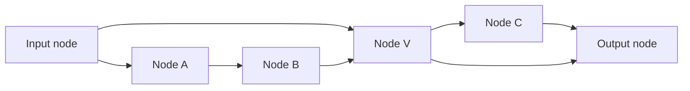

# Token-Owned General DAG Routing

> [!summary] 本页定位
> 本页给出一个面向 Tide 的正向候选：空间结构是任意有限 unit-delay DAG，不要求所有路径等长；运行时 signal 保留 owner token 与 absolute timestamp；node 持有长期 context；prefill 按空间拓扑序处理每个 node 的完整事件流。本文分别定义同一时刻的 owner-ordered 与 atomic-joint 两种 reference semantics，并证明它们各自满足一般 DAG 的 schedule equivalence。

> [!important] 核心结论
> Leveled DAG 是容易证明的特殊情形，但不是 exact chunk prefill 的必要条件。一般 DAG 中，真正需要的是：保留消息的 owner 与到达时间；每个 mutable state 有明确 owner node；routing 只沿 DAG 前进；每个 node 对自身 timestamped event stream 提供与 reference fold 等价的 chunk transducer。跨 token selector state 若存在，也必须纳入该 contract；若还要求高性能，则需另证其 scan/bulk contraction。在这些条件下，absolute-time streaming schedule 可以重排为 node-topological chunk schedule。

> [!warning] Correctness 不自动推出高性能
> 本页主定理只证明两种 schedules 计算同一语义。高性能还要求具体 node transducer 具有 causal attention、scan、segmented bulk、packed sparse kernel 等额外结构，并要求总 event 数受控。任意黑盒 transition、任意 fan-out 或带在线历史计数的 selector 不会因为空间图是 DAG 就自动获得高性能 prefill。

## 0. 一页版模型



上图允许：

- `S -> V` 与 `S -> A -> B -> V` 同时存在。
- 不同路径保留真实长度；不插入 relay node 强行对齐。
- 较早 token 的长路径 signal 与较晚 token 的短路径 signal 在同一 node、同一绝对时间相遇。
- 同一个 owner 经不同路径在同一 node 的不同绝对时间多次出现。

候选模型包含三类对象：

| 对象 | 生命周期 | 语义职责 |
| --- | --- | --- |
| Token-owned message | 有限，只沿空间 DAG 前进 | 标记当前计算轨迹属于哪个输入 token，并携带 arrival time、event id 与 payload |
| Node-owned context state | 跨 token 与事件持久 | KV、SSM state、linear-attention accumulator 或其他显式 context |
| Node event-stream transducer | 每个有限 chunk 调用一次 | 在 node 内按 reference semantics 处理完整 timestamped inbox stream |

本页把 `strict prefill-native` 分成两个独立要求：

1. **正确性要求**：chunk schedule 与 absolute-time streaming reference 产生相同 messages、routes、node outputs、final states 与 readout。
2. **性能要求**：空间调度的顺序 stages 由 DAG critical path 与 node chunk spans 决定，不再额外产生长度随 token 数线性增长的 graph-level control chain。

同一绝对时间到达同一 node 的多个 owners 有两种候选 semantics：

| Profile | 同刻状态可见性 | 主要特点 |
| --- | --- | --- |
| `owner-ordered` | 按 owner token 递增提交；B 读取 A 已提交后的 state | 因果方向明确，接近 autoregressive fold |
| `atomic-joint` | 全部同刻 inputs 进入一个原子 joint transition，再一次 commit | 更接近同步 graph machine，可表达同刻联合交互 |

两种 profile 都可以有 chunk implementation。它们通常是两种不同模型；只有 joint operator 被证明等于 owner-ordered fold 时，joint execution 才只是 ordered semantics 的高性能实现。

## 记号约定

定义自然数与正整数：

$$
\mathbb N=\{0,1,2,\ldots\},
$$

$$
\mathbb N_{>0}=\{1,2,3,\ldots\}.
$$

对 $L\in\mathbb N$，定义：

$$
[L]=\{0,1,\ldots,L-1\}.
$$

若 $L=0$，则 $[L]=\varnothing$。

有限序列使用圆括号表示。有限 multiset 保留重复元素，不因 payload 相等而去重。

本文沿用 [[step-transition-mathematical-specification#定义 1.2：顺序 fold|顺序 fold]]、[[step-transition-mathematical-specification#定义 3.6a：logical event DAG program|logical event DAG]] 与 [[adaptive-routing-prefill-impossibility]] 的结论，但本页所需对象均在首次使用前重新定义。

## 1. 一般 Unit-Delay 空间 DAG

### 定义 1.1：带输入输出的空间 DAG

一个带输入输出的空间 DAG 是三元组：

$$
(G,s,z),
$$

其中：

- $G=(V,E)$ 是有限有向无环图。
- $s\in V$ 是唯一 input node。
- $z\in V$ 是唯一 output node。
- 每个 $v\in V$ 都位于至少一条从 $s$ 到 $z$ 的有向路径上。

对 edge $(u,v)\in E$，$u$ 称为 $v$ 的直接空间前驱，$v$ 称为 $u$ 的直接空间后继。

### 定义 1.2：有向路径与路径长度

从 node $u$ 到 node $v$ 的一条有向路径是 node tuple：

$$
p=(v_0,v_1,\ldots,v_k),
$$

满足：

$$
v_0=u,\qquad v_k=v,
$$

并且对每个 $i\in\{0,\ldots,k-1\}$：

$$
(v_i,v_{i+1})\in E.
$$

路径 $p$ 的 edge 数称为路径长度，记为：

$$
|p|=k.
$$

定义从 input node 到 $v$ 的可达路径长度集合：

$$
\Lambda(v)
=
\{|p|\mid p\text{ 是从 }s\text{ 到 }v\text{ 的有向路径}\}.
$$

因为 $G$ 有限且无环，$\Lambda(v)$ 是有限非空集合。

定义空间 DAG 的最大路径长度：

$$
D
=
\max_{v\in V}\max\Lambda(v).
$$

由于有向路径不能重复经过同一个 node：

$$
D\leq |V|-1.
$$

### 定义 1.3：Unit-delay edge

本文假设每条 edge 的 reference propagation delay 恰好为一个 internal tick：

$$
\operatorname{delay}(u,v)=1,
\qquad (u,v)\in E.
$$

这是一条语义约束，不是硬件传输延迟。物理 runtime 可以 fusion、buffer 或异步执行，但必须保持 logical arrival time。

> [!note] 一般 DAG 与 Leveled DAG
> 若对任意 node $v$，集合 $\Lambda(v)$ 只有一个元素，则所有从 $s$ 到 $v$ 的路径等长，旧文档中的 leveled DAG 是本页模型的特殊情形。本文不再把这一性质作为前提，也不通过 relay nodes 改变原 edge 的单位时延。

## 2. Token Owner、Internal Tick 与绝对时间

### 定义 2.1：External token tick 与 owner

给定长度为 $L$ 的输入序列：

$$
x_{0:L}=(x_0,x_1,\ldots,x_{L-1}).
$$

Token $t\in[L]$ 在 external tick $t$ 注入 input node $s$。由该次注入产生并继续传播的每条 message 都携带 owner：

$$
\operatorname{owner}(m)=t.
$$

Owner 表示 message 正在推进哪个 token 的计算轨迹。它不表示 payload 只能依赖该 token；例如 owner 为 B 的 query 可以通过 node-owned KV state 读取 A 的影响。

### 定义 2.2：Internal tick

一条 message 从 token $t$ 的注入开始，每经过一条 edge，internal tick 增加 $1$。

若某条 message 已沿其实际 routing path 经过 $k\in\mathbb N$ 条 edges，则它的 internal tick 为 $k$。

### 定义 2.3：绝对逻辑时间

定义 owner token $t$、internal tick $k$ 对应的绝对逻辑时间：

$$
\tau=t+k.
\tag{GD-1}
$$
^eq-general-absolute-time

$\tau$ 不是硬件 wall-clock。它是 reference semantics 中所有 tokens 共用的逻辑时间轴。

### 引理 2.4：一般 DAG 的到达时间

若 owner token $t$ 的 message 沿长度为 $k$ 的实际路径到达 node $v$，则它的 absolute arrival time 为：

$$
\tau=t+k,
\qquad k\in\Lambda(v).
\tag{GD-2}
$$
^eq-general-arrival-time

**证明。**

Token $t$ 在 absolute time $t$ 注入。每经过一条 unit-delay edge，arrival time 增加 $1$。长度为 $k$ 的路径包含 $k$ 条 edges，所以到达时间为 $t+k$。

<div class="qed" aria-label="证毕">∎</div>

### 推论 2.4a：Absolute-Time Prefix

任意在 absolute time $\tau$ 到达的 message 都满足：

$$
\operatorname{owner}(m)\leq\tau.
$$

**证明。**

由式 [[#^eq-general-arrival-time|GD-2]]，$\tau=t+k$，其中 $k\geq0$，所以 $t\leq\tau$。

<div class="qed" aria-label="证毕">∎</div>

因此 atomic-joint group 不读取尚未注入 streaming system 的 token；但这只保证 absolute-time causality，不保证 owner $t$ 的所有 late events 只依赖 token prefix $0{:}t$。

### 例 2.5：不同 Owner 的同刻碰撞

考虑：

```text
s ---------> v
s -> a ----> v
```

第一条路径长度为 $1$，第二条路径长度为 $2$。

- Token A 的 index 为 $0$，沿长路径到达 $v$ 的时间为 $0+2=2$。
- Token B 的 index 为 $1$，沿短路径到达 $v$ 的时间为 $1+1=2$。

因此 A 与 B 在同一 node $v$、同一 absolute time $\tau=2$ 到达。

### 命题 2.6：一般 DAG 中 Owner 不能由 Node 与时间恢复

若存在 node $v$ 和两个不同路径长度：

$$
k_A,k_B\in\Lambda(v),
\qquad k_A>k_B,
$$

并且输入长度允许选择：

$$
t_B=t_A+k_A-k_B<L,
$$

则 owner 为 $t_A$、路径长度为 $k_A$ 的 message，与 owner 为 $t_B$、路径长度为 $k_B$ 的 message，在同一 node、同一 absolute time 到达。

**证明。**

两条 message 的 arrival time 分别为：

$$
\tau_A=t_A+k_A,
$$

$$
\tau_B=t_B+k_B.
$$

代入 $t_B=t_A+k_A-k_B$：

$$
\tau_B
=
t_A+k_A-k_B+k_B
=
t_A+k_A
=
\tau_A.
$$

但 $t_A\neq t_B$，所以 $(v,\tau)$ 不能唯一确定 owner。

<div class="qed" aria-label="证毕">∎</div>

这个命题说明：在一般 DAG 中，owner metadata 不是冗余字段。若把同刻不同 owners 的 messages 无标签合并，后续 output alignment、routing、loss、replay 与归因都会失去明确语义。

## 3. 可选的双 Cortex 空间结构

### 定义 3.1：Input/Output 双 Cortex DAG

设 input cortex 为：

$$
G_I=(V_I,E_I),
$$

其执行方向从 input node $s$ 指向 input bridge node $b_I$。

设 output cortex 为：

$$
G_O=(V_O,E_O),
$$

其执行方向从 output bridge node $b_O$ 指向 output node $z$。

假设：

$$
V_I\cap V_O=\varnothing.
$$

增加唯一单向 bridge：

$$
(b_I,b_O).
$$

组合图定义为：

$$
G
=
\left(
V_I\cup V_O,\,
E_I\cup E_O\cup\{(b_I,b_O)\}
\right).
$$

$G_O$ 可以与 $G_I$ 反向同构，但反向同构只描述结构对应关系，不增加从 output cortex 返回 input cortex 的执行 edge。

### 引理 3.2：单向 Bridge 保持 DAG

若 $G_I$ 与 $G_O$ 都是 DAG，且不存在从 $V_O$ 指向 $V_I$ 的 edge，则定义 3.1 的组合图 $G$ 是 DAG。

**证明。**

假设 $G$ 中存在有向环。若该环完全位于 $V_I$ 或 $V_O$，分别与 $G_I$ 或 $G_O$ 是 DAG 矛盾。

若该环同时经过两侧，则它必须通过 bridge $(b_I,b_O)$ 从 $V_I$ 进入 $V_O$。要回到 $V_I$，环中必须存在一条从 $V_O$ 指向 $V_I$ 的 edge，但前提排除了这种 edge，矛盾。

所以 $G$ 无有向环。

<div class="qed" aria-label="证毕">∎</div>

## 4. Message、Inbox 与有限事件性

### 定义 4.1：Token-owned timestamped message

一条 message 写成：

$$
m=(\iota,t,\tau,u,v,\mu,p),
$$

其中：

- $\iota$ 是全局唯一 logical event id。
- $t\in[L]$ 是 owner token。
- $\tau\in\mathbb N$ 是 arrival time。
- $u$ 是 source node；input injection 可以使用一个固定 virtual source。
- $v\in V$ 是 destination node。
- $\mu$ 是可选 metadata，例如 signal slot、phase、source port 或 route id。
- $p$ 是 payload。

定义字段读取函数：

$$
\operatorname{id}(m)=\iota,
\qquad
\operatorname{owner}(m)=t,
$$

$$
\operatorname{arrival}(m)=\tau,
\qquad
\operatorname{src}(m)=u,
\qquad
\operatorname{dst}(m)=v.
$$

Event id 使重复 payload 仍保持为不同 messages。Logical event id 必须由 input id、route lineage、source/destination、owner、timestamp 或 output slot 等语义字段确定性生成，不能来自依赖线程竞争顺序的全局自增计数。Reference semantics 不依赖物理线程首先写入 inbox 的顺序。

对每个 input token $t\in[L]$，定义注入 record：

$$
m_t^{\mathrm{in}}
=
(\iota_t,t,t,\mathtt{input},s,\mu_t,x_t).
$$

因此 input injection 的 owner 与 arrival time 都是 $t$，其 internal tick 为 $0$。

### 定义 4.2：Unit-delay dispatch

若 node $v$ 在 absolute time $\tau$ 沿 selected edge $(v,w)\in E$ 发出 owner 为 $t$ 的 message，则新 message 必须满足：

$$
\operatorname{owner}(m')=t,
$$

$$
\operatorname{arrival}(m')=\tau+1,
\tag{GD-3}
$$
^eq-unit-delay-dispatch

$$
\operatorname{src}(m')=v,
\qquad
\operatorname{dst}(m')=w.
$$

Routing 可以更新 payload、event id 与其他 metadata，但不能静默删除 owner 或 arrival time。

### 定义 4.3：按 Node、时间和 Owner 分桶的 Inbox

对 node $v$、absolute time $\tau$ 与 owner $t$，定义 finite message multiset：

$$
I_{v,\tau,t}
=
\left\{
m\ \middle|\
\operatorname{dst}(m)=v,\,
\operatorname{arrival}(m)=\tau,\,
\operatorname{owner}(m)=t
\right\}_{\mathrm{multi}}.
\tag{GD-4}
$$
^eq-general-owner-inbox

定义同刻到达 $v$ 的 owner 集合：

$$
\mathcal O_{v,\tau}
=
\{t\in[L]\mid I_{v,\tau,t}\neq\varnothing\}.
$$

把它按 token index 递增排列：

$$
O_{v,\tau}^{\uparrow}=(t_1,t_2,\ldots,t_m),
\qquad t_1<t_2<\cdots<t_m.
$$

### 定义 4.4：同 Owner、同刻聚合

对每个 node $v$，给定 input space $X_v$ 和确定性聚合器：

$$
\operatorname{Aggregate}_v:
\mathcal M_{\mathrm{fin}}(\mathcal R_v)
\to X_v,
$$

其中 $\mathcal R_v$ 是到达 $v$ 的 message record 空间，$\mathcal M_{\mathrm{fin}}(\mathcal R_v)$ 表示其有限 multisets。

定义：

$$
x_{v,\tau,t}
=
\operatorname{Aggregate}_v(I_{v,\tau,t}).
\tag{GD-5}
$$
^eq-general-owner-aggregate

如果聚合器与顺序无关，它直接作用于 multiset。若业务语义要求顺序，必须先按固定字段，例如 `(source node id, event id)`，做 canonical sort；不能使用物理 arrival race 作为隐式顺序。

不同 absolute times 的 messages 不在本步骤聚合。同一个 owner 可以因不同路径长度在同一 node 多次激活：

$$
x_{v,\tau_1,t},
\qquad
x_{v,\tau_2,t},
\qquad
\tau_1\neq\tau_2.
$$

### 引理 4.5：有限 Horizon

若 token 数为 $L>0$，则所有由这些 tokens 产生并沿 $G$ 传播的 messages 都满足：

$$
0\leq\tau\leq L-1+D.
\tag{GD-6}
$$
^eq-finite-horizon

**证明。**

任意 owner 满足 $0\leq t\leq L-1$。任意 message 的实际路径长度满足 $0\leq k\leq D$。由引理 2.4：

$$
\tau=t+k\leq L-1+D.
$$

<div class="qed" aria-label="证毕">∎</div>

### 引理 4.6：有限事件性

假设每次 node invocation 只沿有限 outgoing edge 集合发出有限条 messages。对任意有限输入 chunk，一次 execution 产生的 message 集合有限。

**证明。**

有限 DAG 中有向路径数量有限。每条 message 只能沿 edge 方向前进，不能返回已经经过的 node。初始 injection 数有限，每次 invocation 的 fan-out 有限，所以对有限路径树做有限次展开后，总 message 数有限。

<div class="qed" aria-label="证毕">∎</div>

有限不等于高效。一般 DAG 的路径数量可以随 $|V|$ 指数增长，因此后文仍需单独加入 sparse event budget。

## 5. Node-Owned State 与两种同刻语义

### 定义 5.1：Node-owned persistent context

每个 node $v$ 有 state space：

$$
\mathcal S_v,
$$

以及初始 state：

$$
S_v^0\in\mathcal S_v.
$$

其具体实现可以是：

- KV cache。
- Mamba/SSM recurrent state。
- Linear-attention accumulator。
- 显式 node memory。
- 其他具有 chunk correctness contract 的 state。

Strict profile 要求每个 mutable state location 有唯一 owner node。若多个 nodes 必须联合修改同一 state，应把它们封装为一个具有独立 event-stream contract 的 supernode/subgraph operator。

Persistent state 属于 node，不属于某个 token。Token owner 只标记 travelling computation：

```text
message / hidden / route record -> token-owned
persistent context             -> node-owned
```

### 定义 5.2：同刻 Owner tuple

对非空 owner 集合：

$$
O_{v,\tau}^{\uparrow}=(t_1,\ldots,t_m),
$$

定义 node $v$ 在 time $\tau$ 的 owner-indexed input tuple：

$$
B_{v,\tau}
=
\bigl(
(t_1,x_{v,\tau,t_1}),
\ldots,
(t_m,x_{v,\tau,t_m})
\bigr).
$$

该 tuple 的顺序由 token index 唯一决定，不依赖 runtime scheduling。

默认 strict profile 中，没有 inbox event 的 node state 保持不变。若模型需要在空 timestamp 执行 decay，应另行定义：

$$
\operatorname{Idle}_v:
\mathbb N\times\mathcal S_v\to\mathcal S_v,
$$

并把所有 empty-time updates 纳入 $\operatorname{Ref}_v^P$ 与 $\mathcal C_v^P$。本页后续公式取 $\operatorname{Idle}_v(\tau,S)=S$；非平凡 idle/decay 是相同证明框架下的扩展，不是免费省略项。

#### 定义 5.2a：Node 的 Absolute-Time Event Order

对同一 node 的两个 owner events：

$$
e=(\tau,t),
\qquad
e'=(\tau',t'),
$$

定义：

$$
e\prec_v e'
$$

当且仅当：

$$
\tau<\tau',
$$

或：

$$
\tau=\tau'
\quad\text{且}\quad
t<t'.
$$

因此 node state 首先按 absolute time 演进；只有 absolute time 相同，才使用 owner token 打破并列。

#### 例 5.2b：跨时间的 Owner Inversion

考虑 owner A 的 token index 为 $0$，沿长度 $3$ 的路径到达 $v$；owner B 的 token index 为 $1$，沿长度 $1$ 的路径到达 $v$。二者 arrival times 为：

$$
\tau_A=3,
\qquad
\tau_B=2.
$$

虽然 $t_A<t_B$，但在 absolute-time event order 中：

$$
(\tau_B,t_B)\prec_v(\tau_A,t_A).
$$

所以 B 的短路径 event 会先更新 node state，A 的晚到 event 可能读取 B 的影响。后文的 owner-ordered profile 只规定同一 $\tau$ 内的顺序，不消除这种跨时间 owner inversion。

### 5.3 Profile O：Owner-Ordered Within-Timestamp Fold

#### 定义 5.3：单 Owner event transition

给定 hidden space $H_v$。Node $v$ 的单 event transition 是确定函数：

$$
\mathcal T_v:
\mathbb N\times\mathbb N\times X_v\times\mathcal S_v
\to
(H_v\cup\{\bot\})\times\mathcal S_v.
$$

输入的两个自然数依次是 owner token $t$ 与 absolute time $\tau$。$\bot$ 表示该 event 不产生可路由 hidden。

#### 定义 5.4：Owner-ordered 同刻 transition

给定：

$$
B_{v,\tau}
=
\bigl((t_1,x_1),\ldots,(t_m,x_m)\bigr),
\qquad t_1<\cdots<t_m,
$$

以及进入该 timestamp 前的 state $S^{(0)}$。递归定义：

$$
(h_i,S^{(i)})
=
\mathcal T_v(t_i,\tau,x_i,S^{(i-1)}),
\qquad i=1,\ldots,m.
\tag{GD-7}
$$
^eq-owner-ordered-group

该 timestamp 的 owner outputs 与提交后 state 分别为：

$$
H_{v,\tau}^{\mathrm{ord}}
=
\bigl((t_1,h_1),\ldots,(t_m,h_m)\bigr),
$$

$$
S^+
=
S^{(m)}.
$$

若 A、B 同刻到达且 $t_A<t_B$，则 B 的 transition 读取 A 已经更新后的 state。因果方向是：

$$
A\longrightarrow B.
$$

Owner-ordered 是同一 timestamp 内的 reference semantics；完整 node event stream 仍按定义 5.2a 的 $(\tau,t)$ lexicographic order 演进。它不要求物理实现真的逐 owner 循环。若能证明一个 causal mask、scan 或其他 bulk kernel 等于式 [[#^eq-owner-ordered-group|GD-7]]，则可以联合执行。

### 5.4 Profile J：Atomic Joint Timestamp Transition

#### 定义 5.5：Joint transition 与 collective delta

定义 $\mathcal B_v$ 为所有有限 owner-indexed input tuples 的集合。其任意元素具有形式：

$$
B
=
\bigl((t_1,x_1),\ldots,(t_m,x_m)\bigr),
\qquad
t_1<\cdots<t_m.
$$

其中 $m\in\mathbb N_{>0}$、$t_i\in\mathbb N$ 且 $x_i\in X_v$。

定义 $\mathcal H_v^\star$ 为所有具有相同 owner-key 形式的有限 hidden tuples 的集合：

$$
H
=
\bigl((t_1,h_1),\ldots,(t_m,h_m)\bigr).
$$

其中 $h_i\in H_v\cup\{\bot\}$。

调用 $\mathcal J_v$ 时，output tuple 必须与 input tuple 使用完全相同的 owner-key sequence；若某个 owner 不产生 hidden，则相应位置写为 $\bot$。

对 node $v$，给定 delta space $\Delta_v$、commit function：

$$
\operatorname{Commit}_v:
\mathcal S_v\times\Delta_v
\to\mathcal S_v,
$$

以及 atomic joint transition：

$$
\mathcal J_v:
\mathbb N\times\mathcal B_v\times\mathcal S_v
\to
\mathcal H_v^\star\times\Delta_v.
$$

对任意 timestamp $\tau$、owner tuple $B_{v,\tau}$ 与进入该 timestamp 前的 state $S$，定义：

$$
\mathcal J_v(\tau,B_{v,\tau},S)
=
\left(
H_{v,\tau}^{\mathrm{joint}},
\Delta_{v,\tau}
\right),
\tag{GD-8}
$$
^eq-atomic-joint-transition

其中：

$$
H_{v,\tau}^{\mathrm{joint}}
=
\bigl((t_1,h_1),\ldots,(t_m,h_m)\bigr)
$$

仍为 owner-indexed outputs。State 只在 joint computation 结束后提交一次：

$$
S^+
=
\operatorname{Commit}_v(S,\Delta_{v,\tau}).
\tag{GD-9}
$$
^eq-atomic-joint-commit

定义 joint transition 与 commit 的组合：

$$
\operatorname{Atomic}_v(\tau,B_{v,\tau},S)
=
\left(
H_{v,\tau}^{\mathrm{joint}},
\operatorname{Commit}_v(S,\Delta_{v,\tau})
\right).
\tag{GD-9a}
$$
^eq-atomic-joint-composed

$\Delta_{v,\tau}$ 属于 node 的 collective state update，不要求归属于某个单独 token。为了 replay 与 attribution，可以额外保留 per-owner delta decomposition，但它不是数学正确性的必要字段。

Atomic-joint 允许：

- 所有 owners 读取同一个 pre-state。
- Joint kernel 比较多个 owners 的 inputs。
- 每个 owner 的 output 依赖同刻其他 owners。
- Joint kernel 使用 owner index 构造 triangular mask。

它不允许把多个 owners 变成一个永久无 owner 的 travelling signal。Outgoing records 仍必须按 owner 分开。

#### 定义 5.6：同刻 Owner-causal Joint Operator

对 $t\in\mathcal O_{v,\tau}$，定义 owner prefix：

若：

$$
B_{v,\tau}
=
\bigl((t_1,x_1),\ldots,(t_m,x_m)\bigr),
$$

并且 $t=t_j$，则：

$$
B_{v,\tau}^{\leq t}
=
\bigl((t_1,x_1),\ldots,(t_j,x_j)\bigr).
$$

若 owner $t$ 的 hidden 与 route decision 只依赖：

$$
(S,\tau,B_{v,\tau}^{\leq t}),
$$

而不依赖 owner 大于 $t$ 的 inputs，则称 joint operator 在该 timestamp 内是 owner-causal 的。

这是比 arbitrary joint 更强的约束。Arbitrary joint 只保证 absolute-time semantics；它不自动保证 token-owner 意义下的 prefix causality。

### 定义 5.7：Joint Operator 与 Ordered Fold 等价

把定义 5.4 的递归结果记为：

$$
\operatorname{GroupFold}_{\mathcal T_v}(\tau,B,S)
=
\left(
H_{v,\tau}^{\mathrm{ord}},
S^{(m)}
\right).
\tag{GD-9b}
$$
^eq-owner-group-fold

若对任意 $\tau$、任意 owner tuple $B\in\mathcal B_v$ 和任意 state $S\in\mathcal S_v$：

$$
\operatorname{Atomic}_v(\tau,B,S)
=
\operatorname{GroupFold}_{\mathcal T_v}(\tau,B,S),
\tag{GD-10}
$$
^eq-joint-ordered-equivalence

则称 atomic-joint operator 与 owner-ordered group fold 等价。这里要求相等的是：

- 每个 owner 的 hidden。
- 每个 owner 的 route-visible record。
- Timestamp 结束后的 state。

只比较 collective delta 或 final state 不足以建立等价。

### 命题 5.8：Fold-Equivalent Joint Execution 不改变语义

若式 [[#^eq-joint-ordered-equivalence|GD-10]] 对 node $v$ 成立，则在该 node 上用 $\mathcal J_v$ 一次执行整个 timestamp group，与按 owner token 顺序执行 $\mathcal T_v$ 得到相同 observable artifacts。

**证明。**

这是式 [[#^eq-joint-ordered-equivalence|GD-10]] 的直接展开：定义已经要求 owner outputs、route-visible records 与 final state 全部相等。

<div class="qed" aria-label="证毕">∎</div>

### 例 5.9：Final State 相同但语义不同

令：

$$
S\in\mathbb R,
$$

单 event transition 为：

$$
\mathcal T(x,S)=(S+x,S+x).
$$

取：

$$
S=0,\qquad x_A=1,\qquad x_B=2.
$$

Owner-ordered fold 得到：

$$
h_A=1,\qquad h_B=3,\qquad S^+=3.
$$

若 snapshot-joint 分别从旧 state 计算，再把 delta 相加，则可能得到：

$$
h_A=1,\qquad h_B=2,\qquad S^+=3.
$$

两者 final state 都是 $3$，但 B 的 hidden 不同，所以后续 routing 与 output 也可能不同。

### 5.10 两种 Profile 的边界

| 问题 | Owner-ordered | Atomic-joint |
| --- | --- | --- |
| B 是否读取 A 已提交后的 state | 是 | 默认否；除非 joint kernel 显式复现这一效果 |
| 同刻交互是否有方向 | owner index 给出 A -> B | 可对称、可非对称、也可 triangular |
| 是否天然保持 owner-prefix causality | 只保证同刻 owner order；跨时间 inversion 仍可能破坏 | arbitrary joint 连同刻也不保证 |
| 是否可以批量实现 | 可以，但需证明 causal-bulk/scan contract | 可以，但需给出 joint chunk contract |
| 与 GPT/Mamba token fold 的关系 | 只有 event order 与 token order 兼容，或 kernel 按 owner 做 causal masking 时才直接对应 | 除前述条件外，还需满足式 GD-10 |
| 研究定位 | 更安全的基线 | 具有表达力但语义风险更高的候选 |

## 6. 一般 DAG 上的 Routing

### 定义 6.1：Local candidate score

对 node $v$ 在 time $\tau$ 产生的 owner output $(t,h)$，以及每条 outgoing edge $(v,u)\in E$，定义：

$$
s_{v,\tau,t\to u}
=
g_{v\to u}(h)
+b_{v\to u}
+d_{v\to u}(t,\tau,\mu).
\tag{GD-11}
$$
^eq-general-routing-score

其中：

- $g_{v\to u}:H_v\to\mathbb R$ 是 learned content score。
- $b_{v\to u}\in\mathbb R$ 是静态 learned/configured bias。
- $d_{v\to u}$ 是只读取 owner、absolute time 与静态 metadata 的 deterministic prior。

三项都不读取此前 tokens 的实际 hard-route counts。

### 定义 6.2：Pure owner-preserving selector

对每个 owner output，selector 返回有限 selected edge set：

$$
A_{v,\tau,t}
\subseteq
\{(v,u)\in E\}.
$$

Owner-ordered profile 中，$A_{v,\tau,t}$ 只能读取该 owner 的 $h$ 与静态 metadata。需要由 node state 影响 routing 的信息，必须先由 $\mathcal T_v$ 显式写入 $h$；selector 不再隐式选择读取 commit 前还是 commit 后的 state view。

Atomic-joint profile 可以让同一 timestamp 的 route sets 联合决定：

$$
\bigl(A_{v,\tau,t}\bigr)_{t\in\mathcal O_{v,\tau}}
=
\rho_v^{\mathrm{joint}}
\left(
\tau,H_{v,\tau}^{\mathrm{joint}}
\right).
$$

因此 joint selector 可以比较同刻多个 owner hiddens，但 joint transition 的 pre-state/post-state visibility 已经在 $H_{v,\tau}^{\mathrm{joint}}$ 的定义中固定，不由 selector 临时决定。

无论使用哪种 profile，selector 都必须：

- 确定性处理 tie-breaking。
- 只选择 $v$ 的 outgoing edges。
- 对每个 outgoing message 保留原 owner。
- 不根据 route result 追溯修改已经提交的同刻 node state，除非这种修改已写入 node transition contract。

若 selector 具有 mutable state，该 state 必须有唯一 owner node，并纳入 $\mathcal S_v$、$\operatorname{Ref}_v^P$ 与式 [[#^eq-node-event-stream-contract|GD-12]]。这足以定义 correctness，但不自动提供高性能。Strict high-performance profile 进一步要求：`affectcount/selectcount` 一类跨 event feedback 要么删除，要么给出独立的 scan/bulk contraction 证明。

### 定义 6.3：Selected payload dispatch

若 $(v,u)\in A_{v,\tau,t}$，定义：

$$
p'
=
P_{v\to u}(h),
$$

并发出满足式 [[#^eq-unit-delay-dispatch|GD-3]] 的 message：

$$
m'
=
(\iota',t,\tau+1,v,u,\mu',p').
$$

不同 owners 可以选择同一 edge。它们仍是两条 owner-distinct messages。

### 备注 6.4：A 影响 B Routing 的两条合法路径

Owner-ordered profile 中，A 可以先更新 node-owned state，B 再读取该 state：

$$
x_A
\to
S_A
\to
h_B
\to
A_{v,\tau,B}.
$$

Atomic-joint profile 中，A 的当前 input 可以通过 joint operator 直接影响 B 的 hidden 或 route：

$$
(x_A,x_B,S)
\to
\mathcal J_v
\to
h_B
\to
A_{v,\tau,B}.
$$

这两条路径语义不同，实验时不能只看 final state 后把它们视为同一个模型。

## 7. Node Event-Stream Reference 与 Chunk Contract

### 定义 7.1：完整 Node Inbox Stream

对 node $v$，收集所有非空 timestamp groups，并按 absolute time 递增排列：

$$
\mathbf B_v
=
\bigl(
(\tau_1,B_{v,\tau_1}),
\ldots,
(\tau_q,B_{v,\tau_q})
\bigr),
\qquad
\tau_1<\cdots<\tau_q.
$$

由引理 4.5 与引理 4.6，$\mathbf B_v$ 是有限序列。

### 定义 7.2：Node Reference Transducer

取 profile：

$$
P\in\{\mathrm{ord},\mathrm{joint}\}.
$$

Node reference transducer：

$$
\operatorname{Ref}_v^P
$$

按 $\tau_1,\ldots,\tau_q$ 依次处理 $\mathbf B_v$：

- 若 $P=\mathrm{ord}$，每个 timestamp 使用式 [[#^eq-owner-ordered-group|GD-7]]。
- 若 $P=\mathrm{joint}$，每个 timestamp 使用式 [[#^eq-atomic-joint-transition|GD-8]] 与式 [[#^eq-atomic-joint-commit|GD-9]]。
- 每个 owner output 经过第 6 节的 selector 与 unit-delay dispatch。

其输出定义为：

$$
\operatorname{Ref}_v^P(\mathbf B_v,S_v^0)
=
\left(
\mathbf H_v^P,\,
\mathbf R_v^P,\,
\mathbf M_{v,\mathrm{out}}^P,\,
S_v^{P,\mathrm{final}}
\right),
$$

其中四项依次是 owner-indexed hidden records、route records、outgoing message stream 与 final node state。

### 定义 7.3：Node Event-Stream Chunk Operator

Node $v$ 的 profile-$P$ chunk operator 是函数：

$$
\mathcal C_v^P:
(\mathbf B_v,S_v^0)
\mapsto
\left(
\widehat{\mathbf H}_v^P,\,
\widehat{\mathbf R}_v^P,\,
\widehat{\mathbf M}_{v,\mathrm{out}}^P,\,
\widehat S_v^{P,\mathrm{final}}
\right).
$$

称它满足 exact node chunk contract，当且仅当对任意有限合法 inbox stream：

$$
\mathcal C_v^P(\mathbf B_v,S_v^0)
=
\operatorname{Ref}_v^P(\mathbf B_v,S_v^0).
\tag{GD-12}
$$
^eq-node-event-stream-contract

等式比较全部四类 artifacts，而不只比较 final state 或最终 logits。

### 引理 7.4：有限 Execution 可展开为 Logical Event DAG

对一个满足引理 4.6 的有限 execution：

- Owner-ordered profile 为每个非空 $(v,\tau,t)$ 建立一个 logical owner event。
- Atomic-joint profile 为每个非空 $(v,\tau)$ 建立一个 logical group event。

加入两类 dependency edges：

1. **Spatial message edge**：source node 在 time $\tau$ 的 event 指向该 message 在 destination node 的 time $\tau+1$ event。
2. **Local state edge**：同一 node 中，前一个 state-consuming event/group 指向下一个 event/group；owner-ordered profile 在同一 $\tau$ 内还按 $t$ 递增连接。

得到的 finite logical event graph 是 DAG。

**证明。**

由引理 4.6，logical event 数有限。

在 owner-ordered profile 中，给每个 event 赋 lexicographic logical rank：

$$
r(v,\tau,t)=(\tau,t).
$$

Spatial message edge 使 absolute time 从 $\tau$ 增加到 $\tau+1$，所以 rank 严格增加。Local state edge 若连接不同 timestamps，则第一坐标严格增加；若连接同一 timestamp，则 owner token 第二坐标严格增加。因此每条 dependency edge 都使 rank 严格增加，不可能形成有向环。

在 atomic-joint profile 中，每个 group event 的 rank 取为：

$$
r(v,\tau)=\tau.
$$

Spatial message edge 与相邻 local state edge 都指向更大的 absolute time，所以每条 dependency edge 都严格增加 rank，同样不可能形成有向环。

Node kernel 内部的 matmul、scan、attention 或其他 primitive DAG 由 node chunk contract封装；若 kernel 内存在未声明 zero-delay cycle，则不满足本引理前提。

<div class="qed" aria-label="证毕">∎</div>

### 例 7.5：已知 Kernel Family 如何进入 Contract

| Node kernel | Reference semantics | 可能的 chunk implementation |
| --- | --- | --- |
| Token-wise map / FFN | 每个 owner event 独立 | Batched matmul / fused pointwise |
| Causal attention | $(\tau,t)$ event order，或显式 owner-causal mask | Packed QKV + causal mask / fused attention |
| Mamba/SSM | 按声明 event order 的 recurrent state | Parallel/blocked scan 或专用 selective-scan kernel |
| Linear attention | 按声明 event order 的 accumulator update | Associative scan / chunked accumulator |
| Same-time set interaction | Atomic-joint timestamp transition | Segmented set kernel / grouped attention |
| 任意黑盒 transition | 定义给出的顺序 | Sequential fallback；不构成高性能见证 |

一般 DAG 只改变每个 node 收到的 event stream 可能是不规则的。实现可按：

$$
(\tau,t,\mu)
$$

排序与 pack，但必须保持式 [[#^eq-node-event-stream-contract|GD-12]]。

## 8. Streaming 与 Node-Topological Chunk Schedules

### 定义 8.1：Absolute-Time Streaming Schedule

若 $L=0$，execution 没有 input injection，所有 node 保持初始 state。若 $L>0$，streaming reference 按：

$$
\tau=0,1,\ldots,L-1+D
$$

推进。

在 absolute time $\tau$：

1. 收集所有满足 arrival time 为 $\tau$ 的 messages。
2. 对每个 node 构造 $B_{v,\tau}$。
3. 按选定 profile 执行 node transition 与 routing。
4. 所有 outgoing messages 在 $\tau+1$ 到达。

因为每条 edge delay 为 $1$，同一个 $\tau$ 内不存在从一个 spatial node 到另一个 spatial node 的 zero-delay dependency。

### 定义 8.2：Spatial Topological Order

空间 DAG 的 topological order 是 tuple：

$$
\pi=(v_1,v_2,\ldots,v_N),
\qquad N=|V|,
$$

满足每个 node 恰好出现一次，并且：

$$
(v_i,v_j)\in E
\quad\Longrightarrow\quad
i<j.
$$

有限 DAG 至少存在一个 topological order。

### 定义 8.3：Node-Topological Chunk Schedule

给定 topological order $\pi$。Chunk schedule 依次处理：

$$
v_1,v_2,\ldots,v_N.
$$

处理 node $v_i$ 时：

1. 它的所有空间前驱已经完成。
2. 从所有前驱 outgoing streams 合并得到 $v_i$ 的完整 timestamped inbox stream $\mathbf B_{v_i}$。
3. 调用 $\mathcal C_{v_i}^P$ 一次处理整条 stream。
4. 把得到的 outgoing messages 追加到空间后继的待处理 inbox。

互不依赖的 nodes 可以并行执行；tuple $\pi$ 只用于定义一种合法顺序。

### 定理 8.4：General Unit-Delay DAG Schedule Equivalence

给定任意有限输入 chunk、任意 profile：

$$
P\in\{\mathrm{ord},\mathrm{joint}\},
$$

并假设：

1. 空间图 $G$ 满足定义 1.1，不要求 $\Lambda(v)$ 为 singleton。
2. 每条 edge 满足 unit-delay dispatch。
3. 每条 message 保留 owner、arrival time 与 event id。
4. Inbox aggregation 满足定义 4.4。
5. 每个 mutable state location 有唯一 owner node。
6. Routing 只沿 $E$ 前进且是确定函数；任何 mutable routing state 都由唯一 node 持有，并包含在该 node 的 chunk contract 中。
7. 每个 node 的 chunk operator 满足式 [[#^eq-node-event-stream-contract|GD-12]]。
8. Execution 满足引理 4.6 的有限事件条件。

则 node-topological chunk schedule 与 absolute-time streaming schedule 产生完全相同的：

- 每个 node 的 timestamped inbox。
- 每个 owner 的 hidden records。
- Selected routes。
- 全部 dispatched messages。
- 每个 node 的 final context state。
- Output node event stream。

因此，任何只依赖这些 artifacts 的确定性 readout 也相同。

**证明。**

取空间 DAG 的任意 topological order：

$$
\pi=(v_1,\ldots,v_N).
$$

对 $i=1,\ldots,N$ 做数学归纳，证明 node $v_i$ 在两种 schedules 中得到相同完整 inbox stream，并产生相同 reference artifacts。

当 $i=1$ 时，$v_1=s$。这是因为定义 1.1 要求每个其他 node 都位于某条从 $s$ 出发的路径上，所以每个 $v\neq s$ 至少有一个空间前驱。Input node 的 inbox 在两种 schedules 中都只包含定义 4.1 的相同 input injection records。由式 [[#^eq-node-event-stream-contract|GD-12]]，chunk operator 与该 node 在 streaming schedule 中按 absolute time 执行的 reference transducer 相等。因此 $v_1$ 的 hidden、routes、outgoing messages 与 final state 全部相同。

假设结论对 $v_1,\ldots,v_{i-1}$ 成立。考虑 $v_i$。由 topological order 的定义，$v_i$ 的每个直接前驱都位于：

$$
\{v_1,\ldots,v_{i-1}\}.
$$

由归纳假设，每个前驱在两种 schedules 中产生完全相同的 outgoing message stream。Input injection records 也相同。因此，把所有满足 destination 为 $v_i$ 的 messages 按 $(\tau,t)$ 分桶后，得到相同的：

$$
I_{v_i,\tau,t},
$$

相同的 owner tuple $B_{v_i,\tau}$，以及相同的完整 inbox stream $\mathbf B_{v_i}$。

在 streaming schedule 中，node $v_i$ 按 absolute time 对 $\mathbf B_{v_i}$ 执行 $\operatorname{Ref}_{v_i}^P$。在 chunk schedule 中，它执行 $\mathcal C_{v_i}^P$。由式 [[#^eq-node-event-stream-contract|GD-12]]，两者产生相同 hidden、routes、outgoing messages 与 final state。

所以结论对 $v_i$ 成立。由数学归纳法，结论对所有 nodes 成立，特别地对 output node $z$ 成立。

证明中没有使用“所有到达同一 node 的路径等长”，所以一般 DAG 中的 path-length collision 被完整保留，而不是通过 relay node 消除。

<div class="qed" aria-label="证毕">∎</div>

### 推论 8.5：Owner-Ordered Profile 正确性

若每个 node 的 chunk operator 精确实现 owner-ordered event-stream fold，则 node-topological chunk execution 与 owner-ordered absolute-time streaming reference 等价。

**证明。**

在定理 8.4 中取 $P=\mathrm{ord}$。

<div class="qed" aria-label="证毕">∎</div>

### 推论 8.6：Atomic-Joint Profile 正确性

若每个 node 的 chunk operator 精确实现 atomic-joint timestamp transitions，则 node-topological chunk execution 与 atomic-joint absolute-time streaming reference 等价。

**证明。**

在定理 8.4 中取 $P=\mathrm{joint}$。

<div class="qed" aria-label="证毕">∎</div>

### 推论 8.7：Fold-Equivalent Joint Lowering

若每个 node 的 joint operator 还满足式 [[#^eq-joint-ordered-equivalence|GD-10]]，则 joint chunk execution、owner-ordered chunk execution 与 owner-ordered streaming reference 三者等价。

**证明。**

由命题 5.8，每个 timestamp group 上 joint 与 ordered artifacts 相同。对每个 node 的 timestamp stream 归纳，可得两种 node reference transducers 相同。再分别应用推论 8.5 与推论 8.6。

<div class="qed" aria-label="证毕">∎</div>

### 推论 8.8：等长路径模型是本定理的特殊情形

若对每个 node $v$，存在唯一 $d(v)$ 使：

$$
\Lambda(v)=\{d(v)\},
$$

则 owner $t$ 到达 $v$ 的时间唯一为 $t+d(v)$；不同 owners 不会在同一 $v$、同一 $\tau$ 到达。定理 8.4 仍然成立，并退化为旧 leveled-DAG schedule-equivalence 结论。

**证明。**

由引理 2.4，任意到达 $v$ 的 message 都有 $\tau=t+d(v)$。若 $t\neq t'$，则 $t+d(v)\neq t'+d(v)$，所以不存在同刻 owner collision。其余结论直接由定理 8.4 得到。

<div class="qed" aria-label="证毕">∎</div>

## 9. 正确性之外：Work、Span 与超稀疏约束

### 定义 9.1：Node Event Count

定义 node $v$ 的 owner-event count：

$$
M_v
=
\sum_{\tau}|\mathcal O_{v,\tau}|.
$$

定义全图 owner-event count：

$$
M
=
\sum_{v\in V}M_v.
$$

令 $\mathcal M_{\mathrm{dispatch}}$ 为 execution 中全部 dispatched messages 的集合，定义其 message 总数：

$$
N_{\mathrm{msg}}
=
\left|\mathcal M_{\mathrm{dispatch}}\right|.
$$

Atomic-joint profile 的 timestamp group 数可能小于 $M_v$，但 joint kernel 的 work 必须计入它读取的全部 owner records。

### 定义 9.2：Node Chunk Work 与 Span

记 node $v$ 的 chunk operator work 与 parallel span 分别为：

$$
W_v,
\qquad
P_v.
$$

Work 是总 primitive operation 数的抽象；span 是在依赖与无限处理器理想化下的 critical-path length。二者都是性能见证，不属于定理 8.4 的 correctness 结论。

### 命题 9.3：Coarse Node-Topological Work/Span 上界

忽略常数 metadata cost，node-topological schedule 的总 work 满足：

$$
W_{\mathrm{graph}}
\leq
\sum_{v\in V}W_v+O(N_{\mathrm{msg}}).
\tag{GD-13}
$$
^eq-general-dag-work

若无依赖 nodes 可并行，coarse span 满足：

$$
P_{\mathrm{graph}}
\leq
\max_{p}
\sum_{v\in p}
\bigl(P_v+c_v\bigr),
\tag{GD-14}
$$
^eq-general-dag-span

其中最大值遍历空间 DAG 的有向路径，$c_v$ 表示 inbox merge、routing 与 dispatch 的 span。

**证明。**

这里 $W_v$ 已包含 node-local inbox aggregation、transition 与 routing。每个 dispatched message 还产生常数阶 transport/append metadata work，因此得到式 GD-13。若实现需要额外全局 sort、跨设备 exchange 或非线性索引构建，这些成本必须另行加入，不能隐藏在 $O(N_{\mathrm{msg}})$ 中。

Chunk schedule 的 node-level dependency graph 就是空间 DAG。任意 execution critical path 对应其中一条有向路径；沿该路径累加每个 node 的 chunk span 与调度开销，得到式 GD-14。

<div class="qed" aria-label="证毕">∎</div>

这个命题解释了“一般 DAG 仍可能支持高性能 chunk prefill”的准确含义：

- Graph-level 顺序深度由空间 critical path 决定，而不是由 token 数直接决定。
- 但若某个 $P_v=\Theta(M_v)$ 且没有 scan/bulk contraction，token-axis 顺序链只是被封装进 node kernel，并没有消失。
- 若 $M$ 本身因 fan-out 指数增长，即使 span 较小，总 work 与 memory 仍不可接受。

### 定义 9.4：固定 Owner Signal Slots

给定常数：

$$
K\in\mathbb N_{>0}.
$$

每个 token owner $t$ 最多拥有 $K$ 个 signal slots：

$$
q\in[K].
$$

Slot id 写入 message metadata。Strict slot profile 要求：

- 每个 slot 在任一时刻最多对应一条 active travelling message。
- 一个 slot 到达 node 后，最多选择一条 outgoing edge。
- Slot 可以终止或与其他 slots 在 node 内联合计算，但不能复制为两个同时活跃的同 id slots。
- 每个 slot 在一个 owner 的整次 execution 中至多激活一次；终止后不能复用。
- 若需要 split，只能从同一 owner 从未激活过的固定 slot pool 中分配；新 slot 从 split node 开始一条新的单路径 trajectory。

在该 profile 中，routing record 不再只是 edge set，而是 slot-edge assignment：

$$
A_{v,\tau,t}^{\mathrm{slot}}
\subseteq
[K]\times\{(v,u)\in E\}.
$$

同一个 slot id 在 $A_{v,\tau,t}^{\mathrm{slot}}$ 中至多出现一次。若多个 slots 在同一 $(v,\tau,t)$ 聚合，$\operatorname{Aggregate}_v$ 必须保留 slot-indexed records，或显式给出哪些 slots merge、terminate 与继续传播；不能在丢失 slot identity 后仍声称满足 slot conservation。

### 命题 9.5：固定 Slot 的 Event 上界

在 strict slot profile 中，每个 owner 的 node visits 不超过：

$$
K|V|.
$$

长度为 $L$ 的 chunk 的 owner-event 总数满足：

$$
M\leq LK|V|.
\tag{GD-15}
$$
^eq-owner-slot-event-bound

**证明。**

每个 slot 至多激活一次，并且激活后不复制，只沿一条 routing path 前进。空间图无环，所以该路径最多访问每个 node 一次，node visits 不超过 $|V|$。每个 owner 最多有 $K$ 个 slots，因此每个 owner visits 不超过 $K|V|$。Owner-event count 不超过 slot visit count；对 $L$ 个 owners 求和得到式 GD-15。

<div class="qed" aria-label="证毕">∎</div>

固定 slot 不是唯一 sparse design，但它给出一个不依赖 spatial level、也不需要跨 token online counter 的明确上界。若改为“每个 event 独立 top-$K$ fan-out”，最坏 event 数可能随 DAG depth 指数增长，不能称为超稀疏保证。

## 10. 空间/时间均衡与 Selector Profile

### 定义 10.1：Node Activation Load

在 fixed-slot profile 中，定义：

$$
a_{t,q,v}
=
\begin{cases}
1,&\text{owner }t\text{ 的 slot }q\text{ 访问 node }v,\\
0,&\text{否则}.
\end{cases}
$$

定义长度为 $L$ 的 node load：

$$
n_v^{(L)}
=
\sum_{t\in[L]}\sum_{q\in[K]}a_{t,q,v}.
\tag{GD-16}
$$
^eq-general-node-load

若不采用 slot profile，可以把 $n_v^{(L)}$ 改为到达 $v$ 的 owner-event 数，但必须同时报告 event duplication。

### 10.2 当前 LH Online Counter Selector

当前 LH-like selector 可以抽象为：

$$
R_j=\rho(H_j,Q_j),
$$

$$
Q_{j+1}=U(Q_j,R_j),
$$

其中 $Q_j$ 包含 `affectcount/selectcount`。这可以直接惩罚近期热点，但形成：

$$
Q_0\to R_0\to Q_1\to R_1\to\cdots.
$$

若 $j$ 沿 token/event axis 增长且 combined transition 不具有已证明的 scan/bulk structure，就进入 [[adaptive-routing-prefill-impossibility]] 的自适应控制链。

### 命题 10.3：强 Online Feedback 的依赖代价

如果后一个 route 必须读取由前一个实际 hard route 更新的 control state，且该 update/route composition 没有额外已证明的 contraction，则 exact execution 存在相应长度的顺序 control chain。

**证明。**

后一个 route 需要更新后的 $Q_{j+1}$；$Q_{j+1}$ 需要前一个 hard route $R_j$；$R_j$ 又读取 $Q_j$。因此每一步都依赖前一步，得到上述 chain。

<div class="qed" aria-label="证毕">∎</div>

### 10.4 Prefill-Compatible 均衡层

在 strict profile 中，均衡拆成以下互不替代的层：

| 层 | 方法 | 是否进入逐 event forward state |
| --- | --- | --- |
| 结构上界 | 固定 owner slots、有限出度、静态 availability | 否 |
| 静态容量 | Edge/node bias、设备容量权重、拓扑分区 | 否 |
| 确定性时间分散 | $d_{v\to u}(t,\tau,\mu)$ | 否 |
| 训练期均衡 | Node load / time-window loss | 只影响梯度 |
| 在线硬均衡 | Persistent route counters | 是；通常形成 control chain |

给定目标 node capacity weights：

$$
\pi_v>0,
\qquad
\sum_{v\in V}\pi_v=1,
$$

定义归一化实际 load：

$$
\widehat p_v
=
\frac{n_v^{(L)}}{\sum_{u\in V}n_u^{(L)}}.
$$

分母为 $0$ 时把 loss 定义为 $0$。空间均衡目标可以写为：

$$
\mathcal L_{\mathrm{space}}
=
\sum_{v\in V}
(\widehat p_v-\pi_v)^2.
\tag{GD-17}
$$
^eq-general-space-balance-loss

对 absolute-time window：

$$
W_j
=
\{jB,\ldots,(j+1)B-1\},
$$

可以统计到达时间落入 $W_j$ 的 node events，构造 $\mathcal L_{\mathrm{time}}$。它约束真实 pipeline 时间上的热点，而不是把 external token index 误当作唯一 arrival time。

### 命题 10.5：Hard Cross-Token Capacity 的三种基本选择

若要求任意输入上、任意时间窗口内 node $v$ 的 hard admission 不超过 $C$，而多个 owners 都可能选择 $v$，则 exact selector 至少采用以下一种机制：

1. 用静态 eligibility/quota 预先限制可选 owners/slots。
2. 联合观察一个已知 owner/event 集合后做 assignment。
3. 在线维护已使用 capacity，让后续 decision 读取此前 admissions。

第二种机制是否允许取决于 reference semantics：atomic-joint 可以在同一 timestamp group 内使用它，但不能免费跨越尚未形成的未来 groups。第三种机制形成 online control chain。第一种最容易保持 strict prefill-native，但限制内容 routing 自由度。

**证明。**

若资格未预先限制，当超过 $C$ 个 candidates 同时或先后希望进入 $v$ 时，selector 必须依据其他 candidates 拒绝一部分。若同时观察一个已知集合后联合决定，属于第二类；若按到达顺序读取已用 capacity，属于第三类；剩余情形只能提前限制资格，属于第一类。

<div class="qed" aria-label="证毕">∎</div>

### 10.6 三种 Selector Profile

| Profile | State 与均衡 | Chunk-prefill 位置 |
| --- | --- | --- |
| `LH-exact streaming` | 每次 hard route 后更新 persistent counts | 保留原行为，但通常含长 adaptive chain |
| `General-DAG strict` | Fixed slots、static bias/prior、training loss | 满足定理 8.4 的候选 |
| `Block-lagged` | Block 内冻结 counters，block 后更新 | Block 内可批量，block 间仍顺序 |

## 11. 两种同刻语义的实验设计

Owner-ordered 与 atomic-joint 不应在没有等价证明时混成一个实验条件。

### 11.1 必做 Correctness Gates

| Gate | Reference | Chunk candidate | 判定 |
| --- | --- | --- | --- |
| Ordered scalar | 按 $(\tau,t)$ 顺序执行 | Packed/scan/causal-bulk | 全 artifact equality |
| Joint scalar | 按 $\tau$ 调用 $\mathcal J_v$ | Grouped/segmented bulk | 全 artifact equality |
| Joint vs ordered | 两套 reference | 直接比较 | 只在式 GD-10 成立时期待相等 |
| Streaming vs topological | Absolute-time schedule | Node-topological schedule | 定理 8.4 artifacts |

Artifact equality 至少包括：

- Per-owner hidden。
- State before/after each active timestamp。
- Selected edges。
- Message owner、arrival time、destination 与 payload。
- Final node states。
- Output readout。

### 11.2 最小诊断任务

1. **Unequal-path collision**：直接边与两跳/三跳路径使多个 owners 在同一 node、同一 $\tau$ 相遇。
2. **Cross-time owner inversion**：让 B 的短路径 event 先于 A 的长路径 event 到达，检查 absolute-time state visibility。
3. **Accumulator counterexample**：复现实例 5.9，确保测试能发现“final state 相同但 per-owner output 不同”。
4. **Causal attention node**：分别验证 event-order mask 与 owner-order mask 的 scalar/bulk equivalence。
5. **SSM/linear-attention node**：验证 irregular event stream 的 packed scan。
6. **Joint interaction node**：让 route B 显式依赖同刻 A 的 feature，检查 joint semantics。
7. **Sparse slot routing**：检查 event bound、slot conservation 与 output reachability。
8. **Dual cortex DAG**：验证多路径 input cortex、单向 bridge 与 output cortex 的完整 topological execution。

### 11.3 性能与质量指标

- Correct output / artifact equality。
- Total owner-event count $M$。
- Node chunk work 与 measured latency。
- Graph critical-path span。
- Packing utilization 与 padding waste。
- Node/edge load distribution。
- Collision density：同一 $(v,\tau)$ 中 owner 数分布。
- Routing stability 与训练质量。
- Ordered 与 joint profile 的任务质量差异。

## 12. 对当前 LH/Tide 机制的迁移

| 当前机制 | 一般 DAG strict profile 的处理 |
| --- | --- |
| Input/output cortex + bridge | 保留为定义 3.1 的可选空间结构 |
| 每条 edge unit delay | 直接保留 |
| Signal payload | 增加 owner、arrival time、event id、可选 slot |
| 同 tick 多源聚合 | 先按 $(v,\tau,t)$ 分桶；再选择 ordered 或 joint contract |
| Local hidden/KV | 归入 node-owned state 与 node transducer |
| `signal norm` | 作为式 GD-11 的 local content feature |
| `affectcount/selectcount` | Streaming profile 保留；strict profile 改为日志、训练统计或 static bias 来源 |
| Persistent fairness ordering | 不进入 strict exact forward routing |
| `clear_after_activation` | 必须成为 node transition 的显式 state update，并证明 chunk contract；不能作为 selector side effect |
| PACKED/CROSSBATCH | 作为 $\mathcal C_v^P$ 的 physical lowering，不改变 reference semantics |
| Phase barriers | 可封装在 node/subgraph transducer；不得产生未声明 zero-delay shared-state cycle |

当前 native LH 可以继续作为 golden oracle，但本页不主张它自动满足任一 strict profile。特别需要逐项检查：

- 现有 aggregate 是否保留 owner/time provenance。
- Selector counters 是否跨 owners/events 形成 adaptive chain。
- 同一 tick 的 node update 是 ordered、joint 还是依赖线程顺序。
- Memory clear/decay 的 visibility 与 commit timing。
- Output readout 如何把多路径 event stream 映射为 token outputs。

## 13. 全面设计审视

### 13.1 已经解决的结构问题

1. **不再修改路径时延**：skip edge 保持 unit delay，不通过 relay leveling 改写 reference semantics。
2. **同刻碰撞有明确定义**：owner 与 arrival time共同标识事件；ordered/joint 两种语义分开。
3. **一般 DAG 有直接证明**：证明按空间 topological order 归纳，不要求等长路径。
4. **长期上下文位置明确**：长期历史进入 node-owned KV/SSM/accumulator，不藏在无 owner 的游走 signal 中。
5. **Correctness 与 performance 分离**：定理 8.4 证明 schedule equivalence；第 9 节单独给 work/span 与 event bound。
6. **稀疏性不再依赖 spatial level**：fixed owner slots 给出适用于一般 DAG 的 $LK|V|$ 上界。

这里“已经解决”只指 streaming 与 chunk schedules 相对同一个 absolute-time reference 的等价性，不表示已经解决该 reference 与标准 token-prefix autoregressive semantics 的关系。

### 13.2 仍然存在的主要风险

#### 风险一：Node Chunk Contract 可能只是把顺序链藏进 Kernel

式 GD-12 是 correctness contract，不是性能结论。若 selector/state transition 是 arbitrary black box，$\mathcal C_v^P$ 可能只能顺序执行整条 event stream。

研究上必须为每类 node 声明：

- Token-local。
- Causal attention/bulk。
- Scan-composable。
- Same-time joint。
- Sequential fallback。

并分别给出 work/span witness。

#### 风险二：一般 DAG 的 Absolute-Time Order 不自动等于 Token Order

即使选择 owner-ordered profile，一般 DAG 仍允许例 5.2b 的 owner inversion：较晚 token 的短路径 event 先于较早 token 的长路径 event 修改同一 node state。Atomic-joint 还进一步允许较早 owner 的同刻 output 读取较晚 owner 的 input。

这些行为在 absolute-time streaming reference 下可以是合法模型，但不自动等于 GPT 风格的 token-prefix-causal model。当前 [[step-transition-mathematical-specification#定义 3.6a：logical event DAG program|logical event DAG program]] 把 external token index 作为 causal order 的首要坐标；本页的一般 DAG theorem 则以 absolute time 为首要坐标。因此，二者之间还需要一个明确的 embedding/refinement 选择：

1. 接受 absolute-time dynamical semantics，并单独证明 output readout 的 autoregressive prefix consistency。
2. 在 node kernel 内按 owner token 做 causal mask/versioned state，使 owner $t$ 不读取 owner 大于 $t$ 的影响。
3. Buffer/reorder events，使 node reference 改为 token-first order；这会改变原 absolute-time visibility 与 latency。

因此需要分别验证：

- Streaming absolute-time causality。
- Output readout 的 prefix consistency。
- 是否允许跨时间 owner inversion。
- 是否要求定义 5.6 的 owner-causal joint 条件。
- 是否实际满足式 GD-10。

#### 风险三：Owner 不能代替完整 Provenance

同一 owner 可以经不同 path、不同 slot、不同 absolute time 多次到达同一 node。仅保留 owner 仍不足以 replay。Event id、arrival time、source、slot/route metadata 都应进入 trace。

#### 风险四：Fixed Slots 可能限制表达力

$K$ 条 owner trajectories 给出干净上界，但禁止无界 split。需要实验判断：

- 小 $K$ 是否足以覆盖有用的局部通信。
- Merge 后如何保留或释放 slots。
- Training 是否出现 slot collapse。
- 是否需要静态分层 slot pool，而不是自由 cloning。

如果放松 slot conservation，必须提供新的 event-count bound。

#### 风险五：Global Load Balance 仍未被免费解决

Static bias、prior 和 training loss 只保证分布意义上的均衡，不保证任意输入的即时 hard balance。Atomic-joint 只能联合处理已知 timestamp group，不能自动解决跨全部未来 events 的容量分配。

#### 风险六：Output Semantics 必须单独固定

一般 DAG 允许同一 owner 多次、不同时间到达 output cortex。模型必须明确：

- 哪些 output events 进入 readout。
- 是 first/last/aggregate 还是专门 output-node state machine。
- 输出 token index依据 owner 还是 absolute production time。
- Prefill 与 decode 比较的是完整 event stream 还是最终 token logits。

定理 8.4 保证相同 readout 输入；readout 本身仍必须成为 reference semantic contract 的一部分。

#### 风险七：本页不覆盖 Graph Cycle

空间 DAG 无环是主定理前提。特殊 recurrent subgraph 可以：

- 按有限 round 展开为 event DAG。
- 增加 delay/state boundary。
- 封装为有独立 chunk contract 的 supernode。

同一 logical time 的 zero-delay algebraic loop 不在本页范围内，见 [[finite-event-dag-and-zero-delay-loops-memo]]。

#### 风险八：训练与 Backend Lowering 仍需独立验证

Schedule correctness 不自动证明：

- Backward graph 与 gradient accumulation 等价。
- Sparse packed kernel 在 Ascend 上高效。
- Dynamic shape、segment sorting 与 communication cost 可接受。
- 数值重排只产生声明范围内的浮点误差。

### 13.3 当前推荐的最小实现顺序

1. 实现 message key：`(event_id, owner, arrival_time, src, dst, slot)`。
2. 实现一般 DAG 的 absolute-time scalar oracle。
3. 实现 owner-ordered node-topological chunk executor，并做全 artifacts 对齐。
4. 为 token-wise、attention、SSM/linear attention 增加 packed node kernels。
5. 实现 atomic-joint scalar oracle与 grouped chunk executor。
6. 用 unequal-path collision 任务比较两种 profile。
7. 加入 fixed slots、event ledger、work/span 与 load metrics。
8. 最后再引入训练期均衡和更复杂 selector。

### 13.4 当前可主张与不可主张

当前可以主张：

- 一般 finite unit-delay DAG 在本文条件下具有 exact node-topological chunk schedule。
- Token owner 在非等长路径中是必要 provenance 字段。
- Owner-ordered 与 atomic-joint 都可以分别建立 schedule-equivalence theorem。
- Fold-equivalent joint kernel 可以批量实现 owner-ordered semantics。
- Fixed owner slots 给出一个清晰的超稀疏事件上界。

当前不能主张：

- 任意一般 DAG、任意 node kernel 都有高性能 prefill。
- Atomic-joint 与 owner-ordered 在未证明式 GD-10 时语义相同。
- 当前 LH selector 已满足 strict profile。
- Static/training balance 能提供任意输入上的 hard capacity。
- 本页已经解决 output readout、graph cycle、backward 或 Ascend lowering。

## 14. 研究结论

一般 DAG 下，owner token 不应被删除，而应从“可由 node/level 推断的辅助字段”升级为显式 event provenance。空间路径不等长以后，absolute time 决定何时发生，owner 决定哪条 token trajectory 被推进，node-owned state 决定历史如何影响当前计算。

最小正向命题是：

> 对任意有限 unit-delay 空间 DAG，只要每个 node 对自己的 owner-labelled timestamped event stream 提供 exact chunk transducer，routing 只沿 DAG 前进，并且所有 mutable control/context state 都有唯一 node owner 且纳入该 transducer，就可以把 absolute-time streaming execution 重排为 node-topological chunk execution，而不改变 reference semantics。

这个命题保留了 Tide 所需的一般空间 DAG，也把真正的性能问题准确地下推到：

- Node event-stream kernel 是否具有 causal-bulk/scan/joint structure。
- Event 数是否有超稀疏上界。
- Selector 是否避免不可收缩的跨 token control chain。
- Ordered 与 joint semantics 中哪一种更有训练价值与任务价值。
