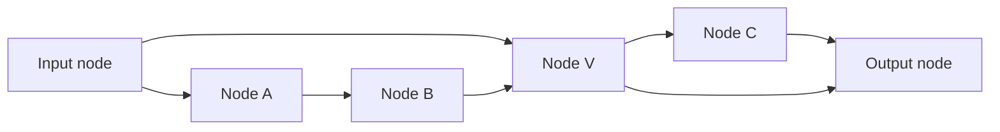

# Token-Owned General DAG Routing

> [!summary] 本页定位
> 本页给出一个面向 Tide 的正向候选：空间结构是任意有限 unit-delay DAG，不要求所有路径等长；外部 token step 通过一般注入时钟映射到全局 internal-round 时间；运行时 signal 保留 owner、causal frontier 与 absolute timestamp；node 持有长期 context；prefill 按空间拓扑序处理每个 node 的完整多 token / 多 round 事件流。本文定义 owner-ordered、atomic-joint 与 frontier-owned atomic fusion 三种 reference semantics，并证明它们各自满足一般 DAG 的 schedule equivalence。

> [!important] 核心结论
> Leveled DAG 是容易证明的特殊情形，但不是 exact chunk prefill 的必要条件。一般 DAG 中，真正需要的是：把 token index、注入时刻、trajectory path age 与 node arrival time 分开；保留消息的 owner 与到达时间；每个 mutable state 有明确 owner node；routing 只沿 DAG 前进；每个 node 对自身 timestamped event stream 提供与 reference fold 等价的 chunk transducer。跨 token selector state 若存在，也必须纳入该 contract。在这些条件下，absolute-time streaming schedule 可以重排为 node-topological chunk schedule。

> [!warning] Correctness 不自动推出高性能
> 本页主定理只证明 streaming 与 chunk 两种 schedules 计算同一 reference semantics。它允许一个 node 在一次调用中处理完整 chunk，并消除逐 token 的全局 host orchestration；但若 node-local transition 本身有顺序 state/control chain，其内部 span 仍可随事件数线性增长。Transformer/Mamba 意义上的低 token-axis span 还要求 causal attention、scan、segmented bulk、packed sparse kernel 等额外结构，并要求总 event 数受控。

## 0. 一页版模型



上图允许：

- `S -> V` 与 `S -> A -> B -> V` 同时存在。
- 不同路径保留真实长度；不插入 relay node 强行对齐。
- 外部 token step 可以间隔多个 internal rounds；长路径 signal 默认允许跨 external-step boundary 继续传播。
- 当路径长度差等于两个 token 的注入时间差时，较早 token 的长路径 signal 与较晚 token 的短路径 signal 会在同一 node、同一绝对时间相遇。
- 同一个 owner 经不同路径在同一 node 的不同绝对时间多次出现。

候选模型包含三类对象：

| 对象 | 生命周期 | 语义职责 |
| --- | --- | --- |
| Causally labelled message | 有限，只沿空间 DAG 前进 | 携带 owner、causal frontier、arrival time、event id 与 payload |
| Node-owned context state | 跨 token 与事件持久 | KV、SSM state、linear-attention accumulator，以及 state causal frontier |
| Node event-stream transducer | 每个有限 chunk 调用一次 | 在 node 内按 reference semantics 处理完整 timestamped inbox stream |

本页把 `strict prefill-native` 分成三个逐级增强的要求：

1. **正确性要求**：chunk schedule 与 absolute-time streaming reference 产生相同 messages、routes、node outputs、final states 与 readout。
2. **Node-local chunk throughput**：每个 node 能在一次或少量 device invocations 中处理完整 chunk event stream，支持本地 packing、批量 edge communication 与 node 内普通程序，不需要逐 token 的全局调度往返。
3. **Sequence-axis low span**：node 内跨 token transition 还能通过 token-local、scan、causal-bulk 或其他 contraction 避免长度随 token/event 数线性增长的 critical path。

第 1 项是本文主定理的结论；第 2 项是 Tide 当前最直接的实现目标；第 3 项是更强但不自动成立的性能性质。

同一绝对时间到达同一 node 的多个 owners 有三种候选 semantics：

| Profile | 同刻状态可见性 | 主要特点 |
| --- | --- | --- |
| `owner-ordered` | 按 owner token 递增提交；B 读取 A 已提交后的 state | 因果方向明确，接近 autoregressive fold |
| `atomic-joint` | 全部同刻 inputs 进入一个原子 joint transition，再一次 commit | 更接近同步 graph machine，可表达同刻联合交互 |
| `frontier-fusion` | 同刻 inputs 与 pre-state 联合计算，只产生一个 frontier-owned output | 以最大 causal dependency 作为新 owner，吸收旧 trajectory，恢复显式 token-prefix 上界 |

三种 profile 都可以有 chunk implementation。它们通常是三种不同模型：只有 joint operator 被证明等于 owner-ordered fold 时，joint execution 才只是 ordered semantics 的高性能实现；frontier fusion 则主动把多个 owner trajectories quotient 成一个 causal-frontier trajectory。

## 记号约定

定义自然数与正整数：

$$
\mathbb N=\{0,1,2,\ldots\},
$$

$$
\mathbb N_{>0}=\{1,2,3,\ldots\}.
$$

对 $L\in\mathbb N$，定义：

$$
[L]=\{0,1,\ldots,L-1\}.
$$

若 $L=0$，则 $[L]=\varnothing$。

有限序列使用圆括号表示。有限 multiset 保留重复元素，不因 payload 相等而去重。

本文沿用 [[step-transition-mathematical-specification#定义 1.2：顺序 fold|顺序 fold]]、[[step-transition-mathematical-specification#定义 3.6a：logical event DAG program|logical event DAG]] 与 [[adaptive-routing-prefill-impossibility]] 的结论，但本页所需对象均在首次使用前重新定义。

## 1. 一般 Unit-Delay 空间 DAG

### 定义 1.1：带输入输出的空间 DAG

一个带输入输出的空间 DAG 是三元组：

$$
(G,s,z),
$$

其中：

- $G=(V,E)$ 是有限有向无环图。
- $s\in V$ 是唯一 input node。
- $z\in V$ 是唯一 output node。
- 每个 $v\in V$ 都位于至少一条从 $s$ 到 $z$ 的有向路径上。

对 edge $(u,v)\in E$，$u$ 称为 $v$ 的直接空间前驱，$v$ 称为 $u$ 的直接空间后继。

### 定义 1.2：有向路径与路径长度

从 node $u$ 到 node $v$ 的一条有向路径是 node tuple：

$$
p=(v_0,v_1,\ldots,v_k),
$$

满足：

$$
v_0=u,\qquad v_k=v,
$$

并且对每个 $i\in\{0,\ldots,k-1\}$：

$$
(v_i,v_{i+1})\in E.
$$

路径 $p$ 的 edge 数称为路径长度，记为：

$$
|p|=k.
$$

定义从 input node 到 $v$ 的可达路径长度集合：

$$
\Lambda(v)
=
\{|p|\mid p\text{ 是从 }s\text{ 到 }v\text{ 的有向路径}\}.
$$

因为 $G$ 有限且无环，$\Lambda(v)$ 是有限非空集合。

定义空间 DAG 的最大路径长度：

$$
D
=
\max_{v\in V}\max\Lambda(v).
$$

由于有向路径不能重复经过同一个 node：

$$
D\leq |V|-1.
$$

定义 input 到 output 的最短路径长度：

$$
d_{\min}
=
\min\Lambda(z).
$$

在某些 streaming/decode 设计中，会把相邻 token 的固定注入间隔取为 $d_{\min}$，使最短 output path 恰好在下一 token 的注入 boundary 到达 output。这是一种 injection policy，不是一般 DAG 的图论性质；当 $D>d_{\min}$ 时，更长路径仍会跨越 external-step boundary。同一 boundary 上“先 readout 还是先注入”必须由 phase order 单独规定。

### 定义 1.3：Unit-delay edge

本文假设每条 edge 的 reference propagation delay 恰好为一个 global internal round：

$$
\operatorname{delay}(u,v)=1,
\qquad (u,v)\in E.
$$

这是一条语义约束，不是硬件传输延迟。物理 runtime 可以 fusion、buffer 或异步执行，但必须保持 logical arrival time。

> [!note] 一般 DAG 与 Leveled DAG
> 若对任意 node $v$，集合 $\Lambda(v)$ 只有一个元素，则所有从 $s$ 到 $v$ 的路径等长，旧文档中的 leveled DAG 是本页模型的特殊情形。本文不再把这一性质作为前提，也不通过 relay nodes 改变原 edge 的单位时延。

## 2. External Step、Internal Round、Owner 与绝对时间

### 定义 2.1：External token step、注入时钟与 Owner

给定长度为 $L$ 的输入序列：

$$
x_{0:L}=(x_0,x_1,\ldots,x_{L-1}).
$$

External token step $t\in[L]$ 是 token 的顺序编号，不是 internal-round 时间单位。

若 $L>0$，给定一个注入时钟：

$$
\sigma:[L]\to\mathbb N,
$$

满足：

$$
\sigma(0)=0,
$$

以及对任意 $t,t+1\in[L]$：

$$
\sigma(t)<\sigma(t+1).
$$

$\sigma(t)$ 表示 token $x_t$ 被注入 input node $s$ 时的全局 internal-round 时刻。对每个满足 $t,t+1\in[L]$ 的 $t$，定义相邻 external steps 之间的 internal-round 数：

$$
R_t
=
\sigma(t+1)-\sigma(t)
\in\mathbb N_{>0}.
$$

固定 round 数 $R\in\mathbb N_{>0}$ 是特殊情形：

$$
\sigma(t)=Rt,
\qquad
R_t=R.
$$

由 token $x_t$ 的注入产生并继续传播的每条 trajectory message 都携带 owner：

$$
\operatorname{owner}(m)=t.
$$

本文把 $\sigma$ 视为 reference semantics 的给定输入，并要求 streaming/chunk 两种 schedules 使用同一个 $\sigma$。若下一 token 的注入时刻由尚未完成的 routing/output 动态决定，则该 schedule generator 本身也必须进入 logical event DAG 与 chunk contract；本文定理不能把这类自适应注入时钟当作免费条件。

默认采用 **carry-over semantics**：external-step boundary 不截断仍在空间 DAG 中传播的 messages。若 $t,t+1\in[L]$，且 token $t$ 的 trajectory 在 path age $R_t$ 后仍未终止，它会在 token $t+1$ 注入后继续传播。Boundary absorption、truncate 或强制 clear 都是不同 reference semantics，必须单独定义。

在 owner-ordered 与 atomic-joint profile 中，owner 默认表示 message 正在推进哪个 token 的 trajectory。它不表示 payload 只能依赖该 token；例如 owner 为 B 的 query 可以通过 node-owned KV state 读取 A 的影响。

在 frontier-fusion profile 中，fusion 后的 owner 改为该结果的 causal frontier。此时 owner 不再表示最初发起路径的 token；原 trajectory lineage 若仍有审计价值，应保存在独立 metadata 中。

### 定义 2.1a：Prefix-Causal Object 与 Causal Frontier

定义 frontier index space：

$$
\mathbb F_L
=
\{-1\}\cup[L].
$$

给定由输入序列 $x_{0:L}$ 决定的任意 semantic object $q$，以及 $c\in\mathbb F_L$。称 $q$ 是 $c$-prefix-causal 的，当且仅当对任意两个输入序列 $x_{0:L}$ 与 $\bar x_{0:L}$：

$$
x_j=\bar x_j,
\qquad
0\leq j\leq c,
$$

都蕴含两次 execution 中的 $q$ 相同。若 $c=-1$，该条件表示 $q$ 与全部 input tokens 无关。

对 dynamic routing object，$q$ 包含“该 event/route 是否存在”这一 presence bit；不存在时把其值记为 $\bot$。因此“$q$ 相同”同时要求两次 execution 中 event existence 与存在时的数值都相同。

若 runtime 为 $q$ 声明：

$$
\operatorname{frontier}(q)=c,
$$

则要求 $q$ 至少是 $c$-prefix-causal 的。Frontier 可以是保守上界，不要求一定是最小依赖 token index。Input token 满足：

$$
\operatorname{frontier}(x_t)=t.
$$

### 定义 2.2：Trajectory Path Age 与 Ambient Internal Round

一条 trajectory message 从 token $t$ 的注入开始，每经过一条 edge，其 path age 增加 $1$。

若某条 message 已沿其实际 routing path 经过 $k\in\mathbb N$ 条 edges，则称 $k$ 为该 trajectory 的 path age。Path age 是相对于其注入时刻的局部量，不等于“当前 external step 内已经运行了多少 round”。

对任意至少已有一个 token 注入的 absolute time $\tau$，定义 ambient external step：

$$
e_{\sigma}(\tau)
=
\max\{t\in[L]\mid \sigma(t)\leq\tau\},
$$

以及该 external step 内的 ambient round offset：

$$
r_{\sigma}(\tau)
=
\tau-\sigma(e_{\sigma}(\tau)).
$$

当 $e_{\sigma}(\tau)<L-1$ 时：

$$
0\leq r_{\sigma}(\tau)<R_{e_{\sigma}(\tau)}.
$$

在最后一个 token 注入后的 drain tail 中，$r_{\sigma}(\tau)$ 可以继续增大。一个 message 的 trajectory owner $t$ 通常不等于其到达时的 ambient external step $e_{\sigma}(\tau)$；这正是跨 external-step carry-over 的含义。

若 runtime 在一个 internal round 内还有有限个具有语义可见性的 phases，取 $N_{\mathrm{phase}}\in\mathbb N_{>0}$，并给定有序 phase tuple：

$$
\mathcal P
=
(\varphi_0,\ldots,\varphi_{N_{\mathrm{phase}}-1}),
$$

并使用完整 logical timestamp：

$$
\theta=(\tau,\varphi_j),
\qquad
j\in\{0,\ldots,N_{\mathrm{phase}}-1\}.
$$

Timestamp 按 lexicographic order 排序。本文后续假设跨 edge message 在固定 inbox phase 可见，因此主要公式只写 $\tau$；node-local phases 封装在 node transducer 内。若 phase 会改变跨 event 的 visibility/commit order，则应把后续公式中的 $\tau$ 系统地替换为 $\theta$，证明形式不变。

例如固定 $R=d_{\min}$ 时，token $t$ 的最短 output event 与 token $t+1$ 的 injection 可能具有同一个 $\tau$。取 $\varphi_{\mathrm{readout}},\varphi_{\mathrm{inject}}\in\mathcal P$ 分别表示 readout 与 injection phase。若 decode 中 $x_{t+1}$ 来自该 output readout，就必须声明：

$$
(\tau,\varphi_{\mathrm{readout}})
<
(\tau,\varphi_{\mathrm{inject}}),
$$

或把下一次 injection 延后一轮。本文主定理比较的是给定 token sequence 下的 streaming/chunk execution；它不把同刻 autoregressive generation feedback 隐藏在未声明的物理顺序中。

### 定义 2.3：绝对逻辑时间

对尚未经过 owner promotion 的 trajectory message，owner token $t$、path age $k$ 对应的绝对逻辑时间为：

$$
\tau=\sigma(t)+k.
\tag{GD-1}
$$
^eq-general-absolute-time

$\tau$ 不是硬件 wall-clock。它是 reference semantics 中所有 tokens 共用的逻辑时间轴。

固定每步 $R$ 个 internal rounds 时，式 GD-1 退化为：

$$
\tau=Rt+k.
$$

这里 $k$ 可以大于 $R$；它描述 message 自 token $t$ 注入后已经沿路径传播了多少个 unit-delay edges，而不是被限制在当前 external step 内。

一般情况下，absolute time $\tau$ 是 message 的一等字段。Frontier fusion 可以改变 owner，但不能重置或重算 $\tau$；fusion 后每经过一条 edge，arrival time 仍只增加 $1$。因此式 GD-1 不能用 promoted owner 反推 internal path length。

### 引理 2.4：Trajectory-Preserving Message 的到达时间

若 owner token $t$ 的 message 尚未经过 owner promotion，并沿长度为 $k$ 的实际 trajectory path 到达 node $v$，则它的 absolute arrival time 为：

$$
\tau=\sigma(t)+k,
\qquad k\in\Lambda(v).
\tag{GD-2}
$$
^eq-general-arrival-time

**证明。**

Token $t$ 在 absolute time $\sigma(t)$ 注入。每经过一条 unit-delay edge，arrival time 增加 $1$。长度为 $k$ 的路径包含 $k$ 条 edges，所以到达时间为 $\sigma(t)+k$。

<div class="qed" aria-label="证毕">∎</div>

### 推论 2.4a：Absolute-Time Prefix

若 $L>0$，对任意 absolute time $\tau\in\mathbb N$，定义已注入 token prefix 的最大 index：

$$
a_{\sigma}(\tau)
=
\max
\left(
\{-1\}
\cup
\{t\in[L]\mid \sigma(t)\leq\tau\}
\right).
$$

假设 node kernel 不直接读取尚未注入的未来 token。任意在 absolute time $\tau$ 产生或到达的 well-formed object $q$ 都可以声明某个满足：

$$
\operatorname{frontier}(q)\leq a_{\sigma}(\tau)
$$

的有效 causal frontier。三种 profile 的 message owner 也都满足：

$$
\operatorname{owner}(m)\leq a_{\sigma}(\tau).
$$

在固定 $R$ 且 $L>0$ 的情形：

$$
a_{\sigma}(\tau)
=
\min
\left(
L-1,
\left\lfloor\frac{\tau}{R}\right\rfloor
\right).
$$

**证明。**

对 absolute time $\tau$ 做外层归纳，并在 owner-ordered profile 的同一 timestamp 内按 owner order 做内层归纳。初始 state 与 tokens 无关，frontier 为 $-1$。在 time $\tau$，系统只可能读取：

- 已在更早 absolute time 产生的 state/messages。
- 若存在满足 $\sigma(t)=\tau$ 的 $t$，则读取本时刻注入的唯一 token $x_t$。
- 同一 timestamp 内已经完成的 earlier-owner intermediate state。
- Static parameters 与 metadata。

由外层归纳假设，更早 objects 的 frontier 不超过相应时刻的 $a_{\sigma}$；因为 $a_{\sigma}$ 单调不减，它们也不超过 $a_{\sigma}(\tau)$。若本时刻注入 $x_t$，则 $t=a_{\sigma}(\tau)$。由内层归纳，同刻 earlier-owner intermediate state 的 frontier 也不超过 $a_{\sigma}(\tau)$。确定性 kernel 对这些 objects 的任意组合至多依赖 input prefix $0{:}a_{\sigma}(\tau)$，所以可以声明不超过该 index 的 frontier。

Owner-ordered/atomic-joint message 的 trajectory owner 来自已经注入的 token，因此不超过 $a_{\sigma}(\tau)$。Frontier-fusion message 的 owner 等于其 frontier，同样不超过 $a_{\sigma}(\tau)$。

<div class="qed" aria-label="证毕">∎</div>

因此三种 profile 都不读取尚未注入 streaming system 的 token；但对前两种 profile，这只保证 absolute-time causality，不保证 trajectory owner $t$ 的所有 late events 只依赖 token prefix $0{:}t$。

### 例 2.5：不同 Owner 的同刻碰撞

考虑：

```text
s -----------------> v
s -> a -> b --------> v
```

第一条路径长度为 $1$，第二条路径长度为 $3$。取固定 external-step interval：

$$
R=2,
\qquad
\sigma(t)=2t.
$$

- Token A 的 index 为 $0$，沿长路径到达 $v$ 的时间为 $\sigma(0)+3=3$。
- Token B 的 index 为 $1$，沿短路径到达 $v$ 的时间为 $\sigma(1)+1=3$。

因此 A 与 B 在同一 node $v$、同一 absolute time $\tau=3$ 到达。A 的长路径 signal 已跨过 token B 的注入 boundary，但没有被截断。

### 命题 2.6：一般 DAG 中 Owner 不能由 Node 与时间恢复

若存在 node $v$、两个不同 token indices $t_A,t_B\in[L]$ 与路径长度：

$$
k_A,k_B\in\Lambda(v),
$$

满足：

$$
\sigma(t_A)+k_A
=
\sigma(t_B)+k_B,
$$

则 owner 为 $t_A$、路径长度为 $k_A$ 的 message，与 owner 为 $t_B$、路径长度为 $k_B$ 的 message，在同一 node、同一 absolute time 到达。

**证明。**

两条 message 的 arrival time 分别为：

$$
\tau_A=\sigma(t_A)+k_A,
$$

$$
\tau_B=\sigma(t_B)+k_B.
$$

由题设：

$$
\tau_B
=
\sigma(t_B)+k_B
=
\sigma(t_A)+k_A
=
\tau_A.
$$

但 $t_A\neq t_B$，所以 $(v,\tau)$ 不能唯一确定 owner。

<div class="qed" aria-label="证毕">∎</div>

这个命题说明：在一般 DAG 中，owner metadata 不是冗余字段。若把同刻不同 owners 的 messages 无标签合并，后续 output alignment、routing、loss、replay 与归因都会失去明确语义。

### 命题 2.7：前序 Token 晚到与 Owner Inversion 条件

取 $t_A<t_B$，并令两条 trajectory messages 到达同一 node $v$ 的 path ages 分别为 $k_A,k_B\in\Lambda(v)$。则后序 token B 的 message 先于前序 token A 的 message 到达，当且仅当：

$$
k_A-k_B
>
\sigma(t_B)-\sigma(t_A).
$$

二者同刻到达，当且仅当上式中的 $>$ 改为 $=$。

**证明。**

由引理 2.4：

$$
\tau_A=\sigma(t_A)+k_A,
\qquad
\tau_B=\sigma(t_B)+k_B.
$$

因此：

$$
\tau_B<\tau_A
$$

当且仅当：

$$
\sigma(t_B)+k_B
<
\sigma(t_A)+k_A,
$$

移项即得结论。同刻条件同理。

<div class="qed" aria-label="证毕">∎</div>

这个命题精确区分了两种情况：增大 external-step interval 会减少不同 token trajectories 的重叠；但只要路径长度差超过注入时间差，一般 DAG 仍会出现后序 owner 先到。固定 $R$ 时，条件化为：

$$
k_A-k_B>R(t_B-t_A).
$$

## 3. 可选的双 Cortex 空间结构

### 定义 3.1：Input/Output 双 Cortex DAG

设 input cortex 为：

$$
G_I=(V_I,E_I),
$$

其执行方向从 input node $s$ 指向 input bridge node $b_I$。

设 output cortex 为：

$$
G_O=(V_O,E_O),
$$

其执行方向从 output bridge node $b_O$ 指向 output node $z$。

假设：

$$
V_I\cap V_O=\varnothing.
$$

增加唯一单向 bridge：

$$
(b_I,b_O).
$$

组合图定义为：

$$
G
=
\left(
V_I\cup V_O,\,
E_I\cup E_O\cup\{(b_I,b_O)\}
\right).
$$

$G_O$ 可以与 $G_I$ 反向同构，但反向同构只描述结构对应关系，不增加从 output cortex 返回 input cortex 的执行 edge。

### 引理 3.2：单向 Bridge 保持 DAG

若 $G_I$ 与 $G_O$ 都是 DAG，且不存在从 $V_O$ 指向 $V_I$ 的 edge，则定义 3.1 的组合图 $G$ 是 DAG。

**证明。**

假设 $G$ 中存在有向环。若该环完全位于 $V_I$ 或 $V_O$，分别与 $G_I$ 或 $G_O$ 是 DAG 矛盾。

若该环同时经过两侧，则它必须通过 bridge $(b_I,b_O)$ 从 $V_I$ 进入 $V_O$。要回到 $V_I$，环中必须存在一条从 $V_O$ 指向 $V_I$ 的 edge，但前提排除了这种 edge，矛盾。

所以 $G$ 无有向环。

<div class="qed" aria-label="证毕">∎</div>

## 4. Message、Inbox 与有限事件性

### 定义 4.1：Causally Labelled Timestamped Message

一条 message 写成：

$$
m=(\iota,t,c,\tau,u,v,\mu,p),
$$

其中：

- $\iota$ 是全局唯一 logical event id。
- $t\in[L]$ 是 owner token。
- $c\in\mathbb F_L$ 是满足定义 2.1a 的 causal frontier。
- $\tau\in\mathbb N$ 是 arrival time。
- $u$ 是 source node；input injection 可以使用一个固定 virtual source。
- $v\in V$ 是 destination node。
- $\mu$ 是可选 metadata，例如 signal slot、phase、source port 或 route id。
- $p$ 是 payload。

定义字段读取函数：

$$
\operatorname{id}(m)=\iota,
\qquad
\operatorname{owner}(m)=t,
$$

$$
\operatorname{frontier}(m)=c,
\qquad
\operatorname{arrival}(m)=\tau,
\qquad
\operatorname{src}(m)=u,
\qquad
\operatorname{dst}(m)=v.
$$

Event id 使重复 payload 仍保持为不同 messages。Logical event id 必须由 input id、route lineage、source/destination、owner/frontier、timestamp 或 birth slot 等语义字段确定性生成，不能来自依赖线程竞争顺序的全局自增计数。Reference semantics 不依赖物理线程首先写入 inbox 的顺序。

对每个 input token $t\in[L]$，定义注入 record：

$$
m_t^{\mathrm{in}}
=
(\iota_t,t,t,\sigma(t),\mathtt{input},s,\mu_t,x_t).
$$

因此 input injection 的 owner 与 frontier 都是 $t$，arrival time 为 $\sigma(t)$，trajectory path age 为 $0$。Metadata $\mu_t$ 应至少允许恢复 external step $t$；ambient round offset 为：

$$
r_{\sigma}(\sigma(t))=0.
$$

### 定义 4.2：Unit-delay dispatch

若 node $v$ 在 absolute time $\tau$ 产生带 owner $t'$ 与 frontier $c'$ 的 output record，并沿 selected edge $(v,w)\in E$ dispatch，则新 message 必须满足：

$$
\operatorname{owner}(m')=t',
\qquad
\operatorname{frontier}(m')=c',
$$

$$
\operatorname{arrival}(m')=\tau+1,
\tag{GD-3}
$$
^eq-unit-delay-dispatch

$$
\operatorname{src}(m')=v,
\qquad
\operatorname{dst}(m')=w.
$$

Routing 可以更新 payload、event id 与其他 metadata，但不能独立改写 node output 已声明的 owner/frontier，也不能改写 logical arrival time。

### 定义 4.3：按 Node、时间和 Owner 分桶的 Inbox

对 node $v$、absolute time $\tau$ 与 owner $t$，定义 finite message multiset：

$$
I_{v,\tau,t}
=
\left\{
m\ \middle|\
\operatorname{dst}(m)=v,\,
\operatorname{arrival}(m)=\tau,\,
\operatorname{owner}(m)=t
\right\}_{\mathrm{multi}}.
\tag{GD-4}
$$
^eq-general-owner-inbox

定义同刻到达 $v$ 的 owner 集合：

$$
\mathcal O_{v,\tau}
=
\{t\in[L]\mid I_{v,\tau,t}\neq\varnothing\}.
$$

把它按 token index 递增排列：

$$
O_{v,\tau}^{\uparrow}=(t_1,t_2,\ldots,t_m),
\qquad t_1<t_2<\cdots<t_m.
$$

### 定义 4.4：同 Owner、同刻聚合

对每个 node $v$，给定 input space $X_v$ 和确定性聚合器：

$$
\operatorname{Aggregate}_v:
\mathcal M_{\mathrm{fin}}(\mathcal R_v)
\to X_v,
$$

其中 $\mathcal R_v$ 是到达 $v$ 的 message record 空间，$\mathcal M_{\mathrm{fin}}(\mathcal R_v)$ 表示其有限 multisets。

定义：

$$
x_{v,\tau,t}
=
\operatorname{Aggregate}_v(I_{v,\tau,t}).
\tag{GD-5}
$$
^eq-general-owner-aggregate

聚合值默认声明保守 frontier：

$$
\operatorname{frontier}(x_{v,\tau,t})
=
\max_{m\in I_{v,\tau,t}}
\operatorname{frontier}(m).
$$

若聚合器能够证明忽略了某些高-frontier messages，可以声明更小但仍有效的 frontier；不能在没有证明时降低 label。

如果聚合器与顺序无关，它直接作用于 multiset。若业务语义要求顺序，必须先按固定字段，例如 `(source node id, event id)`，做 canonical sort；不能使用物理 arrival race 作为隐式顺序。

不同 absolute times 的 messages 不在本步骤聚合。同一个 owner 可以因不同路径长度在同一 node 多次激活：

$$
x_{v,\tau_1,t},
\qquad
x_{v,\tau_2,t},
\qquad
\tau_1\neq\tau_2.
$$

### 引理 4.5：有限 Horizon

若 token 数为 $L>0$，则所有由这些 tokens 产生并沿 $G$ 传播的 messages 都满足：

$$
0\leq\tau\leq \sigma(L-1)+D.
\tag{GD-6}
$$
^eq-finite-horizon

**证明。**

对每条 message 保留一个只用于 timing proof 的 witness $(t,p)$：$t\in[L]$ 是某个触发该 event chain 的 input injection，$p$ 是从 $s$ 到当前 destination 的有向路径，并满足：

$$
\tau=\sigma(t)+|p|.
$$

Input injection 取空路径即可。若 node invocation 由一条带 witness $(t,p)$ 的 incoming message 触发，则沿 edge $(v,w)$ 发出的任意 message 可以取延长路径 $p\mathbin{\|}(v,w)$ 作为 witness。Owner/frontier promotion 不改变 absolute time，也不影响这个 timing witness。

因为默认 profile 不在 empty timestamp 自主发射 message，所有 dispatched messages 都可由上述归纳得到 witness。又因为 $\sigma$ 严格递增、$t\leq L-1$ 且 $|p|\leq D$：

$$
\tau=\sigma(t)+|p|
\leq
\sigma(L-1)+D.
$$

固定每步 $R$ 个 internal rounds 时，上界化为：

$$
\tau\leq R(L-1)+D.
$$

<div class="qed" aria-label="证毕">∎</div>

### 引理 4.6：有限事件性

假设每次 node invocation 只沿有限 outgoing edge 集合发出有限条 messages。对任意有限输入 chunk，一次 execution 产生的 message 集合有限。

**证明。**

有限 DAG 中有向路径数量有限。每条 message 只能沿 edge 方向前进，不能返回已经经过的 node。初始 injection 数有限，每次 invocation 的 fan-out 有限，所以对有限路径树做有限次展开后，总 message 数有限。

<div class="qed" aria-label="证毕">∎</div>

有限不等于高效。一般 DAG 的路径数量可以随 $|V|$ 指数增长，因此后文仍需单独加入 sparse event budget。

## 5. Node-Owned State 与三种同刻/融合语义

### 定义 5.1：Node-owned persistent context

每个 node $v$ 有 state space：

$$
\mathcal S_v,
$$

以及初始 state：

$$
S_v^0\in\mathcal S_v.
$$

其具体实现可以是：

- KV cache。
- Mamba/SSM recurrent state。
- Linear-attention accumulator。
- 显式 node memory。
- 其他具有 chunk correctness contract 的 state。

Strict profile 要求每个 mutable state location 有唯一 owner node。若多个 nodes 必须联合修改同一 state，应把它们封装为一个具有独立 event-stream contract 的 supernode/subgraph operator。

Persistent state 属于 node，不属于某个 token。为进行 causal audit，把实际数值 state 与其 frontier 写成 augmented state：

$$
\widetilde S_v=(S_v,c_v^S),
\qquad
c_v^S\in\mathbb F_L.
$$

初始 state 不依赖输入，声明：

$$
c_v^{S,0}=-1.
$$

后续公式为避免冗长仍把 numerical state 写成 $S$；其 frontier label $c_v^S$ 与 state 一起 commit。前两种 profile 可以只把该 label 用于审计，frontier-fusion profile 则会用它决定新的 outgoing owner。

对任意 node transition，若它读取的 semantic objects 的 frontiers 为：

$$
c_1,\ldots,c_n,
$$

则 output hidden 与 post-state 默认声明：

$$
c_{\mathrm{out}}
=
\max_{1\leq i\leq n}c_i.
$$

Kernel 若通过 causal mask、versioned state 或独立证明得到更紧的 dependency bound，可以声明更小的有效 frontier。Owner-ordered/atomic-joint profile 保留 trajectory owner，即使 $c_{\mathrm{out}}>\operatorname{owner}$；这个不等式正是 owner-prefix contamination 的显式检测信号。

因此：

```text
message / hidden / route record -> owner-labelled + frontier-labelled
persistent context             -> node-owned + frontier-labelled
```

### 定义 5.2：同刻 Owner tuple

对非空 owner 集合：

$$
O_{v,\tau}^{\uparrow}=(t_1,\ldots,t_m),
$$

定义 node $v$ 在 time $\tau$ 的 owner-indexed input tuple：

$$
B_{v,\tau}
=
\bigl(
(t_1,x_{v,\tau,t_1}),
\ldots,
(t_m,x_{v,\tau,t_m})
\bigr).
$$

该 tuple 的顺序由 token index 唯一决定，不依赖 runtime scheduling。

同时定义不按 owner 分开的完整同刻 inbox：

$$
I_{v,\tau}
=
\biguplus_{t\in\mathcal O_{v,\tau}}
I_{v,\tau,t},
$$

其中 $\biguplus$ 表示保留重复 messages 的 multiset union。Frontier-fusion profile 直接对 $I_{v,\tau}$ 做一次联合计算。

默认 strict profile 中，没有 inbox event 的 node state 保持不变。若模型需要在空 timestamp 执行 decay，应另行定义：

$$
\operatorname{Idle}_v:
\mathbb N\times\mathcal S_v\to\mathcal S_v,
$$

并把所有 empty-time updates 纳入 $\operatorname{Ref}_v^P$ 与 $\mathcal C_v^P$。本页后续公式取 $\operatorname{Idle}_v(\tau,S)=S$；非平凡 idle/decay 是相同证明框架下的扩展，不是免费省略项。

#### 定义 5.2a：Node 的 Absolute-Time Event Order

对同一 node 的两个 owner events：

$$
e=(\tau,t),
\qquad
e'=(\tau',t'),
$$

定义：

$$
e\prec_v e'
$$

当且仅当：

$$
\tau<\tau',
$$

或：

$$
\tau=\tau'
\quad\text{且}\quad
t<t'.
$$

因此 node state 首先按 absolute time 演进；只有 absolute time 相同，才使用 owner token 打破并列。

#### 例 5.2b：跨时间的 Owner Inversion

取固定 external-step interval $R=2$，所以 $\sigma(0)=0$、$\sigma(1)=2$。考虑 owner A 的 token index 为 $0$，沿长度 $4$ 的路径到达 $v$；owner B 的 token index 为 $1$，沿长度 $1$ 的路径到达 $v$。二者 arrival times 为：

$$
\tau_A=\sigma(0)+4=4,
\qquad
\tau_B=\sigma(1)+1=3.
$$

虽然 $t_A<t_B$，但在 absolute-time event order 中：

$$
(\tau_B,t_B)\prec_v(\tau_A,t_A).
$$

所以 B 的短路径 event 会先更新 node state，A 的晚到 event 可能读取 B 的影响。后文的 owner-ordered profile 只规定同一 $\tau$ 内的顺序，不消除这种跨时间 owner inversion。

### 5.3 Profile O：Owner-Ordered Within-Timestamp Fold

#### 定义 5.3：单 Owner event transition

给定 hidden space $H_v$。Node $v$ 的单 event transition 是确定函数：

$$
\mathcal T_v:
\mathbb N\times\mathbb N\times X_v\times\mathcal S_v
\to
(H_v\cup\{\bot\})\times\mathcal S_v.
$$

输入的两个自然数依次是 owner token $t$ 与 absolute time $\tau$。$\bot$ 表示该 event 不产生可路由 hidden。

#### 定义 5.4：Owner-ordered 同刻 transition

给定：

$$
B_{v,\tau}
=
\bigl((t_1,x_1),\ldots,(t_m,x_m)\bigr),
\qquad t_1<\cdots<t_m,
$$

以及进入该 timestamp 前的 state $S^{(0)}$。递归定义：

$$
(h_i,S^{(i)})
=
\mathcal T_v(t_i,\tau,x_i,S^{(i-1)}),
\qquad i=1,\ldots,m.
\tag{GD-7}
$$
^eq-owner-ordered-group

该 timestamp 的 owner outputs 与提交后 state 分别为：

$$
H_{v,\tau}^{\mathrm{ord}}
=
\bigl((t_1,h_1),\ldots,(t_m,h_m)\bigr),
$$

其中每个 $h_i$ 还携带按定义 5.1 更新的 causal frontier；tuple 中为简洁省略该字段。

$$
S^+
=
S^{(m)}.
$$

若 A、B 同刻到达且 $t_A<t_B$，则 B 的 transition 读取 A 已经更新后的 state。因果方向是：

$$
A\longrightarrow B.
$$

Owner-ordered 是同一 timestamp 内的 reference semantics；完整 node event stream 仍按定义 5.2a 的 $(\tau,t)$ lexicographic order 演进。它不要求物理实现真的逐 owner 循环。若能证明一个 causal mask、scan 或其他 bulk kernel 等于式 [[#^eq-owner-ordered-group|GD-7]]，则可以联合执行。

### 5.4 Profile J：Atomic Joint Timestamp Transition

#### 定义 5.5：Joint transition 与 collective delta

定义 $\mathcal B_v$ 为所有有限 owner-indexed input tuples 的集合。其任意元素具有形式：

$$
B
=
\bigl((t_1,x_1),\ldots,(t_m,x_m)\bigr),
\qquad
t_1<\cdots<t_m.
$$

其中 $m\in\mathbb N_{>0}$、$t_i\in\mathbb N$ 且 $x_i\in X_v$。

定义 $\mathcal H_v^\star$ 为所有具有相同 owner-key 形式的有限 hidden tuples 的集合：

$$
H
=
\bigl((t_1,h_1),\ldots,(t_m,h_m)\bigr).
$$

其中 $h_i\in H_v\cup\{\bot\}$。

调用 $\mathcal J_v$ 时，output tuple 必须与 input tuple 使用完全相同的 owner-key sequence；若某个 owner 不产生 hidden，则相应位置写为 $\bot$。

对 node $v$，给定 delta space $\Delta_v$、commit function：

$$
\operatorname{Commit}_v:
\mathcal S_v\times\Delta_v
\to\mathcal S_v,
$$

以及 atomic joint transition：

$$
\mathcal J_v:
\mathbb N\times\mathcal B_v\times\mathcal S_v
\to
\mathcal H_v^\star\times\Delta_v.
$$

对任意 timestamp $\tau$、owner tuple $B_{v,\tau}$ 与进入该 timestamp 前的 state $S$，定义：

$$
\mathcal J_v(\tau,B_{v,\tau},S)
=
\left(
H_{v,\tau}^{\mathrm{joint}},
\Delta_{v,\tau}
\right),
\tag{GD-8}
$$
^eq-atomic-joint-transition

其中：

$$
H_{v,\tau}^{\mathrm{joint}}
=
\bigl((t_1,h_1),\ldots,(t_m,h_m)\bigr)
$$

仍为 owner-indexed outputs；每个 $h_i$ 还携带经过证明或按默认 max 规则得到的 causal frontier。State 只在 joint computation 结束后提交一次：

$$
S^+
=
\operatorname{Commit}_v(S,\Delta_{v,\tau}).
\tag{GD-9}
$$
^eq-atomic-joint-commit

定义 joint transition 与 commit 的组合：

$$
\operatorname{Atomic}_v(\tau,B_{v,\tau},S)
=
\left(
H_{v,\tau}^{\mathrm{joint}},
\operatorname{Commit}_v(S,\Delta_{v,\tau})
\right).
\tag{GD-9a}
$$
^eq-atomic-joint-composed

$\Delta_{v,\tau}$ 属于 node 的 collective state update，不要求归属于某个单独 token。为了 replay 与 attribution，可以额外保留 per-owner delta decomposition，但它不是数学正确性的必要字段。

Atomic-joint 允许：

- 所有 owners 读取同一个 pre-state。
- Joint kernel 比较多个 owners 的 inputs。
- 每个 owner 的 output 依赖同刻其他 owners。
- Joint kernel 使用 owner index 构造 triangular mask。

它不允许把多个 owners 变成一个永久无 owner 的 travelling signal。Outgoing records 仍必须按 owner 分开。

#### 定义 5.6：同刻 Owner-causal Joint Operator

对 $t\in\mathcal O_{v,\tau}$，定义 owner prefix：

若：

$$
B_{v,\tau}
=
\bigl((t_1,x_1),\ldots,(t_m,x_m)\bigr),
$$

并且 $t=t_j$，则：

$$
B_{v,\tau}^{\leq t}
=
\bigl((t_1,x_1),\ldots,(t_j,x_j)\bigr).
$$

若 owner $t$ 的 hidden 与 route decision 只依赖：

$$
(S,\tau,B_{v,\tau}^{\leq t}),
$$

而不依赖 owner 大于 $t$ 的 inputs，则称 joint operator 在该 timestamp 内是 owner-causal 的。

这是比 arbitrary joint 更强的约束。Arbitrary joint 只保证 absolute-time semantics；它不自动保证 token-owner 意义下的 prefix causality。

### 定义 5.7：Joint Operator 与 Ordered Fold 等价

把定义 5.4 的递归结果记为：

$$
\operatorname{GroupFold}_{\mathcal T_v}(\tau,B,S)
=
\left(
H_{v,\tau}^{\mathrm{ord}},
S^{(m)}
\right).
\tag{GD-9b}
$$
^eq-owner-group-fold

若对任意 $\tau$、任意 owner tuple $B\in\mathcal B_v$ 和任意 state $S\in\mathcal S_v$：

$$
\operatorname{Atomic}_v(\tau,B,S)
=
\operatorname{GroupFold}_{\mathcal T_v}(\tau,B,S),
\tag{GD-10}
$$
^eq-joint-ordered-equivalence

则称 atomic-joint operator 与 owner-ordered group fold 等价。这里要求相等的是：

- 每个 owner 的 hidden。
- 每个 owner 的 route-visible record。
- Timestamp 结束后的 state。

只比较 collective delta 或 final state 不足以建立等价。

### 命题 5.8：Fold-Equivalent Joint Execution 不改变语义

若式 [[#^eq-joint-ordered-equivalence|GD-10]] 对 node $v$ 成立，则在该 node 上用 $\mathcal J_v$ 一次执行整个 timestamp group，与按 owner token 顺序执行 $\mathcal T_v$ 得到相同 observable artifacts。

**证明。**

这是式 [[#^eq-joint-ordered-equivalence|GD-10]] 的直接展开：定义已经要求 owner outputs、route-visible records 与 final state 全部相等。

<div class="qed" aria-label="证毕">∎</div>

### 例 5.9：Final State 相同但语义不同

令：

$$
S\in\mathbb R,
$$

单 event transition 为：

$$
\mathcal T(x,S)=(S+x,S+x).
$$

取：

$$
S=0,\qquad x_A=1,\qquad x_B=2.
$$

Owner-ordered fold 得到：

$$
h_A=1,\qquad h_B=3,\qquad S^+=3.
$$

若 snapshot-joint 分别从旧 state 计算，再把 delta 相加，则可能得到：

$$
h_A=1,\qquad h_B=2,\qquad S^+=3.
$$

两者 final state 都是 $3$，但 B 的 hidden 不同，所以后续 routing 与 output 也可能不同。

### 5.10 Profile F：Frontier-Owned Atomic Fusion

#### 定义 5.10：Fusion Frontier

给定 node $v$ 在 time $\tau$ 的非空完整 inbox $I_{v,\tau}$，以及 pre-state frontier $c_v^{S,-}$，定义本次 fusion 的 causal frontier：

$$
c_{v,\tau}^{\star}
=
\max
\left(
\{c_v^{S,-}\}
\cup
\{\operatorname{frontier}(m)\mid m\in I_{v,\tau}\}
\right).
\tag{GD-F1}
$$
^eq-frontier-fusion-max

这个定义必须读取 pre-state frontier。若当前 inputs 只有 A、B，但 pre-state 已经受 C 影响且 $C>B$，则：

$$
c_{v,\tau}^{\star}=C,
$$

不能把新 output 错误标记为 B。

#### 定义 5.11：Atomic Fusion Transition

Frontier-fusion kernel 是确定函数：

$$
\mathcal F_v:
\mathbb N
\times
\mathcal M_{\mathrm{fin}}(\mathcal R_v)
\times
\mathcal S_v
\to
(H_v\cup\{\bot\})
\times
\Delta_v.
$$

它对完整同刻 inbox 与 pre-state 做一次联合计算：

$$
\mathcal F_v(\tau,I_{v,\tau},S)
=
(h^\star,\Delta^\star).
\tag{GD-F2}
$$
^eq-frontier-fusion-transition

Numerical state 仍通过 $\operatorname{Commit}_v$ 一次提交：

$$
S^+
=
\operatorname{Commit}_v(S,\Delta^\star),
$$

并同时提交 state frontier：

$$
c_v^{S,+}=c_{v,\tau}^{\star}.
$$

若 $h^\star\neq\bot$，该 timestamp 只产生一个 unified owner record：

$$
H_{v,\tau}^{\mathrm{front}}
=
\bigl((c_{v,\tau}^{\star},h^\star)\bigr),
\tag{GD-F3}
$$
^eq-frontier-owned-output

且声明：

$$
\operatorname{owner}(h^\star)
=
\operatorname{frontier}(h^\star)
=
c_{v,\tau}^{\star}.
$$

所有 outgoing messages 都继承这个 owner/frontier。原始 A/B trajectory lineage 可以保存在 metadata 中，但不再各自产生 travelling output。该操作因此是一个明确的 semantic quotient，而不是对 owner-ordered 或 atomic-joint profile 的免费重排。

#### 例 5.11a：A/B Unified Emission 与 Pre-State Contamination

令 A、B 的 token indices 分别为：

$$
A=0,
\qquad
B=1.
$$

若同刻 inbox 只含 A/B，且 pre-state frontier 不超过 B，则：

$$
c^\star
=
\max(c_v^{S,-},0,1)
=
1,
$$

所以联合计算可以只发射一个 owner/frontier 都为 B 的 output。

若 pre-state 已经受 token C 影响，且：

$$
C=2>B,
\qquad
c_v^{S,-}=2,
$$

则：

$$
c^\star
=
\max(2,0,1)
=
2.
$$

此时数值计算即使当前只混合 A/B，也不能把 output 标记为 B；必须标记为 C，或改用不含 C 的 versioned/masked state。

#### 引理 5.12：Prefix-Causal Composition

设 semantic objects：

$$
q_1,\ldots,q_n
$$

分别具有有效 frontiers：

$$
c_1,\ldots,c_n.
$$

若 $f$ 是不读取其他 input-token 数据的确定函数，令：

$$
q=f(q_1,\ldots,q_n)
$$

并定义：

$$
c^\star
=
\max_{1\leq i\leq n}c_i,
$$

则 $q$ 是 $c^\star$-prefix-causal 的。

**证明。**

取任意两个在 prefix $0{:}c^\star$ 上相同的输入序列。因为每个 $c_i\leq c^\star$，两次 execution 中所有 $q_i$ 都相同。$f$ 是确定函数且不读取其他 token 数据，所以两次得到的 $q$ 相同。

<div class="qed" aria-label="证毕">∎</div>

#### 定理 5.13：Frontier-Fusion Token-Prefix Invariant

假设：

1. Initial state frontier 为 $-1$。
2. Input message $m_t^{\mathrm{in}}$ 的 owner/frontier 都是 $t$。
3. 每个 numerical kernel 与 selector 只读取其显式 inbox/hidden、pre-state、static parameters 与 logical metadata。
4. 每次 fusion 按式 [[#^eq-frontier-fusion-max|GD-F1]] 更新 state frontier，并按式 [[#^eq-frontier-owned-output|GD-F3]] 标记 unified output。

则任意 frontier-fusion state 或 message 若声明 frontier/owner 为 $c$，其数值内容只依赖：

$$
x_0,\ldots,x_c.
$$

特别地，不会出现一个 owner 为 A 的 late signal 读取 B 后仍继续标记为 A；它至少被提升到当前 causal frontier。

**证明。**

沿 absolute-time streaming execution 归纳。Initial states 与 tokens 无关，所以 frontier $-1$ 有效；input $x_t$ 的 frontier $t$ 有效。

假设某次 fusion 的 pre-state 与全部 inbox messages 都具有有效 frontiers。式 [[#^eq-frontier-fusion-max|GD-F1]] 取这些 frontiers 的最大值 $c^\star$。由引理 5.12，$\mathcal F_v$ 产生的 $h^\star$、$\Delta^\star$ 与 commit 后的 numerical state 都是 $c^\star$-prefix-causal 的。式 [[#^eq-frontier-owned-output|GD-F3]] 又把 output owner/frontier 与 $c^\star$ 对齐，所以 invariant 被保持。

Selector 是这些 prefix-causal outputs 与 static metadata 的确定函数，所以 selected-route existence 也保持同一个 frontier bound。Unit-delay spatial dispatch 只复制已经有效的 owner/frontier label，不读取新的 token 数据。对所有 absolute times 与其中的 node events 重复上述论证，结论成立。

<div class="qed" aria-label="证毕">∎</div>

#### 推论 5.13a：Dependency-Frontier Monotonicity

对 frontier-fusion logical event $e$，定义 $\operatorname{frontier}(e)$ 为该 event 提交的 state/output frontier。

在定理 5.13 的前提下，对 frontier-fusion execution 的任意 logical dependency edge：

$$
e\longrightarrow e',
$$

都有：

$$
\operatorname{frontier}(e)
\leq
\operatorname{frontier}(e').
$$

因此有限 logical event DAG 可以先按 frontier 递增分组，再在同一 frontier 内取 topological order；不存在从较大 frontier 指向较小 frontier 的 dependency edge。

**证明。**

Spatial dispatch 保持 owner/frontier 不变，所以 spatial dependency edge 上 frontier 相等。Local state/fusion dependency 的 output frontier 由式 [[#^eq-frontier-fusion-max|GD-F1]] 取所有 inputs 与 pre-state frontiers 的最大值，所以不小于任一 predecessor frontier。

因此每条 dependency edge 上 frontier 单调不减。把有限 event nodes 按 frontier 分组后，跨组 edges 只会从较小组指向较大组；每个同-frontier induced subgraph 仍是 DAG，所以可在组内取 topological order。

<div class="qed" aria-label="证毕">∎</div>

这个推论使 frontier-fusion 更容易嵌入 [[step-transition-mathematical-specification#定义 3.6a：logical event DAG program|token-prefix logical event DAG]]：frontier 是 causal dependency 的 token upper bound。但它仍不推出每个 frontier/token 恰好产生一个 output readout。

#### 命题 5.14：Frontier Promotion 不自动带来高性能 Prefill

式 [[#^eq-frontier-fusion-max|GD-F1]] 中的 $\max$ 是 associative reduction，可以低成本批量计算。但 numerical state 若按 timestamp groups $G_0,\ldots,G_{q-1}$ 满足：

$$
S_{j+1}=\Phi_{G_j}(S_j),
$$

则 arbitrary $\Phi_{G_j}$ 仍形成：

$$
S_0\to S_1\to\cdots\to S_q
$$

的顺序依赖链。要获得 Transformer/Mamba 意义上的高性能 chunk prefill，还需要至少一种额外结构：

- $\Phi_{G_j}$ 有 compact representation，并在函数 composition 下闭合，可用 parallel/blocked scan。
- 全部 outputs 可由 causal mask、segmented attention 或其他 causal-bulk kernel 联合计算。
- Node transition 是 token-local/group-local，不读取前序 mutable state。

例如 affine recurrence：

$$
S_{j+1}=A_jS_j+b_j
$$

可以通过 associative pair composition 做 scan；Mamba/SSM 属于这一方向。Causal attention 则通过 masked bulk kernel 获得 prefill。Frontier ownership 解决的是 causal labelling，不替代这些 numerical contraction。

### 5.15 三种 Profile 的边界

| Profile | 同刻计算 | Outgoing owner | Token-prefix 性质 | 高性能前提 |
| --- | --- | --- | --- | --- |
| Owner-ordered | A commit 后 B 读取 | 保留 trajectory owner | 只保证同刻顺序；跨时间 inversion 仍可能破坏 | Causal-bulk/scan |
| Atomic-joint | A/B 与 pre-state 一次联合计算，保留 per-owner outputs | 保留各 trajectory owners | Arbitrary joint 连同刻 owner-prefix 也不保证 | Joint chunk contract |
| Frontier-fusion | A/B 与 pre-state 一次联合计算，只发射 unified output | 提升为全部依赖的最大 frontier | 由定理 5.13 给出显式 prefix 上界 | 仍需 scan、causal-bulk 或 state-free group kernel |

## 6. 一般 DAG 上的 Routing

### 定义 6.1：Local candidate score

对 node $v$ 在 time $\tau$ 产生的 labelled output $(t,c,h)$，以及每条 outgoing edge $(v,u)\in E$，定义：

$$
s_{v,\tau,t\to u}
=
g_{v\to u}(h)
+b_{v\to u}
+d_{v\to u}(t,\tau,\mu).
\tag{GD-11}
$$
^eq-general-routing-score

其中：

- $g_{v\to u}:H_v\to\mathbb R$ 是 learned content score。
- $b_{v\to u}\in\mathbb R$ 是静态 learned/configured bias。
- $d_{v\to u}$ 是只读取 owner、absolute time 与静态 metadata 的 deterministic prior。

三项都不读取此前 tokens 的实际 hard-route counts。

### 定义 6.2：Pure Label-Preserving Selector

对每个 owner output，selector 返回有限 selected edge set：

$$
A_{v,\tau,t}
\subseteq
\{(v,u)\in E\}.
$$

Owner-ordered profile 中，$A_{v,\tau,t}$ 只能读取该 owner 的 $h$ 与静态 metadata。需要由 node state 影响 routing 的信息，必须先由 $\mathcal T_v$ 显式写入 $h$；selector 不再隐式选择读取 commit 前还是 commit 后的 state view。

Atomic-joint profile 可以让同一 timestamp 的 route sets 联合决定：

$$
\bigl(A_{v,\tau,t}\bigr)_{t\in\mathcal O_{v,\tau}}
=
\rho_v^{\mathrm{joint}}
\left(
\tau,H_{v,\tau}^{\mathrm{joint}}
\right).
$$

因此 joint selector 可以比较同刻多个 owner hiddens，但 joint transition 的 pre-state/post-state visibility 已经在 $H_{v,\tau}^{\mathrm{joint}}$ 的定义中固定，不由 selector 临时决定。

Frontier-fusion profile 只有一个 unified record：

$$
(t,c,h)
=
\left(
c_{v,\tau}^{\star},
c_{v,\tau}^{\star},
h^\star
\right),
$$

所以 selector 只对该 record 选择有限 outgoing edges。

无论使用哪种 profile，selector 都必须：

- 确定性处理 tie-breaking。
- 只选择 $v$ 的 outgoing edges。
- 对每个 outgoing message 保留 node output 已声明的 owner/frontier labels；owner promotion 只能发生在定义 5.11 的 fusion transition 内。
- 不根据 route result 追溯修改已经提交的同刻 node state，除非这种修改已写入 node transition contract。

若 selector 具有 mutable state，该 state 必须有唯一 owner node，并纳入 $\mathcal S_v$、$\operatorname{Ref}_v^P$ 与式 [[#^eq-node-event-stream-contract|GD-12]]。这足以定义 correctness，但不自动提供高性能。Strict high-performance profile 进一步要求：`affectcount/selectcount` 一类跨 event feedback 要么删除，要么给出独立的 scan/bulk contraction 证明。

### 定义 6.3：Selected payload dispatch

若 $(v,u)\in A_{v,\tau,t}$，定义：

$$
p'
=
P_{v\to u}(h),
$$

并记：

$$
c=\operatorname{frontier}(h).
$$

并发出满足式 [[#^eq-unit-delay-dispatch|GD-3]] 的 message：

$$
m'
=
(\iota',t,c,\tau+1,v,u,\mu',p').
$$

不同 owners 可以选择同一 edge。它们仍是两条 owner-distinct messages。

### 备注 6.4：A 影响后续 Routing 的三条语义路径

Owner-ordered profile 中，A 可以先更新 node-owned state，B 再读取该 state：

$$
x_A
\to
S_A
\to
h_B
\to
A_{v,\tau,B}.
$$

Atomic-joint profile 中，A 的当前 input 可以通过 joint operator 直接影响 B 的 hidden 或 route：

$$
(x_A,x_B,S)
\to
\mathcal J_v
\to
h_B
\to
A_{v,\tau,B}.
$$

前两条路径语义不同，实验时不能只看 final state 后把它们视为同一个模型。

Frontier-fusion profile 不再保留 A/B 两条 outgoing trajectories，而是：

$$
(I_A,I_B,S)
\to
\mathcal F_v
\to
(h^\star,c^\star)
\to
A_{v,\tau,c^\star}.
$$

若 $c^\star=B$，则 unified emission 归属 B；若 pre-state 已受 C 影响且 $C>B$，则 emission 必须归属 C。

## 7. Node Event-Stream Reference 与 Chunk Contract

### 定义 7.1：完整 Node Inbox Stream

对每个非空 timestamp，定义同时包含 raw multiset 与 owner-indexed view 的 event-group record：

$$
E_{v,\tau}
=
\left(
e_{\sigma}(\tau),
r_{\sigma}(\tau),
I_{v,\tau},
B_{v,\tau}
\right).
$$

因此 event group 同时保留：

- 全局 internal-round time $\tau$。
- 当时已经推进到的 ambient external step $e_{\sigma}(\tau)$。
- 该 external step 内的 round offset $r_{\sigma}(\tau)$。
- 每条 message 自己的 trajectory owner/frontier；它们不要求等于 ambient external step。

若 phase 是 reference-visible 的，再把 $\varphi_j$ 加入 record，完整 coordinate 为：

$$
(e_{\sigma}(\tau),r_{\sigma}(\tau),\varphi_j),
$$

其 flatten 后的主时间坐标仍是 $\theta=(\tau,\varphi_j)$。External step、round offset 与 phase 是执行坐标；owner/frontier 是 token dependency labels，二者不能互相替代。

对 node $v$，收集全部 event-group records，并按 absolute time 递增排列：

$$
\mathbf E_v
=
\bigl(
(\tau_1,E_{v,\tau_1}),
\ldots,
(\tau_q,E_{v,\tau_q})
\bigr),
\qquad
\tau_1<\cdots<\tau_q.
$$

由引理 4.5 与引理 4.6，$\mathbf E_v$ 是有限序列。Owner-ordered 与 atomic-joint profile 使用 $B_{v,\tau}$；frontier-fusion profile 使用完整 $I_{v,\tau}$。

### 定义 7.2：Node Reference Transducer

取 profile：

$$
P\in\{\mathrm{ord},\mathrm{joint},\mathrm{front}\}.
$$

Node reference transducer：

$$
\operatorname{Ref}_v^P
$$

按 $\tau_1,\ldots,\tau_q$ 依次处理 $\mathbf E_v$：

- 若 $P=\mathrm{ord}$，每个 timestamp 使用式 [[#^eq-owner-ordered-group|GD-7]]。
- 若 $P=\mathrm{joint}$，每个 timestamp 使用式 [[#^eq-atomic-joint-transition|GD-8]] 与式 [[#^eq-atomic-joint-commit|GD-9]]。
- 若 $P=\mathrm{front}$，每个 timestamp 使用式 [[#^eq-frontier-fusion-transition|GD-F2]]，并按式 [[#^eq-frontier-owned-output|GD-F3]] 产生零个或一个 unified output。
- 每个 labelled output 经过第 6 节的 selector 与 unit-delay dispatch。

其输出定义为：

$$
\operatorname{Ref}_v^P(\mathbf E_v,\widetilde S_v^0)
=
\left(
\mathbf H_v^P,\,
\mathbf R_v^P,\,
\mathbf M_{v,\mathrm{out}}^P,\,
\widetilde S_v^{P,\mathrm{final}}
\right),
$$

其中四项依次是 owner/frontier-labelled hidden records、route records、outgoing message stream 与包含 frontier 的 final augmented node state。

### 定义 7.3：Node Event-Stream Chunk Operator

Node $v$ 的 profile-$P$ chunk operator 是函数：

$$
\mathcal C_v^P:
(\mathbf E_v,\widetilde S_v^0)
\mapsto
\left(
\widehat{\mathbf H}_v^P,\,
\widehat{\mathbf R}_v^P,\,
\widehat{\mathbf M}_{v,\mathrm{out}}^P,\,
\widehat{\widetilde S}_v^{P,\mathrm{final}}
\right).
$$

称它满足 exact node chunk contract，当且仅当对任意有限合法 inbox stream：

$$
\mathcal C_v^P(\mathbf E_v,\widetilde S_v^0)
=
\operatorname{Ref}_v^P(\mathbf E_v,\widetilde S_v^0).
\tag{GD-12}
$$
^eq-node-event-stream-contract

等式比较全部四类 artifacts，而不只比较 final state 或最终 logits。

这个 contract 允许 $\mathcal C_v^P$ 在一次调用中接收许多 token owners、许多 path ages 与许多 ambient rounds。它只要求结果等于 reference event-stream fold，不要求这些 events 彼此独立或全部矩阵化并行；实现可以包含有限的 node-local ordinary loops。未声明的 zero-delay algebraic loop 仍不属于该 contract。

### 引理 7.4：有限 Execution 可展开为 Logical Event DAG

对一个满足引理 4.6 的有限 execution：

- Owner-ordered profile 为每个非空 $(v,\tau,t)$ 建立一个 logical owner event。
- Atomic-joint profile 为每个非空 $(v,\tau)$ 建立一个 logical group event。
- Frontier-fusion profile 为每个非空 $(v,\tau)$ 建立一个 logical fusion event。

加入两类 dependency edges：

1. **Spatial message edge**：source node 在 time $\tau$ 的 event 指向该 message 在 destination node 的 time $\tau+1$ event。
2. **Local state edge**：同一 node 中，前一个 state-consuming event/group 指向下一个 event/group；owner-ordered profile 在同一 $\tau$ 内还按 $t$ 递增连接。

得到的 finite logical event graph 是 DAG。

**证明。**

由引理 4.6，logical event 数有限。

在 owner-ordered profile 中，给每个 event 赋 lexicographic logical rank：

$$
r(v,\tau,t)=(\tau,t).
$$

Spatial message edge 使 absolute time 从 $\tau$ 增加到 $\tau+1$，所以 rank 严格增加。Local state edge 若连接不同 timestamps，则第一坐标严格增加；若连接同一 timestamp，则 owner token 第二坐标严格增加。因此每条 dependency edge 都使 rank 严格增加，不可能形成有向环。

在 atomic-joint 与 frontier-fusion profile 中，每个 group/fusion event 的 rank 取为：

$$
r(v,\tau)=\tau.
$$

Spatial message edge 与相邻 local state edge 都指向更大的 absolute time，所以每条 dependency edge 都严格增加 rank，同样不可能形成有向环。

Node kernel 内部的 matmul、scan、attention 或其他 primitive DAG 由 node chunk contract 封装；若 kernel 内存在未声明 zero-delay cycle，则不满足本引理前提。

若 phase 是 reference-visible 的，把 rank 的第一坐标扩展为 lexicographic timestamp $(\tau,j)$，其中 $j$ 是 $\varphi_j$ 在 $\mathcal P$ 中的 ordinal。只要每条 phase dependency 都严格推进 $(\tau,j)$，或在同一 phase 内推进声明的 owner/microstep order，上述无环证明不变。

<div class="qed" aria-label="证毕">∎</div>

### 例 7.5：已知 Kernel Family 如何进入 Contract

| Node kernel | Reference semantics | 可能的 chunk implementation |
| --- | --- | --- |
| Token-wise map / FFN | 每个 owner event 独立 | Batched matmul / fused pointwise |
| Causal attention | $(\tau,t)$ event order，或显式 owner-causal mask | Packed QKV + causal mask / fused attention |
| Mamba/SSM | 按声明 event order 的 recurrent state | Parallel/blocked scan 或专用 selective-scan kernel |
| Linear attention | 按声明 event order 的 accumulator update | Associative scan / chunked accumulator |
| Same-time set interaction | Atomic-joint timestamp transition | Segmented set kernel / grouped attention |
| Frontier-owned state fusion | 同刻 multiset + pre-state -> unified frontier output | Segmented reduction + scan/causal-bulk state kernel |
| 任意黑盒 transition | 定义给出的顺序 | Sequential fallback；不构成高性能见证 |

一般 DAG 只改变每个 node 收到的 event stream 可能是不规则的。实现可按：

$$
(\tau,e_{\sigma}(\tau),r_{\sigma}(\tau),t,c,\mu)
$$

排序与 pack，但必须保持式 [[#^eq-node-event-stream-contract|GD-12]]。

### 7.6 完整 Inbox、等待与 Node 内 Chunk 可行性

“后序 token 是否必须等待前序 token”需要区分三种不同含义。

**第一种是 data-availability wait。** 在在线 streaming runtime 中，node $v$ 只有确认所有空间前驱都不会再发送 arrival time 不超过 $\tau$ 的 message 后，才能认定 timestamp group $E_{v,\tau}$ 已完整。实现可以使用 predecessor completion、watermark 或显式 end-of-chunk marker。

Node-topological chunk schedule 不需要逐 token 等待：处理 $v$ 之前，它的全部空间前驱已经对整个 chunk 完成，所以 $\mathbf E_v$ 已完整可知。这里的等待被提升为按空间 DAG 的 coarse dependency，而不是 token-by-token 的 host barrier。

**第二种是 semantic dependency。** 假设 node state 的 reference order 中 event $e_A$ 位于 event $e_B$ 之前，且 $e_B$ 读取 $e_A$ 提交后的 state。即使完整 inbox 已一次性交给 node，$e_B$ 在逻辑上仍依赖 $e_A$。Chunk operator 可以：

- 对 token-local events 做 batched map。
- 对 affine/associative recurrence 做 scan。
- 对 causal interaction 做 masked bulk kernel。
- 对没有 contraction 的 arbitrary transition 使用 node-local sequential loop。

最后一种仍满足 exact node chunk contract，也仍可获得一次 device invocation、连续内存、packed data 与批量通信的收益；但其 node-local span 可以是 $\Theta(M_v)$，不能主张 Transformer/Mamba 式 token-axis 低 span。

**第三种是 circular readiness dependency。** 若为了生成 $v$ 的完整 inbox，必须先执行 $v$ 自己的 output、共享 mutable selector 或沿空间 cycle 返回的 message，那么不能先得到 $\mathbf E_v$ 再调用 $\mathcal C_v^P$。这不是普通“等待”，而是 node-topological factorization 失败。本页通过空间 DAG、mutable state 的唯一 node owner 与 forward-only routing 排除了这类环；带 cycle 的模型必须改用有限 event-DAG/wavefront contract。

对 $t_A<t_B$ 的两个 events，是否存在 semantic wait 由 absolute-time event order 决定，而不是只看 owner：

- 若 $\tau_A<\tau_B$，且两者通过 node state 相连，则 B event 必须看到 A event 的已提交影响。
- 若 $\tau_B<\tau_A$，absolute-time semantics 会先处理 B；它不会为了尚未到达的 A event 主动等待。
- 若研究目标要求“任意 B event 都必须等完 A 的所有路径”，就已经从 absolute-time semantics 改成 token-first buffering/reorder semantics；这可能需要额外 completeness watermark，并改变 latency 与模型行为。

例如，设 owner A/B 的 token indices 分别为 $t_A,t_B$，并记：

$$
e_{A,2}=(2,t_A),
\qquad
e_{B,3}=(3,t_B),
\qquad
e_{A,4}=(4,t_A).
$$

对 owner event $e=(\tau,t)$ 与 pre-state $S\in\mathcal S_v$，取 $h\in H_v\cup\{\bot\}$ 与 $S'\in\mathcal S_v$ 满足定义 5.3 的 transition：

$$
(h,S')
=
\mathcal T_v(t,\tau,x_{v,\tau,t},S)
$$

并定义 $\operatorname{StepState}_v(e,S)=S'$。若某个 node 的完整 event order 是：

$$
e_{A,2}
\prec_v
e_{B,3}
\prec_v
e_{A,4}.
$$

对应 reference state fold 为：

$$
S_1=\operatorname{StepState}_v(e_{A,2},S_0),
$$

$$
S_2=\operatorname{StepState}_v(e_{B,3},S_1),
$$

$$
S_3=\operatorname{StepState}_v(e_{A,4},S_2).
$$

B event 必须等待并看到 absolute time $2$ 的 A 影响，但不能看到尚处在其逻辑未来的 $e_{A,4}$。Node chunk operator 可以一次收到这三个 records 后在设备内执行上述 fold，或在 $\mathcal T_v$ 具有代数结构时做等价 contraction；它不需要 runtime 在三个 external token steps 之间往返调度。

所以，前序信号造成的等待不会使“node 一次处理多个 chunk tokens”在数学上不可行；它决定的是 node 内可并行程度。真正使当前定理不可用的是 inbox 生成与 node output 之间形成空间或共享状态的循环依赖。

## 8. Streaming 与 Node-Topological Chunk Schedules

### 定义 8.1：Absolute-Time Streaming Schedule

若 $L=0$，execution 没有 input injection，所有 node 保持初始 state。若 $L>0$，streaming reference 按：

$$
\tau=0,1,\ldots,\sigma(L-1)+D
$$

推进。

在 absolute time $\tau$：

1. 若存在满足 $\sigma(t)=\tau$ 的 token $t$，生成 input injection record $m_t^{\mathrm{in}}$。
2. 收集所有满足 arrival time 为 $\tau$ 的 messages。
3. 对每个 node 构造 $E_{v,\tau}=(e_{\sigma}(\tau),r_{\sigma}(\tau),I_{v,\tau},B_{v,\tau})$。
4. 按选定 profile 执行 node transition 与 routing。
5. 所有 outgoing messages 在 $\tau+1$ 到达。

因为每条 edge delay 为 $1$，同一个 $\tau$ 内不存在从一个 spatial node 到另一个 spatial node 的 zero-delay dependency。

### 定义 8.2：Spatial Topological Order

空间 DAG 的 topological order 是 tuple：

$$
\pi=(v_1,v_2,\ldots,v_N),
\qquad N=|V|,
$$

满足每个 node 恰好出现一次，并且：

$$
(v_i,v_j)\in E
\quad\Longrightarrow\quad
i<j.
$$

有限 DAG 至少存在一个 topological order。

### 定义 8.3：Node-Topological Chunk Schedule

给定 topological order $\pi$。Chunk schedule 依次处理：

$$
v_1,v_2,\ldots,v_N.
$$

处理 node $v_i$ 时：

1. 它的所有空间前驱已经完成。
2. 从所有前驱 outgoing streams 合并得到 $v_i$ 的完整 timestamped inbox stream $\mathbf E_{v_i}$。
3. 调用 $\mathcal C_{v_i}^P$ 一次处理整条 stream。
4. 把得到的 outgoing messages 追加到空间后继的待处理 inbox。

互不依赖的 nodes 可以并行执行；tuple $\pi$ 只用于定义一种合法顺序。

### 定理 8.4：General Unit-Delay DAG Schedule Equivalence

给定任意有限输入 chunk、任意 profile：

$$
P\in\{\mathrm{ord},\mathrm{joint},\mathrm{front}\},
$$

并假设：

1. 空间图 $G$ 满足定义 1.1，不要求 $\Lambda(v)$ 为 singleton。
2. Streaming 与 chunk schedules 使用同一个严格递增注入时钟 $\sigma$，并采用定义 2.1 的 carry-over semantics。
3. 每条 edge 满足 unit-delay dispatch。
4. 每条 message 保留 owner、causal frontier、arrival time 与 event id。
5. Inbox aggregation 满足定义 4.4。
6. 每个 mutable state location 有唯一 owner node。
7. Routing 只沿 $E$ 前进且是确定函数；任何 mutable routing state 都由唯一 node 持有，并包含在该 node 的 chunk contract 中。
8. 每个 node 的 chunk operator 满足式 [[#^eq-node-event-stream-contract|GD-12]]。
9. Execution 满足引理 4.6 的有限事件条件。

则 node-topological chunk schedule 与 absolute-time streaming schedule 产生完全相同的：

- 每个 node 的 timestamped inbox。
- 每条 owner/frontier-labelled hidden record。
- Selected routes。
- 全部 dispatched messages。
- 每个 node 的 final context state 与 state frontier。
- Output node event stream。

因此，任何只依赖这些 artifacts 的确定性 readout 也相同。

**证明。**

取空间 DAG 的任意 topological order：

$$
\pi=(v_1,\ldots,v_N).
$$

对 $i=1,\ldots,N$ 做数学归纳，证明 node $v_i$ 在两种 schedules 中得到相同完整 inbox stream，并产生相同 reference artifacts。

当 $i=1$ 时，$v_1=s$。这是因为定义 1.1 要求每个其他 node 都位于某条从 $s$ 出发的路径上，所以每个 $v\neq s$ 至少有一个空间前驱。Input node 的 inbox 在两种 schedules 中都只包含由同一个 $\sigma$ 生成的相同 input injection records。由式 [[#^eq-node-event-stream-contract|GD-12]]，chunk operator 与该 node 在 streaming schedule 中按 absolute time 执行的 reference transducer 相等。因此 $v_1$ 的 hidden/frontier labels、routes、outgoing messages 与 final augmented state 全部相同。

假设结论对 $v_1,\ldots,v_{i-1}$ 成立。考虑 $v_i$。由 topological order 的定义，$v_i$ 的每个直接前驱都位于：

$$
\{v_1,\ldots,v_{i-1}\}.
$$

由归纳假设，每个前驱在两种 schedules 中产生完全相同的 outgoing message stream。Input injection records 也相同。因此，把所有满足 destination 为 $v_i$ 的 messages 按 $(\tau,t)$ 分桶后，得到相同的：

$$
I_{v_i,\tau,t},
$$

相同的 raw multiset $I_{v_i,\tau}$、owner tuple $B_{v_i,\tau}$，以及相同的完整 inbox stream $\mathbf E_{v_i}$。

在 streaming schedule 中，node $v_i$ 按 absolute time 对 $\mathbf E_{v_i}$ 执行 $\operatorname{Ref}_{v_i}^P$。在 chunk schedule 中，它执行 $\mathcal C_{v_i}^P$。由式 [[#^eq-node-event-stream-contract|GD-12]]，两者产生相同 hidden/frontier labels、routes、outgoing messages 与 final augmented state。

所以结论对 $v_i$ 成立。由数学归纳法，结论对所有 nodes 成立，特别地对 output node $z$ 成立。

证明中没有使用“所有到达同一 node 的路径等长”，所以一般 DAG 中的 path-length collision 被完整保留，而不是通过 relay node 消除。

<div class="qed" aria-label="证毕">∎</div>

### 推论 8.4a：多个 Internal Rounds 不破坏 Schedule Equivalence

定理 8.4 对任意严格递增注入时钟 $\sigma$ 成立，因而同时覆盖：

- 固定每个 external step 运行 $R>1$ 个 internal rounds，即 $\sigma(t)=Rt$。
- 每步 round 数可变，即 $\sigma(t+1)-\sigma(t)=R_t$。
- 取 $R=d_{\min}$，并允许长度大于 $d_{\min}$ 的 trajectories 跨 external-step boundary carry over。

这些设置会改变 event collisions、owner inversions 与 node inbox stream，但只要 streaming/chunk schedules 使用同一个 $\sigma$、同一种 carry-over policy，并且 node chunk contract 对改变后的完整 event stream 成立，就不会破坏 schedule equivalence。

**证明。**

定理 8.4 的归纳只使用：相同 input injection records、相同 timestamped predecessor streams、空间 DAG 的 topological order 与 exact node chunk contract。证明没有要求 $\sigma(t+1)-\sigma(t)=1$，也没有要求 message 在下一 external step 前终止。

<div class="qed" aria-label="证毕">∎</div>

### 推论 8.5：Owner-Ordered Profile 正确性

若每个 node 的 chunk operator 精确实现 owner-ordered event-stream fold，则 node-topological chunk execution 与 owner-ordered absolute-time streaming reference 等价。

**证明。**

在定理 8.4 中取 $P=\mathrm{ord}$。

<div class="qed" aria-label="证毕">∎</div>

### 推论 8.6：Atomic-Joint Profile 正确性

若每个 node 的 chunk operator 精确实现 atomic-joint timestamp transitions，则 node-topological chunk execution 与 atomic-joint absolute-time streaming reference 等价。

**证明。**

在定理 8.4 中取 $P=\mathrm{joint}$。

<div class="qed" aria-label="证毕">∎</div>

### 推论 8.6a：Frontier-Fusion Profile 正确性

若每个 node 的 chunk operator 精确实现 frontier-owned atomic fusion event-stream transition，则 node-topological chunk execution 与 frontier-fusion absolute-time streaming reference 等价，并在定理 5.13 的前提下保持 token-prefix frontier invariant。

**证明。**

在定理 8.4 中取 $P=\mathrm{front}$，得到 schedule equivalence；再应用定理 5.13，得到 causal-frontier invariant。

<div class="qed" aria-label="证毕">∎</div>

### 推论 8.7：Fold-Equivalent Joint Lowering

若每个 node 的 joint operator 还满足式 [[#^eq-joint-ordered-equivalence|GD-10]]，则 joint chunk execution、owner-ordered chunk execution 与 owner-ordered streaming reference 三者等价。

**证明。**

由命题 5.8，每个 timestamp group 上 joint 与 ordered artifacts 相同。对每个 node 的 timestamp stream 归纳，可得两种 node reference transducers 相同。再分别应用推论 8.5 与推论 8.6。

<div class="qed" aria-label="证毕">∎</div>

### 推论 8.8：等长路径模型是本定理的特殊情形

若对每个 node $v$，存在唯一 $d(v)$ 使：

$$
\Lambda(v)=\{d(v)\},
$$

则尚未经过 owner promotion 的 trajectory message 到达 $v$ 的时间唯一为 $\sigma(t)+d(v)$；不同 trajectory owners 不会在同一 $v$、同一 $\tau$ 到达。定理 8.4 仍然成立，并在 owner-ordered/atomic-joint profile 中退化为旧 leveled-DAG schedule-equivalence 结论；frontier-fusion profile 仍可因 persistent state dependency 发生 owner promotion。

**证明。**

由引理 2.4，任意未经过 owner promotion 而到达 $v$ 的 trajectory message 都有 $\tau=\sigma(t)+d(v)$。若 $t\neq t'$，由 $\sigma$ 的严格单调性：

$$
\sigma(t)+d(v)
\neq
\sigma(t')+d(v),
$$

所以不存在同刻 trajectory-owner collision。其余结论直接由定理 8.4 得到。

<div class="qed" aria-label="证毕">∎</div>

## 9. 正确性之外：Work、Span 与超稀疏约束

### 9.0 三层性能目标

本文把“支持 chunk prefill”拆成三个不能混用的层级：

| 层级 | 要求 | 允许的 node 内实现 | 本页状态 |
| --- | --- | --- | --- |
| Exact chunk correctness | 一次 chunk 调用与逐 timestamp reference artifacts 完全相同 | 包括 sequential fallback | 由定理 8.4 归约到 node contract |
| Node-local chunk throughput | 一个 node 一次或少量调用处理完整多 token / 多 round stream；本地 pack，批量收发 edge messages，无逐 token 全局 orchestration | 普通 C++/device loop、branch、top-k、gather/scatter、局部矩阵 kernel 均可 | Tide 当前首要性能目标 |
| Sequence-axis low span | 跨 token/event 依赖可被 contraction，不保留长度随 chunk 线性增长的 critical path | Token-local map、causal attention、scan、segmented bulk 等 | 更强的可选目标，需逐 kernel 证明 |

在默认 identity idle semantics 下，固定有限 $R$ 或一般给定注入时钟 $\sigma$ 不会自动破坏前两层。它们只是改变每个 node 的 timestamped event stream。若 empty timestamp 也执行非平凡 decay/update，其 work/span 必须另行计入。真正阻止第三层的是 node-local state/control transition 缺少可组合结构，而不是“一个 external step 含多个 internal rounds”这一事实本身。

因此，若每个 node 映射到独立设备，合理的第一阶段实现是：空间前驱批量生成完整或分块 event streams，node 在本设备内对这些 records 做 sort/segment/pack 后一次处理，再批量 dispatch。Node 内某些 selector/routing 代码即使只能顺序执行，也不要求 runtime 回到逐 token 的跨设备控制循环；但它的实际 span 与吞吐必须诚实计入性能报告。

### 定义 9.1：Node Event Count

定义 node $v$ 的 owner-event count：

$$
M_v
=
\sum_{\tau}|\mathcal O_{v,\tau}|.
$$

定义全图 owner-event count：

$$
M
=
\sum_{v\in V}M_v.
$$

令 $\mathcal M_{\mathrm{dispatch}}$ 为 execution 中全部 dispatched messages 的集合，定义其 message 总数：

$$
N_{\mathrm{msg}}
=
\left|\mathcal M_{\mathrm{dispatch}}\right|.
$$

Atomic-joint 与 frontier-fusion profile 的 timestamp group 数可能小于 $M_v$，但 joint/fusion kernel 的 work 必须计入它读取的全部 raw messages 与 owner records。

### 定义 9.2：Node Chunk Work 与 Span

记 node $v$ 的 chunk operator work 与 parallel span 分别为：

$$
W_v,
\qquad
P_v.
$$

Work 是总 primitive operation 数的抽象；span 是在依赖与无限处理器理想化下的 critical-path length。二者都是性能见证，不属于定理 8.4 的 correctness 结论。

### 命题 9.3：Coarse Node-Topological Work/Span 上界

忽略常数 metadata cost，node-topological schedule 的总 work 满足：

$$
W_{\mathrm{graph}}
\leq
\sum_{v\in V}W_v+O(N_{\mathrm{msg}}).
\tag{GD-13}
$$
^eq-general-dag-work

若无依赖 nodes 可并行，coarse span 满足：

$$
P_{\mathrm{graph}}
\leq
\max_{p}
\sum_{v\in p}
\bigl(P_v+c_v\bigr),
\tag{GD-14}
$$
^eq-general-dag-span

其中最大值遍历空间 DAG 的有向路径，$c_v$ 表示 inbox merge、routing 与 dispatch 的 span。

**证明。**

这里 $W_v$ 已包含 node-local inbox aggregation、transition 与 routing。每个 dispatched message 还产生常数阶 transport/append metadata work，因此得到式 GD-13。若实现需要额外全局 sort、跨设备 exchange 或非线性索引构建，这些成本必须另行加入，不能隐藏在 $O(N_{\mathrm{msg}})$ 中。

Chunk schedule 的 node-level dependency graph 就是空间 DAG。任意 execution critical path 对应其中一条有向路径；沿该路径累加每个 node 的 chunk span 与调度开销，得到式 GD-14。

<div class="qed" aria-label="证毕">∎</div>

这个命题解释了“一般 DAG 仍可能支持高性能 chunk prefill”的准确含义：

- Graph-level 顺序深度由空间 critical path 决定，而不是由 token 数直接决定。
- 但若某个 $P_v=\Theta(M_v)$ 且没有 scan/bulk contraction，token-axis 顺序链只是被封装进 node kernel，并没有消失。
- 若 $M$ 本身因 fan-out 指数增长，即使 span 较小，总 work 与 memory 仍不可接受。

### 定义 9.4：固定 Birth Signal Slots

给定常数：

$$
K\in\mathbb N_{>0}.
$$

每个 input token $b\in[L]$ 在注入时最多创建 $K$ 个 immutable birth slots：

$$
(b,q),
\qquad
q\in[K].
$$

这里 $b$ 是 birth token，不随后续 owner/frontier promotion 改变。Slot id $(b,q)$ 写入 message metadata。Strict slot profile 要求：

- 每个 slot 在任一时刻最多对应一条 active travelling message。
- 一个 slot 到达 node 后，最多选择一条 outgoing edge。
- Slot 可以终止或与其他 slots 在 node 内联合计算，但不能复制为两个同时活跃的同 id slots。
- 每个 birth slot 在整次 execution 中至多激活一次；终止后不能复用。
- 若需要 split，只能从同一 birth token 从未激活过的固定 slot pool 中分配；新 slot 从 split node 开始一条新的单路径 trajectory。
- Frontier fusion 可以消费多个 incoming birth slots，并保留其中一个或若干已有 slots继续传播；不能因为 owner 提升到更大的 frontier 而获得新的 slot pool。

在该 profile 中，routing record 不再只是 edge set，而是 slot-edge assignment：

$$
A_{v,\tau}^{\mathrm{slot}}
\subseteq
([L]\times[K])
\times
\{(v,u)\in E\}.
$$

同一个 birth slot id 在 $A_{v,\tau}^{\mathrm{slot}}$ 中至多出现一次。若多个 slots 在同一 event group 中聚合，node kernel 必须显式给出哪些 slots merge、terminate 与继续传播；不能在丢失 slot identity 后仍声称满足 slot conservation。

### 命题 9.5：固定 Slot 的 Event 上界

在 strict slot profile 中，每个 birth token 的全部 slot node visits 不超过：

$$
K|V|.
$$

长度为 $L$ 的 chunk 的 owner-event 总数满足：

$$
M\leq LK|V|.
\tag{GD-15}
$$
^eq-owner-slot-event-bound

**证明。**

每个 birth slot 至多激活一次，并且激活后不复制，只沿一条 routing path 前进。空间图无环，所以该路径最多访问每个 node 一次，node visits 不超过 $|V|$。每个 birth token 最多有 $K$ 个 slots，因此其全部 slot visits 不超过 $K|V|$。Frontier promotion 只改变 causal owner label，不创建 birth slots。Owner/frontier-event count 不超过 slot visit count；对 $L$ 个 birth tokens 求和得到式 GD-15。

<div class="qed" aria-label="证毕">∎</div>

固定 birth slot 不是唯一 sparse design，但它给出一个不依赖 spatial level、owner promotion，也不需要跨 token online counter 的明确上界。若改为“每个 event 独立 top-$K$ fan-out”，最坏 event 数可能随 DAG depth 指数增长，不能称为超稀疏保证。

## 10. 空间/时间均衡与 Selector Profile

### 定义 10.1：Node Activation Load

在 fixed-slot profile 中，定义：

$$
a_{b,q,v}
=
\begin{cases}
1,&\text{birth token }b\text{ 的 slot }q\text{ 访问 node }v,\\
0,&\text{否则}.
\end{cases}
$$

定义长度为 $L$ 的 node load：

$$
n_v^{(L)}
=
\sum_{b\in[L]}\sum_{q\in[K]}a_{b,q,v}.
\tag{GD-16}
$$
^eq-general-node-load

若不采用 slot profile，可以把 $n_v^{(L)}$ 改为到达 $v$ 的 owner-event 数，但必须同时报告 event duplication。

### 10.2 当前 LH Online Counter Selector

当前 LH-like selector 可以抽象为：

$$
R_j=\rho(H_j,Q_j),
$$

$$
Q_{j+1}=U(Q_j,R_j),
$$

其中 $Q_j$ 包含 `affectcount/selectcount`。这可以直接惩罚近期热点，但形成：

$$
Q_0\to R_0\to Q_1\to R_1\to\cdots.
$$

若 $j$ 沿 token/event axis 增长且 combined transition 不具有已证明的 scan/bulk structure，就进入 [[adaptive-routing-prefill-impossibility]] 的自适应控制链。

### 命题 10.3：强 Online Feedback 的依赖代价

如果后一个 route 必须读取由前一个实际 hard route 更新的 control state，且该 update/route composition 没有额外已证明的 contraction，则 exact execution 存在相应长度的顺序 control chain。

**证明。**

后一个 route 需要更新后的 $Q_{j+1}$；$Q_{j+1}$ 需要前一个 hard route $R_j$；$R_j$ 又读取 $Q_j$。因此每一步都依赖前一步，得到上述 chain。

<div class="qed" aria-label="证毕">∎</div>

### 10.4 Prefill-Compatible 均衡层

在 strict profile 中，均衡拆成以下互不替代的层：

| 层 | 方法 | 是否进入逐 event forward state |
| --- | --- | --- |
| 结构上界 | 固定 birth slots、有限出度、静态 availability | 否 |
| 静态容量 | Edge/node bias、设备容量权重、拓扑分区 | 否 |
| 确定性时间分散 | $d_{v\to u}(t,\tau,\mu)$ | 否 |
| 训练期均衡 | Node load / time-window loss | 只影响梯度 |
| 在线硬均衡 | Persistent route counters | 是；通常形成 control chain |

给定目标 node capacity weights：

$$
\pi_v>0,
\qquad
\sum_{v\in V}\pi_v=1,
$$

定义归一化实际 load：

$$
\widehat p_v
=
\frac{n_v^{(L)}}{\sum_{u\in V}n_u^{(L)}}.
$$

分母为 $0$ 时把 loss 定义为 $0$。空间均衡目标可以写为：

$$
\mathcal L_{\mathrm{space}}
=
\sum_{v\in V}
(\widehat p_v-\pi_v)^2.
\tag{GD-17}
$$
^eq-general-space-balance-loss

对 absolute-time window：

$$
W_j
=
\{jB,\ldots,(j+1)B-1\},
$$

可以统计到达时间落入 $W_j$ 的 node events，构造 $\mathcal L_{\mathrm{time}}$。它约束真实 pipeline 时间上的热点，而不是把 external token index 误当作唯一 arrival time。

### 命题 10.5：Hard Cross-Token Capacity 的三种基本选择

若要求任意输入上、任意时间窗口内 node $v$ 的 hard admission 不超过 $C$，而多个 owners 都可能选择 $v$，则 exact selector 至少采用以下一种机制：

1. 用静态 eligibility/quota 预先限制可选 owners/slots。
2. 联合观察一个已知 owner/event 集合后做 assignment。
3. 在线维护已使用 capacity，让后续 decision 读取此前 admissions。

第二种机制是否允许取决于 reference semantics：atomic-joint 与 frontier-fusion 可以在同一 timestamp group 内使用它，但不能免费跨越尚未形成的未来 groups。第三种机制形成 online control chain。第一种最容易保持 strict prefill-native，但限制内容 routing 自由度。

**证明。**

若资格未预先限制，当超过 $C$ 个 candidates 同时或先后希望进入 $v$ 时，selector 必须依据其他 candidates 拒绝一部分。若同时观察一个已知集合后联合决定，属于第二类；若按到达顺序读取已用 capacity，属于第三类；剩余情形只能提前限制资格，属于第一类。

<div class="qed" aria-label="证毕">∎</div>

### 10.6 三种 Selector Profile

| Profile | State 与均衡 | Chunk-prefill 位置 |
| --- | --- | --- |
| `LH-exact streaming` | 每次 hard route 后更新 persistent counts | 保留原行为，但通常含长 adaptive chain |
| `General-DAG strict` | Fixed birth slots、static bias/prior、training loss | 满足定理 8.4 的候选 |
| `Block-lagged` | Block 内冻结 counters，block 后更新 | Block 内可批量，block 间仍顺序 |

## 11. 三种同刻/融合语义的实验设计

Owner-ordered、atomic-joint 与 frontier-fusion 不应混成一个实验条件。前两种保留 per-owner trajectories；第三种主动做 semantic quotient，并改变 outgoing owner。

### 11.1 必做 Correctness Gates

| Gate | Reference | Chunk candidate | 判定 |
| --- | --- | --- | --- |
| Ordered scalar | 按 $(\tau,t)$ 顺序执行 | Packed/scan/causal-bulk | 全 artifact equality |
| Joint scalar | 按 $\tau$ 调用 $\mathcal J_v$ | Grouped/segmented bulk | 全 artifact equality |
| Frontier-fusion scalar | 按 $\tau$ 调用 $\mathcal F_v$，统一发射 | Segmented fusion + scan/causal-bulk | 全 artifact equality |
| Frontier invariant | 式 GD-F1 的 scalar propagation | Batched max/frontier propagation | 所有 output/state 满足定理 5.13 |
| Joint vs ordered | 两套 reference | 直接比较 | 只在式 GD-10 成立时期待相等 |
| Fusion vs per-owner | 三套 reference | 直接比较 | 默认不期待相等；评估 quotient 的质量/效率 |
| Streaming vs topological | Absolute-time schedule | Node-topological schedule | 定理 8.4 artifacts |

Artifact equality 至少包括：

- Per-owner/frontier hidden。
- State before/after each active timestamp。
- State causal frontier。
- Selected edges。
- Message owner、frontier、birth slot、arrival time、destination 与 payload。
- Final node states。
- Output readout。

### 11.2 最小诊断任务

1. **Unequal-path collision**：直接边与两跳/三跳路径使多个 owners 在同一 node、同一 $\tau$ 相遇。
2. **Cross-time owner inversion**：让 B 的短路径 event 先于 A 的长路径 event 到达，检查 absolute-time state visibility。
3. **State-frontier contamination**：当前 inputs 只有 A/B，但 pre-state frontier 为 C>B；验证 emission 必须归属 C 而不是 B。
4. **Frontier fusion**：A/B 同刻联合计算，只发射一个 owner B 的 message，并与 per-owner joint 输出比较。
5. **Accumulator counterexample**：复现实例 5.9，确保测试能发现“final state 相同但 per-owner output 不同”。
6. **Causal attention node**：分别验证 event-order mask 与 owner-order mask 的 scalar/bulk equivalence。
7. **SSM/linear-attention node**：验证 irregular event stream 的 packed scan。
8. **Joint interaction node**：让 route B 显式依赖同刻 A 的 feature，检查 joint semantics。
9. **Sparse birth-slot routing**：检查 event bound、slot conservation、fusion slot consumption 与 output reachability。
10. **Dual cortex DAG**：验证多路径 input cortex、单向 bridge 与 output cortex 的完整 topological execution。

### 11.3 性能与质量指标

- Correct output / artifact equality。
- Total owner-event count $M$。
- Node chunk work 与 measured latency。
- Graph critical-path span。
- Packing utilization 与 padding waste。
- Node/edge load distribution。
- Collision density：同一 $(v,\tau)$ 中 owner 数分布。
- Frontier promotion distance 与 promotion frequency。
- Fusion compression ratio：raw owner records / unified outputs。
- Routing stability 与训练质量。
- Ordered、joint 与 frontier-fusion profile 的任务质量差异。

## 12. 对当前 LH/Tide 机制的迁移

| 当前机制 | 一般 DAG strict profile 的处理 |
| --- | --- |
| Input/output cortex + bridge | 保留为定义 3.1 的可选空间结构 |
| 每条 edge unit delay | 直接保留 |
| Signal payload | 增加 owner、causal frontier、arrival time、event id、birth slot |
| 同 absolute internal round 多源聚合 | 同时保留 raw inbox 与 owner view；选择 ordered、joint 或 frontier-fusion contract |
| Local hidden/KV | 归入 node-owned state 与 node transducer |
| `signal norm` | 作为式 GD-11 的 local content feature |
| `affectcount/selectcount` | Streaming profile 保留；strict profile 改为日志、训练统计或 static bias 来源 |
| Persistent fairness ordering | 不进入 strict exact forward routing |
| `clear_after_activation` | 必须成为 node transition 的显式 state update，并证明 chunk contract；不能作为 selector side effect |
| PACKED/CROSSBATCH | 作为 $\mathcal C_v^P$ 的 physical lowering，不改变 reference semantics |
| Phase barriers | 可封装在 node/subgraph transducer；不得产生未声明 zero-delay shared-state cycle |

当前 native LH 可以继续作为 golden oracle，但本页不主张它自动满足任一 strict profile。特别需要逐项检查：

- 现有 aggregate 是否保留 owner/time provenance。
- 现有 state/message 是否能增加 causal-frontier audit label。
- Selector counters 是否跨 owners/events 形成 adaptive chain。
- 同一 absolute internal round 的 node update 是 ordered、joint、frontier-fusion，还是依赖线程顺序。
- Memory clear/decay 的 visibility 与 commit timing。
- Output readout 如何把多路径 event stream 映射为 token outputs。

## 13. 全面设计审视

### 13.1 已经解决的结构问题

1. **不再修改路径时延**：skip edge 保持 unit delay，不通过 relay leveling 改写 reference semantics。
2. **内外时间已分离**：external token index、注入时钟 $\sigma(t)$、trajectory path age $k$、absolute arrival time $\tau$ 与可选 phase 不再互相混用。
3. **同刻碰撞有明确定义**：owner、frontier 与 arrival time 共同标识事件；ordered、joint、frontier-fusion 三种语义分开。
4. **一般 DAG 有直接证明**：证明按空间 topological order 归纳，不要求等长路径，也不要求相邻 token 只间隔一个 internal round。
5. **长期上下文位置明确**：长期历史进入 node-owned KV/SSM/accumulator，不藏在无 owner 的游走 signal 中。
6. **Correctness 与 performance 分层**：定理 8.4 证明 schedule equivalence；第 9 节再区分 node-local chunk throughput、token-axis low span、work 与 event bound。
7. **稀疏性不再依赖 spatial level**：fixed birth slots 给出适用于一般 DAG 与 owner promotion 的 $LK|V|$ 上界。

这里“已经解决”只指 streaming 与 chunk schedules 相对同一个 absolute-time reference 的等价性，不表示已经解决该 reference 与标准 token-prefix autoregressive semantics 的关系。

### 13.2 仍然存在的主要风险

#### 风险一：Node Chunk Contract 可能只是把顺序链藏进 Kernel

式 GD-12 是 correctness contract，不是性能结论。若 selector/state transition 是 arbitrary black box，$\mathcal C_v^P$ 可能只能顺序执行整条 event stream。

研究上必须为每类 node 声明：

- Token-local。
- Causal attention/bulk。
- Scan-composable。
- Same-time joint。
- Sequential fallback。

并分别给出 work/span witness。

#### 风险二：一般 DAG 的 Absolute-Time Order 不自动等于 Token Order

即使选择 owner-ordered profile，一般 DAG 仍允许例 5.2b 的 owner inversion：当路径长度差超过注入时间差时，较晚 token 的短路径 event 会先于较早 token 的长路径 event 修改同一 node state。增大 $R_t$ 会减少这种 inversion，但除非 injection interval 与全部有效路径差满足额外约束，否则不会自动消失。Atomic-joint 还进一步允许较早 owner 的同刻 output 读取较晚 owner 的 input。

这些行为在 absolute-time streaming reference 下可以是合法模型，但不自动等于 GPT 风格的 token-prefix-causal model。当前 [[step-transition-mathematical-specification#定义 3.6a：logical event DAG program|logical event DAG program]] 把 external token index 作为 causal order 的首要坐标；本页的一般 DAG theorem 则以 absolute time 为首要坐标。因此，二者之间还需要一个明确的 embedding/refinement 选择：

1. 接受 absolute-time dynamical semantics，并单独证明 output readout 的 autoregressive prefix consistency。
2. 在 node kernel 内按 owner token 做 causal mask/versioned state，使 owner $t$ 不读取 owner 大于 $t$ 的影响。
3. Buffer/reorder events，使 node reference 改为 token-first order；这会改变原 absolute-time visibility 与 latency。
4. 使用 frontier-fusion，把混合结果 owner 提升为全部依赖的最大 frontier；这保持显式 prefix 上界，但改变 per-owner trajectory 与 output semantics。

因此需要分别验证：

- Streaming absolute-time causality。
- Output readout 的 prefix consistency。
- 是否允许跨时间 owner inversion。
- 是否要求定义 5.6 的 owner-causal joint 条件。
- 是否实际满足式 GD-10。
- 是否采用定理 5.13 的 frontier promotion invariant。

#### 风险三：Owner/Frontier 不能代替完整 Provenance

同一 owner/frontier 可以经不同 path、不同 birth slot、不同 absolute time 多次到达同一 node。Frontier 只给出 dependency upper bound，不说明具体依赖了哪些 tokens；仅保留 owner/frontier 仍不足以 replay。Event id、arrival time、source、birth slot、route lineage metadata 都应进入 trace。

#### 风险四：Fixed Slots 可能限制表达力

$K$ 条 birth-slot trajectories 给出干净上界，但禁止无界 split。需要实验判断：

- 小 $K$ 是否足以覆盖有用的局部通信。
- Merge/fusion 后如何保留、消费或释放 birth slots。
- Training 是否出现 slot collapse。
- 是否需要静态分层 slot pool，而不是自由 cloning。

如果放松 slot conservation，必须提供新的 event-count bound。

#### 风险五：Global Load Balance 仍未被免费解决

Static bias、prior 和 training loss 只保证分布意义上的均衡，不保证任意输入的即时 hard balance。Atomic-joint/frontier-fusion 只能联合处理已知 timestamp group，不能自动解决跨全部未来 events 的容量分配。

#### 风险六：Output Semantics 必须单独固定

一般 DAG 允许同一 owner 多次、不同时间到达 output cortex。模型必须明确：

- 哪些 output events 进入 readout。
- 是 first/last/aggregate 还是专门 output-node state machine。
- 输出 token index 依据 owner 还是 absolute production time。
- Prefill 与 decode 比较的是完整 event stream 还是最终 token logits。

Frontier-fusion 还会产生两个额外问题：

- 多个 internal events 可能都提升为同一个 frontier owner。
- 一次 fusion 可能吸收多个 owners，只留下一个 unified output，从而跳过某些 owner-labelled events。

因此 internal frontier correctness 不等于“一 token 一 readout”。Output anchor 必须单独保证每个训练/生成位置的 logits 定义与 prefix consistency。

定理 8.4 保证相同 readout 输入；readout 本身仍必须成为 reference semantic contract 的一部分。

#### 风险七：本页不覆盖 Graph Cycle

空间 DAG 无环是主定理前提。特殊 recurrent subgraph 可以：

- 按有限 round 展开为 event DAG。
- 增加 delay/state boundary。
- 封装为有独立 chunk contract 的 supernode。

同一 logical time 的 zero-delay algebraic loop 不在本页范围内，见 [[finite-event-dag-and-zero-delay-loops-memo]]。

#### 风险八：训练与 Backend Lowering 仍需独立验证

Schedule correctness 不自动证明：

- Backward graph 与 gradient accumulation 等价。
- Sparse packed kernel 在 Ascend 上高效。
- Dynamic shape、segment sorting 与 communication cost 可接受。
- 数值重排只产生声明范围内的浮点误差。

### 13.3 当前推荐的最小实现顺序

1. 实现 reference injection clock $\sigma$，并固定 carry-over/truncate policy；strict profile 默认 carry-over。
2. 实现 message key：`(event_id, owner, frontier, arrival_time, ambient_external_step, round_offset, phase, src, dst, birth_slot)`。
3. 实现一般 DAG 的 absolute-time scalar oracle。
4. 实现 owner-ordered node-topological chunk executor，并做全 artifacts 对齐。
5. 为 token-wise、attention、SSM/linear attention 增加 packed node kernels；其他局部逻辑先允许 sequential fallback。
6. 实现 atomic-joint scalar oracle 与 grouped chunk executor。
7. 实现 frontier-fusion scalar oracle、frontier invariant checker 与 unified-output chunk executor。
8. 用 unequal-path collision、owner inversion、跨 external-step carry-over 与 state-frontier contamination 比较三种 profile。
9. 加入 fixed birth slots、event ledger、work/span 与 load metrics。
10. 最后再引入训练期均衡和更复杂 selector。

### 13.4 当前可主张与不可主张

当前可以主张：

- 一般 finite unit-delay DAG 在本文条件下具有 exact node-topological chunk schedule。
- 固定或可变的多 internal-round external step 不破坏该 schedule equivalence；它通过 $\sigma$ 改变 event stream。
- Token owner 在非等长路径中是必要 provenance 字段。
- Owner-ordered、atomic-joint 与 frontier-fusion 都可以分别建立 schedule-equivalence theorem。
- Fold-equivalent joint kernel 可以批量实现 owner-ordered semantics。
- Frontier-fusion 在定理 5.13 的条件下保持显式 token-prefix dependency upper bound。
- Fixed birth slots 给出一个兼容 owner promotion 的超稀疏事件上界。

当前不能主张：

- 任意一般 DAG、任意 node kernel 都有高性能 prefill。
- Atomic-joint 与 owner-ordered 在未证明式 GD-10 时语义相同。
- Frontier-fusion 的 numerical state transition 自动具有 scan/bulk 高性能实现。
- Frontier correctness 已经解决一 token 一 readout。
- 当前 LH selector 已满足 strict profile。
- Static/training balance 能提供任意输入上的 hard capacity。
- 本页已经解决 output readout、graph cycle、backward 或 Ascend lowering。

## 14. 研究结论

一般 DAG 下，owner 与 causal frontier 都不应被删除，但二者职责不同。Absolute time 决定何时发生；trajectory owner 表示哪条 token path 正被推进；causal frontier 给出数值内容依赖到哪个 token prefix；node-owned state 决定历史如何影响当前计算。Frontier-fusion 会主动终止多个旧 trajectories，并把 unified output owner 提升为 causal frontier。

最小正向命题是：

> 对任意有限 unit-delay 空间 DAG 与任意给定的严格递增注入时钟 $\sigma$，只要两种 schedules 采用相同 carry-over policy，每个 node 对自己的 owner/frontier-labelled timestamped event stream 提供 exact chunk transducer，routing 只沿 DAG 前进，并且所有 mutable control/context state 都有唯一 node owner 且纳入该 transducer，就可以把 absolute-time streaming execution 重排为 node-topological chunk execution，而不改变所选择的 ordered、joint 或 frontier-fusion reference semantics。

这个命题保留了 Tide 所需的一般空间 DAG，也把真正的性能问题准确地下推到：

- Node event-stream kernel 是否至少具有可接受的 local chunk throughput，以及是否进一步具有 causal-bulk/scan/joint low-span structure。
- Event 数是否有超稀疏上界。
- Selector 是否避免不可收缩的跨 token control chain。
- Ordered、joint 与 frontier-fusion semantics 中哪一种更有训练价值、任务价值与可实现的 numerical contraction。
