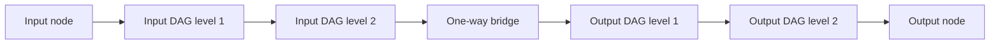

# Token-Owned Leveled DAG Routing

> [!summary] 本页定位
> 本页给出一个兼容 Tide 空间 DAG、token-owned signal、显式 KV/SSM context 与高性能 chunk prefill 的候选模型。它允许修改 LH selector，并回答一个核心问题：如何在不引入逐 token persistent control chain 的前提下，控制不同 nodes 在空间和时间上的激活不均衡。

> [!important] 核心结论
> 强在线均衡、任意内容相关 routing、通用高性能 prefill 三者不能无条件同时得到。若 selector 用每个 token 的实际选择结果更新计数，并让下一 token 读取这些计数，就重新形成 [[adaptive-routing-prefill-impossibility]] 证明的自适应控制链。Prefill-native 版本应把均衡改成固定激活预算、结构性容量、无历史的确定性时间先验和训练期均衡损失；需要硬在线反馈时，只能接受分块顺序依赖或归入 streaming profile。

## 0. 一页版模型



候选模型由两类对象组成：

| 对象 | 生命周期 | 职责 |
| --- | --- | --- |
| Token-owned activation signal | 有限，只沿空间 DAG 前进 | 当前 token 的局部计算、激活和 routing |
| Node-owned context state | 跨 token 持久 | KV、SSM、linear-attention accumulator 等长期上下文 |

本页称一个 routing design 为 `strict prefill-native`，如果在把每个 node 的跨 token context 交给其 chunk operator 后，剩余必须顺序执行的 routing stages 数量只依赖固定 Graph depth，而不随 token 长度 $L$ 增长。

执行规则是：

```text
node context update
-> token-owned hidden
-> owner-separated level routing
-> selected edges
-> 下一 spatial level
```

长期 context 可以影响后续 token 的 routing，但影响必须经过具有 chunk implementation 的 context kernel；selector 本身不再维护逐 token 可见的 `affectcount / selectcount` 控制历史。

## 记号约定

定义自然数与正整数：

$$
\mathbb N=\{0,1,2,\ldots\},
$$

$$
\mathbb N_{>0}=\{1,2,3,\ldots\}.
$$

对 $L\in\mathbb N$，定义：

$$
[L]=\{0,1,\ldots,L-1\}.
$$

若 $L=0$，则 $[L]=\varnothing$。

本页沿用 [[step-transition-mathematical-specification#定义 1.2：顺序 fold|顺序 fold]] 的思想，但在首次使用 node fold 时仍会给出本页所需的递归定义。

> [!note] 关于此前使用的 `rank`
> 为避免与 runtime event 的拓扑 rank 混淆，本页不再单独使用含义不明的 `rank`。此前讨论中的 `spatial rank` 在本页统一改称 `spatial level`，记为 $\ell(v)$；external tick、internal tick 与 absolute logical time 分别使用 $t,k,\tau$。

## 1. 空间 DAG 与 Level

### 定义 1.1：带输入输出的空间 DAG

一个带输入输出的空间 DAG 是三元组：

$$
(G,s,z),
$$

其中：

- $G=(V,E)$ 是有限有向无环图。
- $s\in V$ 是唯一 input node。
- $z\in V$ 是唯一 output node。
- 每个 $v\in V$ 都位于至少一条从 $s$ 到 $z$ 的有向路径上。

### 定义 1.2：Spatial level

定义 input node 的 spatial level：

$$
\ell(s)=0.
$$

对任意 $v\neq s$，定义：

$$
\ell(v)
=
1+max_{(u,v)\in E}\ell(u).
\tag{LD-1}
$$
^eq-spatial-level

因为 $G$ 是有限 DAG，可以按拓扑顺序依次计算每个 $\ell(v)$，所以上述定义是良定义的。

由定义立即得到：

$$
(u,v)\in E
\quad\Longrightarrow\quad
\ell(u)<\ell(v).
$$

定义 Graph spatial depth：

$$
R=\ell(z)=\max_{v\in V}\ell(v).
$$

### 定义 1.3：Leveled unit-delay DAG

若每条 edge 都满足：

$$
(u,v)\in E
\quad\Longrightarrow\quad
\ell(v)=\ell(u)+1,
\tag{LD-2}
$$
^eq-adjacent-level-edge

则称 $G$ 是一个 leveled unit-delay DAG。

本页假设每条 edge 传播 signal 的延迟恰好为 $1$ 个 internal tick。

### 构造 1.4：一般 DAG 的 leveling

若一般 DAG 中存在 edge $(u,v)$ 满足：

$$
\ell(v)-\ell(u)=d>1,
$$

则把该 edge 替换为包含 $d$ 条 unit-delay edges 的 relay chain：

```text
u -> relay 1 -> relay 2 -> ... -> v
```

Relay node 只转发 token owner、payload 和必要 metadata，不引入新的 learned transition。

第 $i$ 个 relay node 被赋予 spatial level $\ell(u)+i$，其中 $1\leq i<d$；原 destination $v$ 仍保持 level $\ell(v)$。

> [!warning] Timing semantics 会改变
> 原 edge $(u,v)$ 的传播延迟为 $1$；替换为 $d$ 条 relay edges 后，传播延迟变为 $d$。因此 leveling 保持 reachability 和 payload transformation，却不保持原始 absolute-time semantics。它不是对既有 LH 行为的免费优化，而是 strict prefill profile 主动选择的新 timing contract。若 skip-level edge 必须继续保持 unit delay，则后文固定到达时间定理不适用。

这样每条新 edge 都只增加一个 spatial level。后文把这种 leveling 视为严格 prefill profile 的图规范化步骤。

### 引理 1.5：Leveling 后所有路径等长

在构造 1.4 得到的 leveled DAG 中，从 input node $s$ 到任意 node $v$ 的每条有向路径都恰好包含 $\ell(v)$ 条 edges。

**证明。**

对 $\ell(v)$ 做数学归纳。

当 $\ell(v)=0$ 时，$v=s$，从 $s$ 到自身的空路径包含 $0$ 条 edges，结论成立。

假设结论对所有 level 不超过 $r$ 的 nodes 成立。取任意满足 $\ell(v)=r+1$ 的 node $v$。根据式 [[#^eq-adjacent-level-edge|LD-2]]，任意入边 $(u,v)$ 的 source 都满足：

$$
\ell(u)=r.
$$

由归纳假设，从 $s$ 到 $u$ 的每条路径都包含 $r$ 条 edges。再经过 edge $(u,v)$，得到从 $s$ 到 $v$ 的路径长度为 $r+1=\ell(v)$。因为任意到达 $v$ 的路径都必须以某条入边 $(u,v)$ 结束，所以结论对 $v$ 成立。

由数学归纳法，结论对所有 nodes 成立。

<div class="qed" aria-label="证毕">∎</div>

## 2. External Tick、Internal Tick 与绝对时间

### 定义 2.1：Token owner 与 external tick

输入 token 按：

$$
t=0,1,2,\ldots
$$

编号。Token $t$ 在 external tick $t$ 注入 input node。每个由它产生的 activation signal 都把 $t$ 作为 owner。

### 定义 2.2：Internal tick

Token $t$ 的 signal 从 input node 出发后，每经过一条 edge，internal tick 增加 $1$。

记 token $t$ 的某个 signal 已经经过的 edge 数量为：

$$
k\in\mathbb N.
$$

### 定义 2.3：绝对逻辑时间

定义 token $t$、internal tick $k$ 的绝对逻辑时间：

$$
\tau=t+k.
\tag{LD-3}
$$
^eq-absolute-time

这里 $\tau$ 不是硬件 wall-clock，而是 reference semantics 中所有 token 共用的逻辑时间轴。

每个绝对时间内部采用固定顺序：

```text
node context evaluation
-> owner-separated level selector
-> selected messages emitted
-> messages 在绝对时间 tau + 1 到达下一 level
```

因此，同一条 edge 不产生 zero-delay dependency。

### 定理 2.4：固定到达时间

在 leveled unit-delay DAG 中，token $t$ 的任意 signal 若到达 node $v$，则：

$$
k=\ell(v),
$$

并且到达绝对时间唯一确定为：

$$
\tau(t,v)=t+\ell(v).
\tag{LD-4}
$$
^eq-fixed-arrival-time

**证明。**

由引理 1.5，从 input node 到 $v$ 的每条路径都包含 $\ell(v)$ 条 edges。每条 edge 延迟为 $1$，因此 signal 到达 $v$ 时 internal tick 为 $k=\ell(v)$。

把 $k=\ell(v)$ 代入式 [[#^eq-absolute-time|LD-3]]，得到：

$$
\tau(t,v)=t+\ell(v).
$$

<div class="qed" aria-label="证毕">∎</div>

### 推论 2.5：不同 Token 不会在同一 Node、同一绝对时间失去归属

若 $t\neq t'$，则 token $t$ 与 token $t'$ 的 signals 不可能在同一 node $v$、同一绝对时间到达。

**证明。**

由定理 2.4，二者到达 $v$ 的绝对时间分别为：

$$
t+\ell(v),
$$

$$
t'+\ell(v).
$$

因为 $t\neq t'$，这两个绝对时间不同。

<div class="qed" aria-label="证毕">∎</div>

> [!note] 对原始设想的影响
> “A 走长路径、B 走短路径，最终在同一 node 同一绝对时间相遇”只会出现在未 leveling 的 DAG 中。严格 prefill profile 通过 relay nodes 对齐所有通往同一 node 的路径长度，从语义上消除这一归属歧义。多个上游 signals 仍可同时到达，但它们属于同一个 token owner。

## 3. Input/Output 反向同构结构

### 定义 3.1：双 Cortex DAG

设 input cortex 为：

$$
G_I=(V_I,E_I),
$$

从 input node $s$ 指向 input bridge node $b_I$。

设 output cortex 为：

$$
G_O=(V_O,E_O),
$$

从 output bridge node $b_O$ 指向 output node $z$。

允许 $G_O$ 与 $G_I$ 反向同构：对应 nodes 保留角色对应关系，但 edge 方向相反。增加唯一单向 bridge：

$$
(b_I,b_O).
$$

组合后的实际执行方向始终是：

```text
input -> input cortex -> bridge -> output cortex -> output
```

### 定义 3.2：全局 Spatial level

先分别对 $G_I$ 和 $G_O$ 做构造 1.4 的 leveling。

若 input cortex 最大 level 为 $R_I$，定义：

$$
\ell(b_O)=R_I+1.
$$

对 output cortex 中从 $b_O$ 出发的 local level $\ell_O(v)$，定义全局 level：

$$
\ell(v)=R_I+1+\ell_O(v).
$$

若两侧严格反向同构且深度相同，则整个 Graph 最大 spatial level 为：

$$
R=2R_I+1.
$$

反向同构只描述两侧空间结构的对应关系，不产生从 output cortex 返回 input cortex 的执行 edge。

## 4. Token-Owned Signal 与 Node Inbox

### 定义 4.1：Token-owned signal

一个 activation signal 写成：

$$
m=(t,u,v,r,p),
$$

其中：

- $t$ 是 owner token。
- $u$ 是 source node。
- $v$ 是 destination node。
- $r=\ell(v)$ 是 destination spatial level。
- $p$ 是 payload。

所有 routing 和 relay operations 都保持 owner 不变。

对 signal $m=(t,u,v,r,p)$，定义字段读取函数：

$$
\operatorname{owner}(m)=t,
\qquad
\operatorname{src}(m)=u,
\qquad
\operatorname{dst}(m)=v.
$$

### 定义 4.2：同 Owner inbox

对 token $t$ 和 node $v$，定义 inbox $I_{t,v}$ 为满足以下条件的有限 message multiset：

$$
I_{t,v}
=
\{m\mid \operatorname{owner}(m)=t,\ \operatorname{dst}(m)=v\}_{\mathrm{multi}}.
$$

下标 `multi` 表示相同 payload 的多个 messages 仍分别保留，不会因为普通集合去重而丢失。

根据定理 2.4，$I_{t,v}$ 中全部 messages 都在绝对时间 $t+\ell(v)$ 到达。

### 定义 4.3：同 Owner 聚合

对每个 node $v$，记其 token-owned input space 为 $X_v$。固定聚合器把有限同-owner message multiset 映射到 $X_v$。

Node $v$ 使用固定聚合器：

$$
x_{t,v}
=
\operatorname{Aggregate}_v(I_{t,v}).
\tag{LD-5}
$$
^eq-owner-aggregate

聚合器只合并同一个 owner token 的多个上游 signals。不同 token 的 inputs 不被合并成一个无 owner activation。

若 $I_{t,v}=\varnothing$，定义：

$$
x_{t,v}=\bot,
$$

其中 $\bot$ 表示 token $t$ 在 node $v$ 不活跃。

## 5. Node Context Kernel

### 定义 5.1：Node-owned persistent context

每个 learned node $v$ 有 persistent context state space：

$$
\mathcal S_v.
$$

其具体实现可以是：

- KV cache。
- Mamba/SSM recurrent state。
- Linear-attention accumulator。
- 其他具有明确 chunk correctness contract 的 state。

Persistent context 属于 node，不属于某个单独 token；token-owned query 读取该 context 并产生 token-owned output。

Strict profile 要求每个 mutable context state location 有唯一 node owner。若多个 nodes 必须联合读写同一状态，应先把它们封装成一个具有独立 chunk contract 的 subgraph operator。

### 定义 5.2：Node reference transition

记 node $v$ 的 token-owned hidden/output space 为 $H_v$。

Node $v$ 的单 token transition 是函数：

$$
\mathcal T_v:
(X_v\cup\{\bot\})\times\mathcal S_v
\to
(H_v\cup\{\bot\})\times\mathcal S_v.
$$

对 active input $x_{t,v}\neq\bot$：

$$
(h_{t,v},S^v_{t+1})
=
\mathcal T_v(x_{t,v},S^v_t).
$$

对 inactive input $x_{t,v}=\bot$，必须明确定义：

- State 保持不变；或者
- 执行一个固定、可 chunk 化的 decay transition。

### 定义 5.3：Node chunk contract

给定输入序列：

$$
x^v_{0:L}=(x_{0,v},x_{1,v},\ldots,x_{L-1,v})
$$

和初始 state $S^v_0$，递归执行：

$$
(h_{t,v},S^v_{t+1})
=
\mathcal T_v(x_{t,v},S^v_t),
\qquad t\in[L].
$$

定义 node transition 的顺序 fold：

$$
\operatorname{Fold}_{\mathcal T_v}^L(x^v_{0:L},S^v_0)
=
(h^v_{0:L},S^v_L).
$$

对任意长度 $L$，node $v$ 提供 chunk operator：

$$
\mathcal C_v^L:
(X_v\cup\{\bot\})^L\times\mathcal S_v
\to
(H_v\cup\{\bot\})^L\times\mathcal S_v.
$$

要求它严格等于 $\mathcal T_v$ 的顺序 fold：

$$
\mathcal C_v^L
=
\operatorname{Fold}_{\mathcal T_v}^L.
\tag{LD-6}
$$
^eq-node-chunk-contract

Attention、SSM 和 linear-attention kernel 各自通过自己的 causal-bulk 或 scan 证明满足这一 contract。

### 解释 5.4：A 如何影响 B 的 Routing

如果 token A 在 node $v$ active，它可以更新 $S^v$。后续 token B 的 hidden 因而依赖 A：

$$
x_{A,v}
\to
S^v
\to
h_{B,v}.
$$

这种跨 token 影响被包含在式 [[#^eq-node-chunk-contract|LD-6]] 的 chunkable context kernel 中。它是数据依赖，不是 selector 自身维护的逐 token control history。

## 6. Owner-Separated Level Routing

### 定义 6.1：Local candidate score

对 active pair $(t,v)$ 和每条 outgoing edge $(v,u)$，定义 routing score：

$$
s_{t,v\to u}
=
g_{v\to u}(h_{t,v})
+b_{v\to u}
+d_{t,v\to u}.
\tag{LD-7}
$$
^eq-routing-score

其中：

- $g_{v\to u}:H_v\to\mathbb R$ 是 learned content score。
- $b_{v\to u}\in\mathbb R$ 是静态 learned 或配置 bias。
- $d_{t,v\to u}\in\mathbb R$ 是只依赖 token index、spatial level 和 edge id 的确定性时间均衡先验。

三项都不读取此前 token 的实际 selector decisions。

### 定义 6.2：Owner-level candidate set

对 token $t$ 和 spatial level $r$，把该 token 在 level $r$ 的全部 active nodes 产生的 outgoing candidates 合并为：

$$
\mathcal Q_{t,r+1}
=
\left\{
(v,u,s_{t,v\to u})
\middle|
\ell(v)=r,\ x_{t,v}\neq\bot,\ (v,u)\in E
\right\}.
$$

因为 Graph 是 leveled DAG，集合中每个 destination 都满足 $\ell(u)=r+1$。

### 定义 6.3：Owner-separated level selector

给定固定 activation budget $K\in\mathbb N_{>0}$，定义：

$$
A_{t,r+1}
=
\operatorname{TopK}_K(\mathcal Q_{t,r+1}).
\tag{LD-8}
$$
^eq-owner-level-selector

若 candidate 数量少于 $K$，则保留全部 candidates。相同 score 按 `(source node id, destination node id)` 做固定 tie-break，保证结果不依赖 runtime thread scheduling。

这里 $\operatorname{TopK}_K$ 表示按 candidate 的第三个分量 score 从大到小选择至多 $K$ 项。

Selector 可以在实现上使用 segmented top-k 或分布式 reduction，但不同 token owners 的候选集合不能相互竞争同一个 runtime-updated quota。Selector 不维护：

$$
Q_{t+1}=U(Q_t,A_{t,r+1})
$$

形式的 persistent control state。

### 定义 6.4：Selected payload dispatch

只有满足 $(v,u,s_{t,v\to u})\in A_{t,r+1}$ 的 selected edge 执行重 payload projection：

$$
m_{t,v\to u}
=
P_{v\to u}(h_{t,v}).
$$

输出 signal 保持：

$$
\operatorname{owner}(m_{t,v\to u})=t.
$$

未选择的 edges 可以计算廉价 score，但不执行后续 node context kernel。

### 约束 6.5：Routing 不反馈当前 Node Context

当前 node state transition 必须先由 $x_{t,v}$ 决定，再由其输出 $h_{t,v}$ 决定 routing：

$$
(h_{t,v},S^v_{t+1})
=
\mathcal T_v(x_{t,v},S^v_t),
$$

$$
A_{t,r+1}
=
\rho_{t,r}\left(\{h_{t,v}\mid\ell(v)=r\}\right).
$$

严格 profile 不允许再用 $A_{t,r+1}$ 追溯修改任意 level $r$ node 已经得到的 $S^v_{t+1}$。特别地，`clear_after_activation` 不进入这一 reference semantics。

## 7. Streaming 与 Prefill 的两种调度

### 7.1 Streaming absolute-time schedule

Streaming decode 可以按绝对时间对角线执行：

```text
absolute time tau = 3:
    token 3 at level 0
    token 2 at level 1
    token 1 at level 2
    token 0 at level 3
```

因为 token $t$ 到达 level $r$ 的时间是 $t+r$。

| Absolute time | Level 0 | Level 1 | Level 2 | Level 3 |
| --- | --- | --- | --- | --- |
| 0 | token 0 |  |  |  |
| 1 | token 1 | token 0 |  |  |
| 2 | token 2 | token 1 | token 0 |  |
| 3 | token 3 | token 2 | token 1 | token 0 |

这是 streaming pipeline 的对角线调度。

### 7.2 Level-major chunk schedule

Chunk prefill 可以改成：

```text
level 0: all token owners
level 1: all token owners
...
level R: all token owners
```

它把上表按列重排：先计算 Level 0 的全部 token，再计算 Level 1 的全部 token。定理 7.3 说明在本页约束下，这种重排不改变语义。

对每个 node，用式 [[#^eq-node-chunk-contract|LD-6]] 的 chunk operator 一次处理全部 token positions，再用式 [[#^eq-owner-level-selector|LD-8]] 按 owner 分段、批量产生下一 level 的 active set。

### 定理 7.3：Leveled-DAG schedule equivalence

设组合 Graph 满足：

1. 它是 leveled unit-delay DAG。
2. Signal owner 在传播过程中保持不变。
3. Node inbox 只按式 [[#^eq-owner-aggregate|LD-5]] 聚合同 owner messages。
4. 每个 node chunk operator 满足式 [[#^eq-node-chunk-contract|LD-6]]。
5. Routing 使用式 [[#^eq-owner-level-selector|LD-8]] 的 pure owner-separated level selector。
6. 不存在跨 nodes 的 persistent selector control state，也不存在未封装的跨-node shared mutable context state。

则对任意有限 token 序列，level-major chunk schedule 与 absolute-time streaming schedule 产生相同的：

- Token-owned messages。
- Node hidden outputs。
- Selected edges。
- 最终 node context states。
- Output node outputs。

**证明。**

对 spatial level $r$ 做数学归纳。

当 $r=0$ 时，两个 schedules 都在 input node 接收相同 token 序列，所以 input inbox sequences 相同。由 node chunk contract，level-major execution 与 streaming 顺序执行产生相同 hidden outputs 和最终 input-node state。Owner-separated level selector 是相同 hidden、token index 和静态 metadata 的确定函数，所以 selected edges 和发往 level $1$ 的 messages 相同。

假设两个 schedules 在所有不超过 level $r$ 的 nodes 上产生相同 messages、hidden、routes 和 context states。取任意 level $r+1$ 的 node $v$。

由 leveled DAG 条件，$v$ 的所有入边都来自 level $r$。根据归纳假设，两个 schedules 从这些入边发送的 token-owned messages 完全相同。因此对每个 token $t$，式 [[#^eq-owner-aggregate|LD-5]] 得到相同的 $x_{t,v}$，整个 node input sequence 相同。

由式 [[#^eq-node-chunk-contract|LD-6]]，level $r+1$ 的每个 node 在两个 schedules 中产生相同 hidden sequence 和最终 context state。把同一 owner 在该 level 的全部 candidates 合并后，两个 schedules 得到相同的 $\mathcal Q_{t,r+2}$。再由 owner-separated level selector 的确定性，二者产生相同 selected edges 与 outgoing messages。

所以结论对 level $r+1$ 成立。由数学归纳法，结论对所有 levels 成立，特别地对 output node 成立。

<div class="qed" aria-label="证毕">∎</div>

## 8. 空间与时间均衡问题

### 定义 8.1：Activation indicator

对 token $t$ 和 node $v$，定义：

$$
a_{t,v}
=
\begin{cases}
1, & x_{t,v}\neq\bot,\\
0, & x_{t,v}=\bot.
\end{cases}
$$

### 定义 8.2：Chunk node load

对长度为 $L$ 的 token chunk，定义 node $v$ 的 activation load：

$$
n_v^{(L)}
=
\sum_{t=0}^{L-1}a_{t,v}.
\tag{LD-9}
$$
^eq-node-load

空间均衡关注同一 spatial region 中不同 nodes 的 $n_v^{(L)}$ 是否过度集中；时间均衡关注同一个 node 的 activations 是否长期集中在少量时间窗口。

### 8.3 当前 LH Online Counter Selector

当前 LH-like selector 可以抽象为：

$$
R_t=\rho(H_t,Q_t),
$$

$$
Q_{t+1}=U(Q_t,R_t),
$$

其中 $Q_t$ 包含 `affectcount / selectcount`。这种反馈确实可以直接惩罚历史上被频繁选择的 nodes，但也形成：

$$
Q_A\to R_A\to Q_B\to R_B\to Q_C\to\cdots.
$$

若 selector family 足够一般，就进入 [[adaptive-routing-prefill-impossibility]] 的自适应路由下界。

### 命题 8.4：强 Online Feedback 与严格 Prefill-Native 的冲突

如果 token $t+1$ 的 selector score 必须读取由 token $t$ 的实际 hard route 更新后的 control state，并且该 combined transition 没有额外已证明的 scan/bulk composition，那么 routing decisions 之间存在逐 token dependency chain。

**证明。**

Token $t+1$ 的 route 需要 control state $Q_{t+1}$；$Q_{t+1}$ 又需要 token $t$ 的 hard route $R_t$；$R_t$ 需要 $Q_t$。因此：

$$
Q_t\to R_t\to Q_{t+1}\to R_{t+1}.
$$

对所有 tokens 重复该关系，得到长度随 $L$ 线性增长的 dependency chain。若不存在另外的等价 contraction，就不能把这些 selector calls 同时放入同一个 exact chunk routing stage。

<div class="qed" aria-label="证毕">∎</div>

命题 8.4 本身是 dependency 结论；模型类别级算法下界由 [[adaptive-routing-prefill-impossibility#定理 6.1：Exact adaptive routing lower bound|自适应路由链下界定理]] 给出。

### 命题 8.5：Hard Cross-Token Capacity 的三种选择

固定 node $v$、时间窗口 $W$ 与 hard capacity $C$。要求对任意内容 scores 都满足：

$$
\sum_{t\in W}a_{t,v}\leq C.
$$

若不同 token 原本都可能选择 $v$，则 exact selector 至少要采用以下一种机制：

1. 在运行前用静态 quota/availability mask 预先决定哪些 token 有资格选择 $v$。
2. 联合观察窗口中多个 tokens 后再做 assignment，使某个 token 的结果可能依赖未来 token。
3. 按 token 顺序维护已使用 capacity，并让后续 token 读取此前 admission results。

第二种机制通常不满足 autoregressive prefix consistency；第三种机制形成 online control chain。只有第一种机制天然兼容本页 strict prefill-native contract，但会限制内容 routing 的自由度。

**证明。**

如果资格没有被静态预先限制，那么当超过 $C$ 个 tokens 都希望选择 $v$ 时，selector 必须根据其他 tokens 的情况拒绝其中一部分。

若 token $t$ 的决定依赖窗口中尚未到达的未来 token，则属于第二种联合 assignment。若它不读取未来，只能根据此前 tokens 已经占用的 capacity 作决定，则必须维护并读取历史 admission state，属于第三种 online feedback。除此之外，只剩在运行前固定资格的第一种机制。

<div class="qed" aria-label="证毕">∎</div>

## 9. Prefill-Compatible 均衡设计

严格 prefill-native 版本不承诺对任意输入都实现完全相等的 node load。它把均衡拆成四层，每层都不引入逐 token route feedback。

### 9.1 固定 Token Activation Budget

给定常数 $K\geq1$。每个 token 在每个 spatial level 最多拥有 $K$ 个 active signal slots。

Split、merge 和 routing 必须满足：

$$
\sum_{v:\ell(v)=r}a_{t,v}\leq K,
\qquad t\in[L].
\tag{LD-10}
$$
^eq-token-activation-budget

若 Graph 最大 level 为 $R$，则全部 token-node active pairs 至多为：

$$
L K (R+1).
$$

这个约束由式 [[#^eq-owner-level-selector|LD-8]] 的 per-owner、per-level top-$K$ 直接保证，因此超稀疏 work 不会因每个 node 各自分支而指数增长。

逻辑上的 owner-level top-$K$ 可以实现为 segmented top-k、分层 reduction 或其他确定性选择算法；是否满足去中心化通信目标，需要在后续 runtime 设计中单独评估。

### 9.2 结构性空间容量

为每个 node $v$ 指定目标容量权重：

$$
\pi_v>0.
$$

同一 level 的权重满足：

$$
\sum_{v:\ell(v)=r}\pi_v=1.
$$

$\pi_v$ 可以根据 node kernel cost、设备位置、memory capacity 或目标负载设置。Static bias $b_{v\to u}$ 用于把内容 router 的长期分布推向这些容量权重。

因为 $b_{v\to u}$ 不随 token-by-token runtime history 更新，它不会形成新的 adaptive chain。

### 9.3 确定性时间均衡先验

对每条 edge 定义一个预先给定的周期性或 hash-based 序列：

$$
d_{t,v\to u}
=
D(v,u,t\bmod P),
$$

其中 $P$ 是固定周期，$D$ 是部署前已经确定的有限表或无状态函数。

设计 $D$ 时，可以让不同 token indices 周期性偏好不同 edges/nodes，从而减少长期固定热点。

因为任意 $d_{t,v\to u}$ 只由 $t$ 和静态 edge id 决定，prefill 可以一次性生成整个 chunk 的全部时间先验；decode 也会对同一个 token index 得到相同值。

这种方法提供确定性的时间分散倾向，但内容 score 仍可能覆盖它，所以它不是任意输入上的严格负载上界。

### 9.4 训练期空间均衡损失

对 spatial level $r$，定义归一化实际 load：

$$
\widehat p_{r,v}
=
\frac{n_v^{(L)}}{
\sum_{u:\ell(u)=r}n_u^{(L)}
},
$$

分母为 $0$ 时把该 level 的 loss 定义为 $0$。

定义空间均衡损失：

$$
\mathcal L_{\mathrm{space}}
=
\sum_r
\sum_{v:\ell(v)=r}
(\widehat p_{r,v}-\pi_v)^2.
\tag{LD-11}
$$
^eq-spatial-balance-loss

训练时，这个 loss 促使 learned routing scores 在数据分布上接近目标容量。它影响参数梯度，但不成为 forward execution 中逐 token 更新的 selector state。

实际训练可以用 soft routing probabilities 构造可微 surrogate；式 [[#^eq-spatial-balance-loss|LD-11]] 只定义希望约束的 load 目标。

### 9.5 训练期时间窗口损失

给定固定窗口长度 $B\geq1$。对窗口 index $j$，定义：

$$
W_j=\{jB,jB+1,\ldots,\min((j+1)B,L)-1\}.
$$

这里只考虑满足 $jB<L$ 的非空窗口。

定义 node $v$ 在窗口 $W_j$ 中的 load：

$$
n_{j,v}
=
\sum_{t\in W_j}a_{t,v}.
$$

可以对每个窗口重复式 [[#^eq-spatial-balance-loss|LD-11]] 的归一化与平方偏差，得到 $\mathcal L_{\mathrm{time}}$。它抑制“全局平均均衡，但某些时间窗口严重拥塞”的情况。

和空间 loss 一样，它只参与训练，不改变 exact inference dependency。

### 9.6 可选的静态 Availability Mask

若需要比 bias 更强的确定性约束，可以定义：

$$
M_{t,v\to u}\in\{0,1\},
$$

并只允许 selector 在满足 $M_{t,v\to u}=1$ 的 edges 中选择。

Mask 必须满足：

- 只依赖 token index 和静态 Graph metadata。
- 对每个可能 active 的 $(t,v)$ 至少保留一条通向 output 的合法 edge。
- 不读取此前 token 的实际 route counts。

这种方法可以提供硬时间分片或设备容量约束，但会限制内容 routing 的自由度，应作为可选设计而不是默认机制。

## 10. 三种 Selector Profile

| Profile | 均衡方式 | Token-axis prefill |
| --- | --- | --- |
| `LH-exact streaming` | 每次 hard route 后更新 persistent counts | 自适应链长度通常至少随 $L$ 线性增长 |
| `Prefill-native` | 固定 $K$、static bias、deterministic prior、training loss | 支持定理 7.3 的 level-major chunk execution |
| `Block-lagged balance` | 固定 block 内冻结 counters，block 结束后更新 | Block 内并行，block 间仍顺序 |

### 10.1 Block-lagged compromise

给定固定 block size $B$。对 block $j$，使用冻结的 balancing state $Q_j$：

$$
R_t=\rho(h_t,Q_j),
\qquad t\in W_j.
$$

Block 内全部 routes 互不更新 $Q_j$，可以批量计算。Block 结束后聚合 load：

$$
C_j=\sum_{t\in W_j}a_t,
$$

其中：

$$
a_t=(a_{t,v})_{v\in V}
$$

是 token $t$ 的 node activation indicator family。然后更新：

$$
Q_{j+1}=\gamma Q_j+C_j.
$$

这里 $0\leq\gamma\leq1$ 是固定衰减系数。

它比逐 token online feedback 更容易并行，但长度为 $L$ 的序列仍有约 $\lceil L/B\rceil$ 个顺序 balancing stages，其中 $\lceil x\rceil$ 表示不小于 $x$ 的最小整数。若 $B$ 固定，这个顺序 stage 数仍随 $L$ 线性增长，只是把常数缩小约 $B$ 倍，因此属于工程折中而不是严格 prefill-native 方案。

## 11. 对当前 LH Selector 的迁移建议

| 当前 LH 元素 | Prefill-native 处理 |
| --- | --- |
| `signal norm` | 保留为 $g_{v\to u}(h_{t,v})$ 的一个特征 |
| `affectcount` | 改为日志、训练统计或 balance loss 输入 |
| `selectcount` | 改为日志、训练统计或 static learned bias 初始化依据 |
| Persistent fairness ordering | 不进入 exact forward routing |
| `clear_after_activation` | 从 strict profile 删除；用固定 decay 或 context kernel 管理 state |
| Candidate generation | 可对有界出度的全部 local edges 计算廉价 score |
| Heavy payload / destination kernel | 只对 selected edges 和 active token-node pairs 执行 |

推荐的第一版 reference selector 是：

$$
A_{t,r+1}
=
\operatorname{TopK}_K
\left(
\mathcal Q_{t,r+1}
\right),
$$

其中每个 candidate 的 score 由式 [[#^eq-routing-score|LD-7]] 定义。

并配合：

- 每 token、每 level 固定 activation budget $K$。
- 空间容量权重 $\pi_v$。
- 确定性时间先验 $d_{t,v}$。
- 训练期 $\mathcal L_{\mathrm{space}}+\lambda\mathcal L_{\mathrm{time}}$，其中 $\lambda\geq0$ 是固定 loss weight。

## 12. 边界与后续证明

当前文档给出的结论是：

1. Leveled unit-delay DAG 消除了不同 owner 在同 node、同绝对时间相遇的归属歧义。
2. Token-owned activation 与 node-owned context 分离，使长期历史由已知 chunkable kernel 承担。
3. Pure owner-separated level selector 允许把 streaming diagonal schedule 重排为 level-major chunk schedule。
4. 结构性和训练期均衡可以与 high-performance prefill 共存。
5. 任意输入上的强在线硬均衡若依赖实际历史 route counts，仍会形成自适应控制链。

仍需后续证明或实验的问题包括：

1. 对给定 input/output 反向同构拓扑，固定 per-token、per-level budget $K$ 是否具有足够表达力。
2. Static bias、时间先验和 balance losses 能否在真实训练中避免 node collapse 与长期热点。
3. 不同 node 的 active subsequence 如何高效 lower 到 packed attention、segmented scan 或 Ascend kernels。
4. Relay-node leveling 带来的 Graph depth、通信和 latency 成本是否可接受。
5. 特殊有环子图应固定展开、封装成 chunk kernel，还是只归入 streaming profile。
6. 若保留 skip-level unit-delay edges、不改变原 absolute-time semantics，能否把同一 node 的 `(owner token, internal tick)` 稀疏 event sequence 直接 lower 为高效 chunk kernel。

因此，对“能否同时得到空间/时间均衡与高性能 prefill”的准确回答是：

> 可以得到结构性上界和数据分布意义上的空间/时间均衡，同时保持 exact high-performance prefill；不能在一般内容路由下，同时要求逐 token 即时硬均衡反馈而又消除 token-axis 自适应链。
